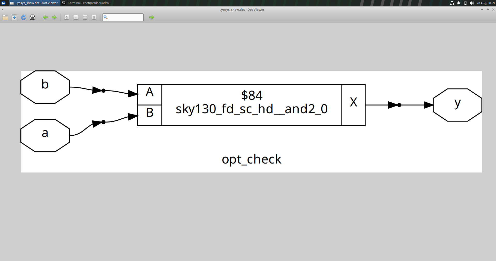
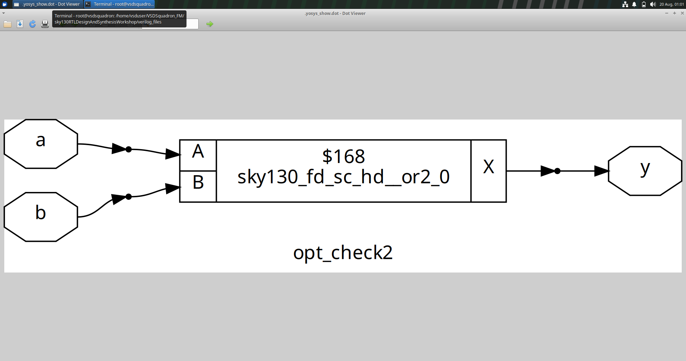
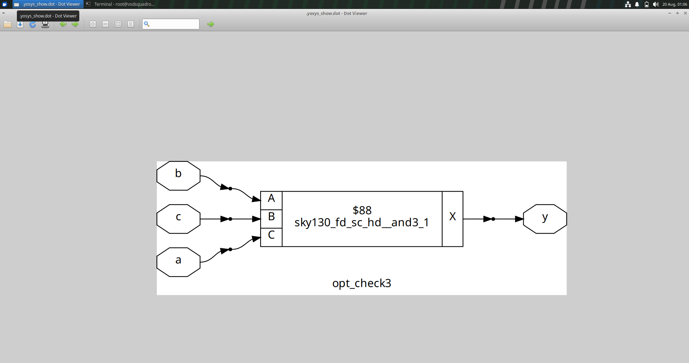
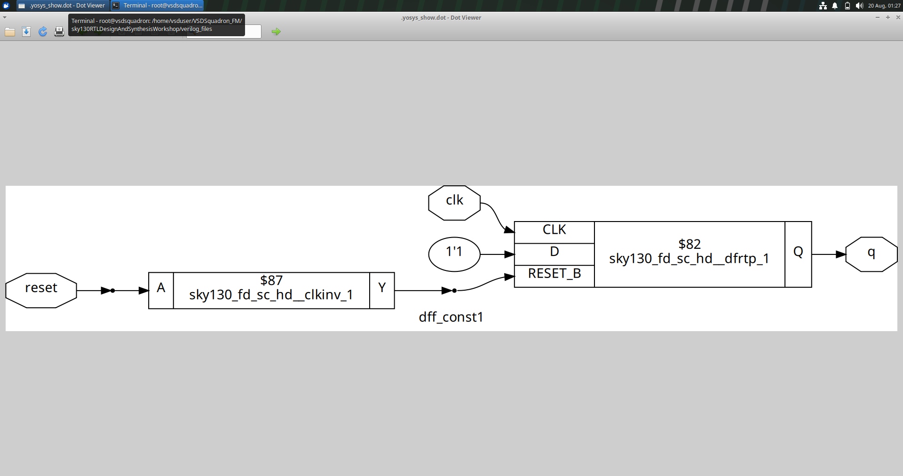
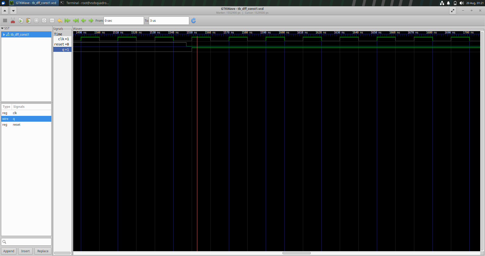
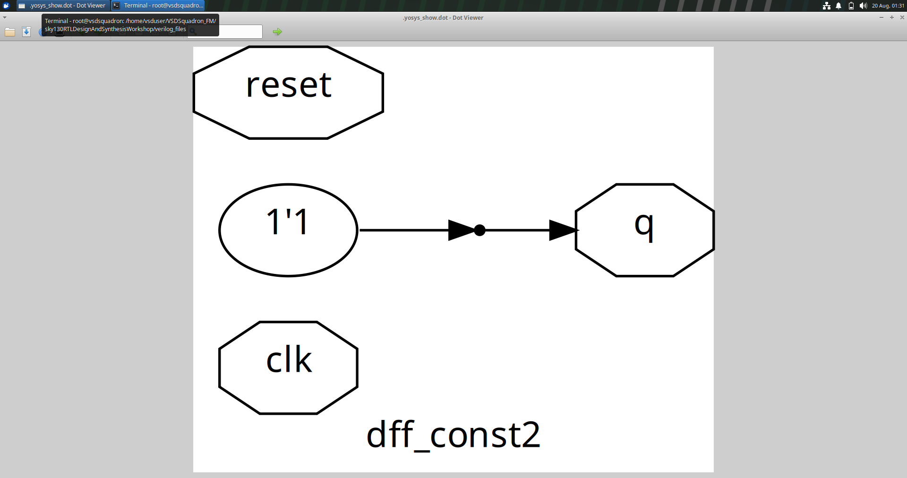
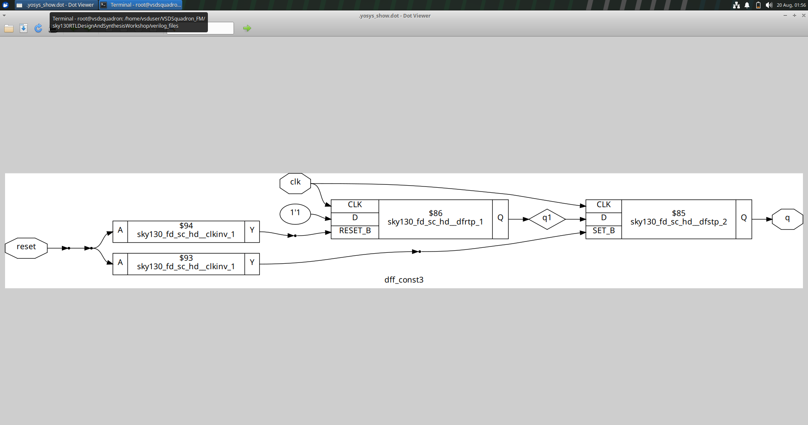
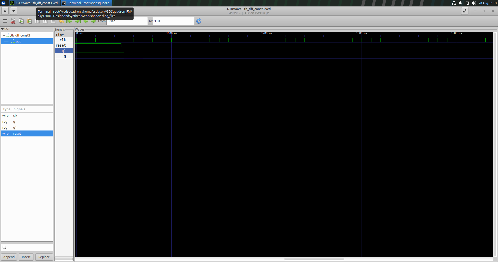
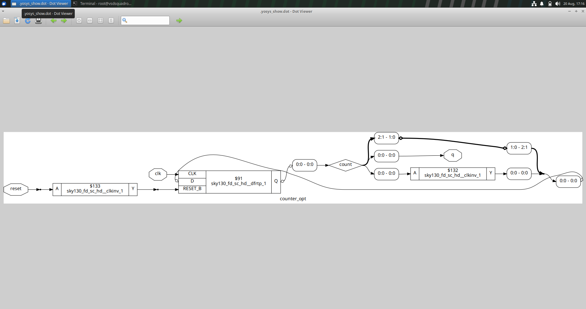
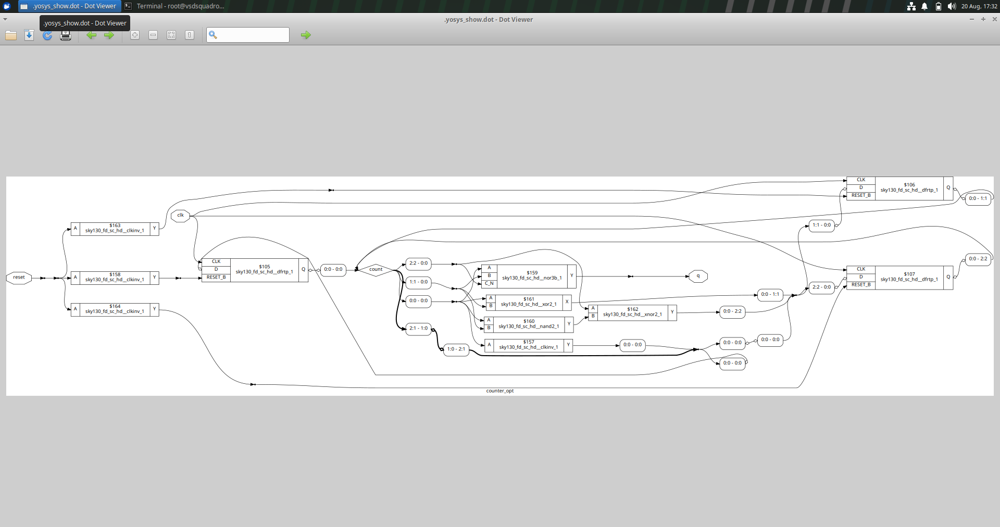

# Day 3 – RTL Optimization and Synthesis

## Overview

Day 3 focuses on understanding how synthesis tools optimize an RTL design and convert it into an efficient gate-level implementation.

The experiments performed in this session cover basic logic optimization, constant propagation in D flip-flops, sequential logic optimization, and counter optimization.

The designs were synthesized using Yosys and the synthesized results were examined to understand how RTL descriptions are transformed into hardware.

---

## Table of Contents

- [Objective](#objective)
- [1. Logic Optimization](#1-logic-optimization)
  - [AND Logic](#and-logic)
  - [OR Logic](#or-logic)
  - [Three-Input AND Logic](#three-input-and-logic)
- [2. D Flip-Flop Optimization](#2-d-flip-flop-optimization)
  - [DFF Constant 1](#dff-constant-1)
  - [DFF Constant 2](#dff-constant-2)
  - [DFF Constant 3](#dff-constant-3)
- [3. Counter Optimization](#3-counter-optimization)
- [Key Observations](#key-observations)
- [Conclusion](#conclusion)

---

## Objective

The main objectives of this session are:

- To understand the purpose of RTL optimization during synthesis.
- To observe how simple Boolean expressions are mapped into hardware.
- To study constant propagation in sequential circuits.
- To understand how unnecessary hardware can be simplified during synthesis.
- To examine synthesized gate-level representations.
- To verify sequential circuits using simulation waveforms.

---

# 1. Logic Optimization

Logic optimization is an important part of the synthesis process.

The synthesis tool analyzes the RTL description and tries to obtain an efficient hardware implementation while preserving the required functionality.

The first three experiments demonstrate the synthesis of simple combinational logic.

---

## AND Logic

The first experiment deals with a basic AND operation.

The RTL description is synthesized and mapped to the appropriate logic cell available in the target technology library.

### Synthesized Result

The synthesized representation shows the hardware implementation obtained from the RTL description.

---

## OR Logic

The second experiment deals with an OR operation.

During synthesis, the Boolean function is analyzed and mapped to the corresponding hardware cell.

### Synthesized Result

The result demonstrates how the RTL Boolean operation is represented at the synthesized level.

---

## Three-Input AND Logic

The third experiment uses three inputs for an AND operation.

The synthesis tool identifies the required logic function and maps it to a suitable implementation.

### Synthesized Result

This experiment shows how a multi-input Boolean operation is represented after synthesis.

---

# 2. D Flip-Flop Optimization

The next set of experiments focuses on sequential logic.

A D flip-flop stores the value present at its D input based on the clock. When the synthesis tool can determine that a signal has a constant value, this information can be propagated through the circuit.

Constant propagation can help simplify the resulting hardware.

---

## DFF Constant 1

The first experiment investigates a D flip-flop with a constant input.

### Synthesized Circuit

The synthesized diagram shows the resulting sequential structure after synthesis.

### Simulation Waveform

---

## DFF Constant 2

The second experiment further examines the effect of a constant value on the D flip-flop.

### Synthesized Circuit

### Simulation Waveform

The waveform is used to observe the behavior of the sequential circuit with respect to the clock and output signals.

---

## DFF Constant 3

The third experiment continues the study of constant propagation and sequential optimization.

### Synthesized Circuit

### Simulation Waveform

The waveform helps verify that the optimized circuit continues to produce the expected behavior.

---

# 3. Counter Optimization

A counter is a sequential circuit consisting of storage elements and logic that determines the next state.

The counter experiment was synthesized to observe the resulting hardware structure and the effect of modifying the design.

### Original Counter

The synthesized representation shows the hardware generated for the counter design.

### Modified Counter

The modified version provides a comparison of the synthesized implementation after changes were made to the design.

---

# Key Observations

The experiments performed during Day 3 demonstrate the following:

1. RTL Boolean expressions can be converted into corresponding hardware cells during synthesis.
2. Different Boolean functions produce different synthesized structures.
3. Constant values can be propagated through sequential logic.
4. Synthesis can simplify unnecessary portions of a design.
5. The synthesized circuit can have a different structure from the original RTL while maintaining the required functionality.
6. Simulation waveforms are useful for verifying optimized sequential designs.

---

# Conclusion

Day 3 provided practical experience with RTL optimization and synthesis.

The combinational logic experiments demonstrated how basic Boolean operations are mapped into hardware. The D flip-flop experiments showed how constant values can be propagated through sequential logic, while the counter experiment demonstrated optimization in a larger sequential circuit.

These experiments helped demonstrate that synthesis is not simply a direct conversion of RTL into gates. The synthesis tool analyzes the design and produces an optimized hardware representation while maintaining the intended functionality.
