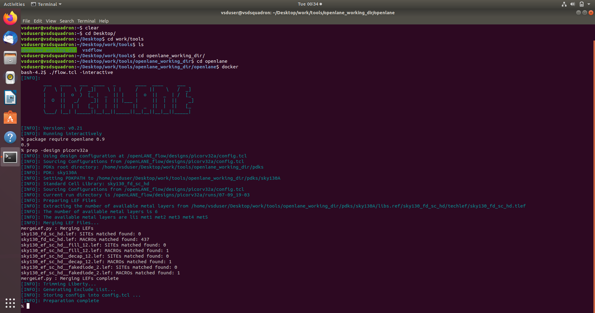
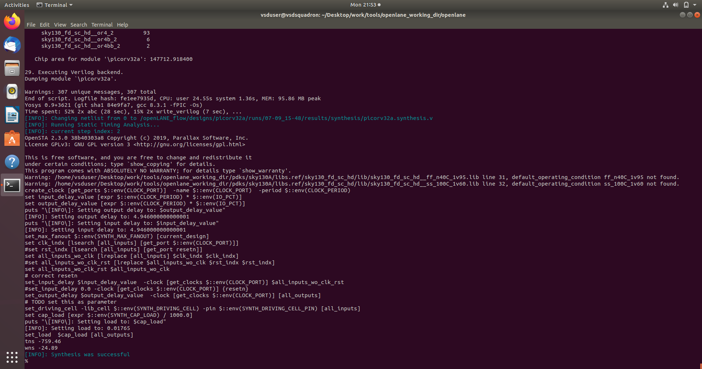
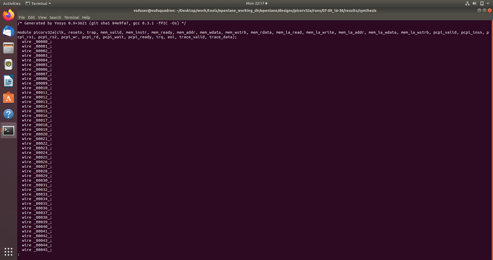
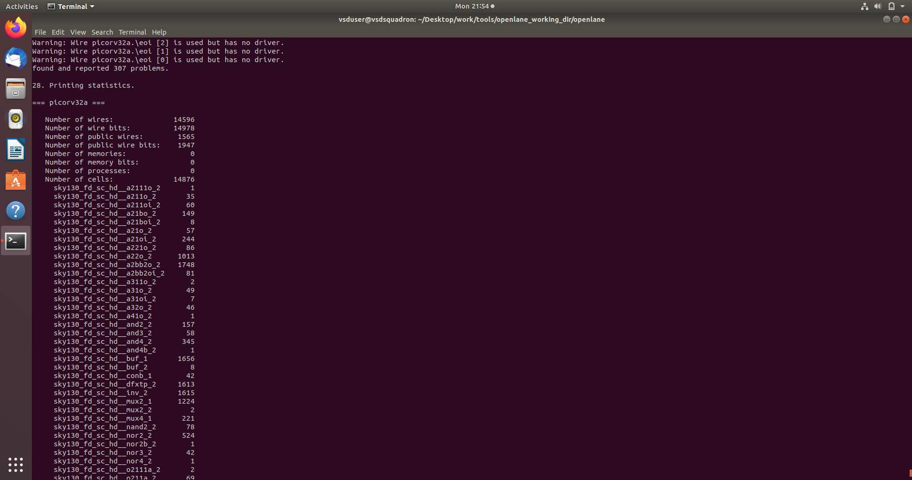
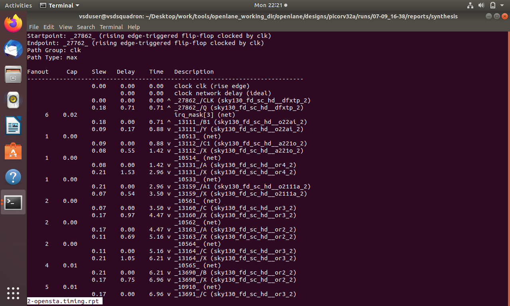

# Day 6 — OpenLane Design Preparation & Synthesis

## Overview

Day 6 focuses on the early stages of the **ASIC implementation flow using OpenLane**. The **PicoRV32A** design is prepared and synthesized using the **SKY130 PDK**. After synthesis, the generated reports are examined to evaluate the design in terms of **area, cell count, wire count, and timing**.

The objective is to understand how an RTL design is converted into a technology-mapped gate-level representation and how the synthesized design can be characterized using the generated reports.

---

## Contents

1. [Open-Source EDA Flow](#1-open-source-eda-flow)
2. [PDK and SKY130](#2-pdk-and-sky130)
3. [OpenLane](#3-openlane)
4. [OpenLane Directory Structure](#4-openlane-directory-structure)
5. [PicoRV32A Design](#5-picorv32a-design)
6. [Design Preparation](#6-design-preparation)
7. [Reviewing the Prepared Design](#7-reviewing-the-prepared-design)
8. [Synthesis](#8-synthesis)
9. [Synthesis Completion](#9-synthesis-completion)
10. [Reviewing Synthesis Reports](#10-reviewing-synthesis-reports)
11. [Synthesis Statistics](#11-synthesis-statistics)
12. [Timing Analysis](#12-timing-analysis)
13. [Characterizing Synthesis Results](#13-characterizing-synthesis-results)
14. [Practical Flow](#14-practical-flow)
15. [Key Learnings](#15-key-learnings)

---

## 1. Open-Source EDA Flow

**Electronic Design Automation (EDA)** tools are used to design, analyze, and implement integrated circuits.

An open-source ASIC flow uses different tools for different stages of the design process:

| Stage | Tool | Purpose |
|---|---|---|
| RTL Synthesis | Yosys | Converts RTL into a gate-level representation |
| Logic Optimization | ABC | Optimizes logic and performs technology mapping |
| Static Timing Analysis | OpenSTA | Analyzes timing paths and timing constraints |
| Physical Design | OpenROAD | Performs floorplanning, placement, CTS and optimization |
| Routing | TritonRoute | Performs detailed routing |
| RC Extraction | OpenRCX | Extracts interconnect parasitics |
| DRC | Magic | Checks design-rule violations |
| LVS | Netgen | Compares layout with the netlist |
| Layout Viewing | KLayout / Magic | Allows visual inspection of physical layouts |

**OpenLane** integrates and automates these tools into an RTL-to-GDSII flow.

---

## 2. PDK and SKY130

A **Process Design Kit (PDK)** provides the technology-specific information required by EDA tools to implement a design for a particular semiconductor manufacturing process.

A PDK contains information such as:

- Standard-cell libraries
- Timing libraries
- Technology LEF files
- Physical cell information
- Design rules
- Device models
- Parasitic and extraction information

The **SKY130 PDK** provides the technology information required for implementation using the SkyWater 130 nm process.

```text
RTL Design
     ↓
OpenLane
     ↓
SKY130 PDK
     ↓
Technology-Specific Implementation
````

---

## 3. OpenLane

**OpenLane** is an automated RTL-to-GDSII flow that integrates multiple open-source EDA tools.

A simplified ASIC implementation flow is:

```text
RTL
 ↓
Synthesis
 ↓
Floorplanning
 ↓
Power Planning
 ↓
Placement
 ↓
Clock Tree Synthesis
 ↓
Optimization
 ↓
Routing
 ↓
Parasitic Extraction
 ↓
Timing Analysis
 ↓
Physical Verification
 ↓
GDSII
```

For this Day 6 exercise, the practical work focuses on:

```text
Design Preparation
        ↓
Synthesis
        ↓
Synthesis Completion
        ↓
Report Analysis
        ↓
Timing Analysis
        ↓
Synthesis Characterization
```

---

## 4. OpenLane Directory Structure

A typical OpenLane design is organized as:

```text
openlane/
├── designs/
│   └── picorv32a/
│       ├── config.json
│       ├── config.tcl
│       ├── src/
│       │   └── picorv32.v
│       └── runs/
│           └── <run_directory>/
│               ├── results/
│               ├── reports/
│               ├── logs/
│               └── tmp/
│
├── pdks/
│   └── sky130A/
│
└── scripts/
```

### Important Directories

| Directory    | Purpose                                                |
| ------------ | ------------------------------------------------------ |
| `designs/`   | Contains the designs used by OpenLane                  |
| `picorv32a/` | Contains the PicoRV32A design configuration and source |
| `src/`       | Contains RTL source files                              |
| `runs/`      | Stores files generated during an OpenLane run          |
| `results/`   | Contains generated design results                      |
| `reports/`   | Contains analysis reports                              |
| `logs/`      | Contains tool execution logs                           |
| `tmp/`       | Contains temporary and intermediate files              |
| `pdks/`      | Contains technology-specific PDK information           |

---

## 5. PicoRV32A Design

**PicoRV32** is a compact implementation of the RISC-V instruction set architecture and provides a practical design for experimenting with an ASIC implementation flow.

Unlike a small RTL example, a processor core contains a combination of:

* Control logic
* Arithmetic logic
* Registers
* Instruction decoding
* Memory interface logic
* Sequential and combinational logic

The design used in this exercise is **PicoRV32A**.

---

## 6. Design Preparation

Before synthesis, OpenLane prepares the selected design by loading its configuration, RTL, PDK, libraries, and other required technology information.

### Command Used

```tcl
prep -design picorv32a
```

This initializes the OpenLane run for the `picorv32a` design and creates the required working environment.

### Design Preparation Output

<!-- Upload: images/01_design_preparation.png -->



The output shows the loading of the design configuration, PDK, libraries, and technology information required for the OpenLane flow.

---

## 7. Reviewing the Prepared Design

After the preparation stage, the generated run directory can be inspected to verify that OpenLane has created the required working structure.

```text
runs/
└── <run_directory>/
    ├── logs/
    ├── reports/
    ├── results/
    └── tmp/
```

These directories contain the files generated during different stages of the OpenLane flow.

* **`logs/`** — tool execution logs
* **`reports/`** — generated analysis reports
* **`results/`** — implementation results
* **`tmp/`** — temporary and intermediate files

This review helps verify that the design has been correctly prepared before starting synthesis.

---

## 8. Synthesis

### What is Synthesis?

**Logic synthesis** converts an RTL description into a gate-level representation while applying logic optimization and technology mapping.

The basic process is:

```text
RTL
 ↓
Elaboration
 ↓
Logic Optimization
 ↓
Technology Mapping
 ↓
Gate-Level Netlist
```

During technology mapping, the optimized logic is mapped to cells available in the target standard-cell library.

Typical mapped cells include:

* Logic gates
* Inverters
* Buffers
* Multiplexers
* Flip-flops

### Importance of Synthesis

Synthesis provides an initial view of:

* Logic complexity
* Standard-cell usage
* Estimated area
* Netlist structure
* Timing characteristics

The output of synthesis forms the basis for the subsequent analysis stages.

---

## 9. Synthesis Completion

Once synthesis has finished, the OpenLane output is checked to verify whether the synthesis stage completed successfully.

<!-- Upload: images/05_synthesis_completed.png -->



The run reported:

```text
Synthesis was successful
```

This confirms that the synthesis stage completed successfully.

However, **successful synthesis does not necessarily mean that the design meets its timing requirements**. Timing must be evaluated separately using the generated timing reports.

---

## 10. Reviewing Synthesis Reports

After synthesis has completed, the generated reports and results are examined to understand the characteristics of the synthesized design.

The synthesis output provides information about:

* Generated cells
* Number of wires
* Netlist complexity
* Estimated area
* Technology mapping
* Timing-related information

<!-- Upload: images/03_synthesis_result.png -->



The synthesis result confirms that the RTL has been converted into a technology-mapped representation.

---

## 11. Synthesis Statistics

The synthesis statistics provide quantitative information about the generated netlist.

### Observed Results

| Parameter              |         Value |
| ---------------------- | ------------: |
| Number of wires        |        14,596 |
| Number of wire bits    |        14,978 |
| Number of public wires |         1,565 |
| Number of cells        |        14,876 |
| Estimated chip area    | 147712.918400 |

<!-- Upload: images/04_synthesis_statistics.png -->



### Interpretation

**Number of cells**
Indicates the amount of standard-cell logic used by the synthesized design.

**Number of wires**
Provides an indication of the connectivity and structural complexity of the generated netlist.

**Number of wire bits**
Represents the total number of individual signal bits associated with the synthesized connectivity.

**Estimated chip area**
Represents the estimated area of the synthesized cells. It is not the final physical die area because placement and routing have not yet been completed.

---

## 12. Timing Analysis

After synthesis, **Static Timing Analysis (STA)** is used to evaluate the timing behavior of the synthesized design.

STA analyzes timing paths using the design constraints and cell timing information without requiring exhaustive functional simulation.

A timing report can contain:

* Startpoint
* Endpoint
* Path group
* Fanout
* Capacitance
* Slew
* Cell delay
* Net delay
* Arrival time
* Required time
* Slack

<!-- Upload: images/02_timing_report.png -->



### Slack

Slack represents the difference between the required arrival time and the actual arrival time.

```text
Slack = Required Time − Arrival Time
```

```text
Positive Slack → Timing requirement satisfied
Negative Slack → Timing violation
```

### WNS — Worst Negative Slack

**WNS** represents the worst timing margin among the analyzed paths.

```text
WNS ≥ 0  → No worst-path timing violation
WNS < 0  → Timing violation exists
```

For this run:

```text
WNS ≈ -24.89
```

The negative WNS indicates that the analyzed design has a timing violation and requires further optimization to achieve timing closure.

### TNS — Total Negative Slack

**TNS** represents the total accumulated negative slack across violating timing paths.

```text
TNS = Sum of negative slack values
```

WNS indicates the severity of the worst path, while TNS gives an indication of the overall extent of timing violations.

---

## 13. Characterizing Synthesis Results

The synthesized design can be characterized using three major categories.

### Area

Evaluate:

* Number of cells
* Cell area
* Standard-cell distribution
* Estimated area

### Timing

Evaluate:

* WNS
* TNS
* Critical paths
* Arrival time
* Required time
* Setup and hold violations

### Structural Complexity

Evaluate:

* Number of wires
* Number of wire bits
* Number of cells
* Cell types
* Sequential and combinational logic

```text
                  Synthesized Design
                         │
          ┌──────────────┼──────────────┐
          ↓              ↓              ↓
        Area           Timing       Complexity
          │              │              │
      Cell Count        WNS          Wire Count
      Cell Area         TNS          Cell Count
      Cell Types        Slack        Cell Types
```

A synthesized design should not be evaluated using a single metric. **Area, timing, and structural complexity should be considered together.**

For this run:

```text
Cells       = 14,876
Wires       = 14,596
Wire Bits   = 14,978
Area        = 147712.918400
WNS         ≈ -24.89
```

These values provide a quantitative characterization of the synthesized PicoRV32A design.

---

## 14. Practical Flow

The complete practical sequence followed during Day 6 was:

```text
OpenLane Environment
        ↓
PicoRV32A Design
        ↓
Design Preparation
        ↓
Review Prepared Design
        ↓
Synthesis
        ↓
Synthesis Completed
        ↓
Review Synthesis Results
        ↓
Analyze Synthesis Statistics
        ↓
Analyze Timing Report
        ↓
Characterize Area, Timing & Complexity
```

### Command Used

```tcl
prep -design picorv32a
```

---

## 15. Key Learnings

* Understood the role of open-source EDA tools in an ASIC design flow.
* Learned the purpose of a PDK and the role of the SKY130 PDK.
* Understood the basic organization of an OpenLane design.
* Prepared the PicoRV32A design using OpenLane.
* Understood the RTL-to-gate-level synthesis process.
* Verified successful completion of synthesis.
* Analyzed synthesis results and generated statistics.
* Understood cell count, wire count, and estimated area.
* Learned how to read a static timing report.
* Understood slack, WNS, and TNS.
* Learned that synthesis success and timing closure are different objectives.
* Learned how to characterize a synthesized design using area, timing, and structural complexity.

---

## Conclusion

Day 6 provided practical exposure to the early stages of an **open-source ASIC implementation flow using OpenLane**.

The PicoRV32A design was first prepared using the SKY130 technology environment and then synthesized into a technology-mapped representation. After synthesis completed successfully, the generated results and reports were analyzed to determine the design's **cell count, wire count, estimated area, and timing characteristics**.

The reported negative WNS shows that although synthesis was successful, further optimization would be required to achieve timing closure.

Overall, the exercise demonstrated how OpenLane connects **RTL design, technology-specific synthesis, report generation, timing analysis, and design characterization** within an ASIC implementation flow.

```
```
