# Physical Design-Module 2
## Floorplanning, Placement and Introduction to Library Cells

---

## 1. Overview

Module 2 focuses on the fundamental concepts of physical design, beginning with chip floorplanning and progressing through placement, standard-cell design, library characterization and timing analysis.

The module explains how a synthesized digital design is organized physically inside the chip. It covers the definition of the core and die, utilization factor, aspect ratio, pre-placed cells, power-integrity concepts, pin placement, floorplan visualization, placement optimization, standard-cell design and timing characterization.

The module is organized into four major skill areas:

- **SK1 — Chip Floorplanning Considerations**
- **SK2 — Placement**
- **SK3 — Standard Cell Design Flow**
- **SK4 — Timing Characterization**

The overall progression can be represented as:

```text
SYNTHESIZED DESIGN
       |
       v
FLOORPLANNING
       |
       +---- Core and Die
       |
       +---- Utilization and Aspect Ratio
       |
       +---- Pre-Placed Cells
       |
       +---- Power Integrity
       |
       +---- Pin Placement
       |
       v
FLOORPLAN REVIEW
       |
       v
MAGIC LAYOUT VIEW
       |
       v
PLACEMENT
       |
       +---- Initial Placement
       |
       +---- Placement Optimization
       |
       +---- Congestion
       |
       v
STANDARD CELL DESIGN
       |
       +---- Circuit Design
       |
       +---- Layout Design
       |
       +---- Characterization
       |
       v
TIMING CHARACTERIZATION
       |
       +---- Timing Thresholds
       |
       +---- Propagation Delay
       |
       +---- Transition Time
````

---

# 2. Contents

* [SK1 — Chip Floorplanning Considerations](#3-sk1--chip-floorplanning-considerations)

  * [Core and Die](#31-core-and-die)
  * [Utilization Factor](#32-utilization-factor)
  * [Aspect Ratio](#33-aspect-ratio)
  * [Good Floorplan and Bad Floorplan](#34-good-floorplan-and-bad-floorplan)
  * [Pre-Placed Cells](#35-pre-placed-cells)
  * [Decoupling Capacitors](#36-decoupling-capacitors)
  * [Noise Margin](#37-noise-margin)
  * [Ground Bounce](#38-ground-bounce)
  * [Voltage Droop](#39-voltage-droop)
  * [Pin Placement](#310-pin-placement)
  * [Logical Cell Placement Blockage](#311-logical-cell-placement-blockage)
  * [Floorplan Flow Using OpenLane](#312-floorplan-flow-using-openlane)
  * [Reviewing Floorplan Files](#313-reviewing-floorplan-files)
  * [Viewing the Floorplan in Magic](#314-viewing-the-floorplan-in-magic)
* [SK2 — Placement](#4-sk2--placement)

  * [Netlist Binding and Initial Placement](#41-netlist-binding-and-initial-placement)
  * [Placement Optimization](#42-placement-optimization)
  * [Final Placement Optimization](#43-final-placement-optimization)
  * [Need for Libraries and Characterization](#44-need-for-libraries-and-characterization)
  * [Congestion-Aware Placement Using RePlAce](#45-congestion-aware-placement-using-replace)
* [SK3 — Standard Cell Design Flow](#5-sk3--standard-cell-design-flow)

  * [Inputs for Cell Design Flow](#51-inputs-for-cell-design-flow)
  * [Circuit Design](#52-circuit-design)
  * [Layout Design](#53-layout-design)
  * [Typical Characterization Flow](#54-typical-characterization-flow)
* [SK4 — Timing Characterization](#6-sk4--timing-characterization)

  * [Timing Threshold Definitions](#61-timing-threshold-definitions)
  * [Propagation Delay](#62-propagation-delay)
  * [Transition Time](#63-transition-time)
* [Module 2 Practical Flow](#7-module-2-practical-flow)
* [Key Learnings](#8-key-learnings)
* [Conclusion](#9-conclusion)

---

# 3. SK1 — Chip Floorplanning Considerations

Floorplanning is one of the first stages of physical design. It establishes the physical framework of the chip before detailed placement and routing.

The major floorplanning considerations covered in this module are:

* Core and die dimensions
* Utilization factor
* Aspect ratio
* Pre-placed cells
* Power and supply considerations
* Decoupling capacitors
* Noise margin
* Ground bounce
* Voltage droop
* Pin placement
* Placement blockages
* Floorplan visualization

---

## 3.1 Core and Die

The **die** represents the complete physical area of the chip.

The **core** is the internal region where the main logic cells are placed.

A simplified representation is:

```text
+---------------------------------------------+
|                    DIE                      |
|                                             |
|       +-----------------------------+       |
|       |            CORE             |       |
|       |                             |       |
|       |       Standard Cells        |       |
|       |                             |       |
|       +-----------------------------+       |
|                                             |
+---------------------------------------------+
```

The dimensions of the core and die determine the physical area available for implementing the design.

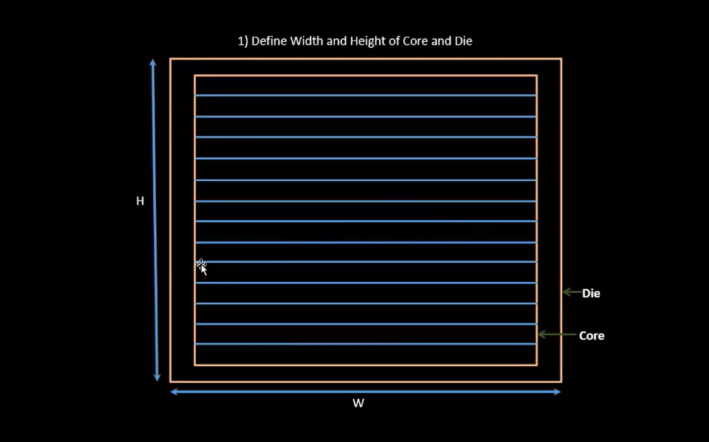

---

## 3.2 Utilization Factor

The utilization factor represents the fraction of the core area occupied by the netlist.

### Formula

```text
Utilization Factor =
Area Occupied by Netlist
------------------------
Total Area of Core
```

For example, if the netlist occupies `50 units²` inside a core of `100 units²`:

```text
Utilization Factor = 50 / 100
                   = 0.5
                   = 50%
```

Utilization is an important floorplanning parameter because insufficient free area can create routing congestion, while excessive unused area can lead to inefficient area utilization.

The examples below illustrate different utilization values and their relationship with the physical dimensions of the core.

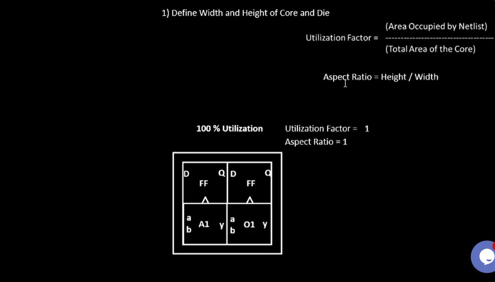

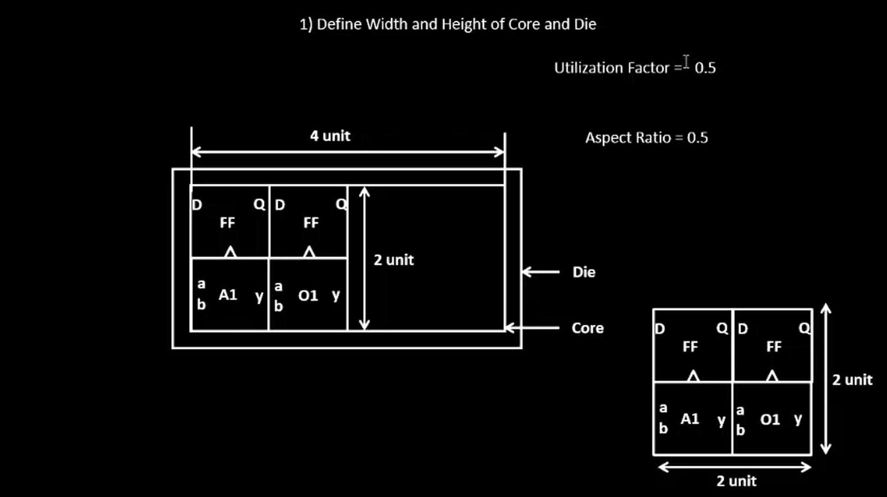

---

## 3.3 Aspect Ratio

Aspect ratio defines the shape of the core.

### Formula

```text
Aspect Ratio = Height / Width
```

For example:

```text
Width  = 4 units
Height = 2 units

Aspect Ratio = 2 / 4
             = 0.5
```

An aspect ratio of `1` represents a square core.

Changing the width and height of the core changes its physical shape and can influence placement and routing.

The utilization and aspect-ratio examples demonstrate how the dimensions of the core affect its physical organization.

---

## 3.4 Good Floorplan and Bad Floorplan

A good floorplan should provide a practical physical arrangement for the rest of the implementation flow.

Important considerations include:

* suitable utilization
* appropriate aspect ratio
* sufficient routing space
* practical macro and IP locations
* accessible pin locations
* manageable congestion
* proper power distribution

A poorly organized floorplan can lead to:

* excessive routing congestion
* longer interconnects
* difficult pin access
* inefficient area utilization
* timing difficulties
* routing problems

Therefore, floorplanning decisions have a direct influence on later physical-design stages.

---

## 3.5 Pre-Placed Cells

Some blocks require specific physical locations before automated standard-cell placement takes place. These are referred to as **pre-placed cells or blocks**.

Examples include:

* Memory
* Clock-gating cells
* Comparators
* Multiplexers
* Other predefined IP or macro blocks

The placement of these blocks is important because their locations influence the placement and routing of the remaining logic.

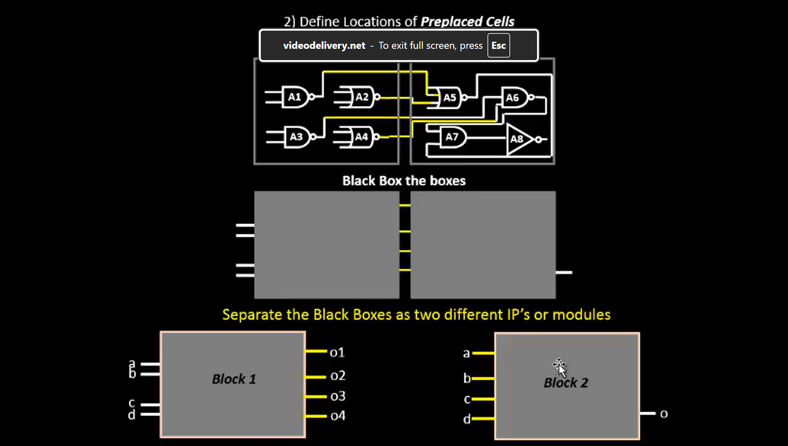

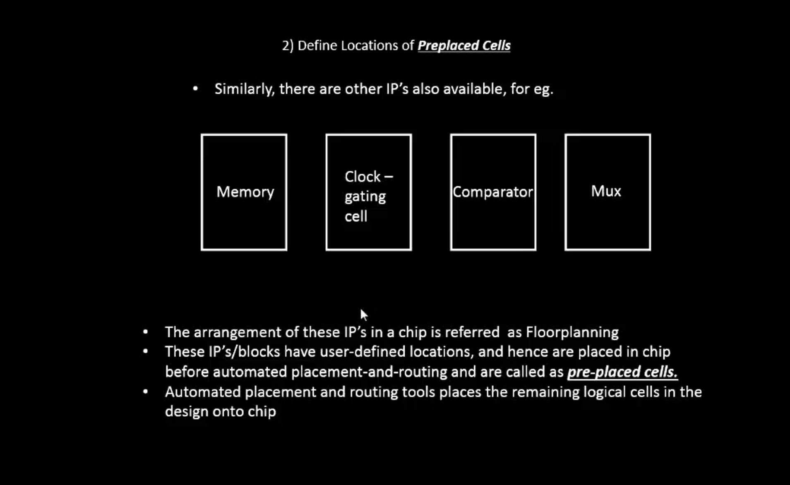

After the locations of important blocks are established, the automated placement process can arrange the remaining logical cells around them.

---

## 3.6 Decoupling Capacitors

Digital circuits draw current during switching activity.

During a `0 → 1` transition, charge is required to charge the capacitances associated with the circuit. During a `1 → 0` transition, the stored charge is discharged through the ground network.

The power-distribution network contains resistance and inductance. Therefore, a sudden change in current can produce a temporary voltage disturbance.

A simplified representation is:

```text
              VDD
               |
           R / L Network
               |
               +-------- Circuit
               |
              Cd
               |
              VSS
```

Here, `Cd` represents a decoupling capacitor.

The decoupling capacitor provides a local source of charge during a transient switching event. The power-distribution network subsequently replenishes the charge stored in the capacitor.

The switching-current and power-network relationship is illustrated below.

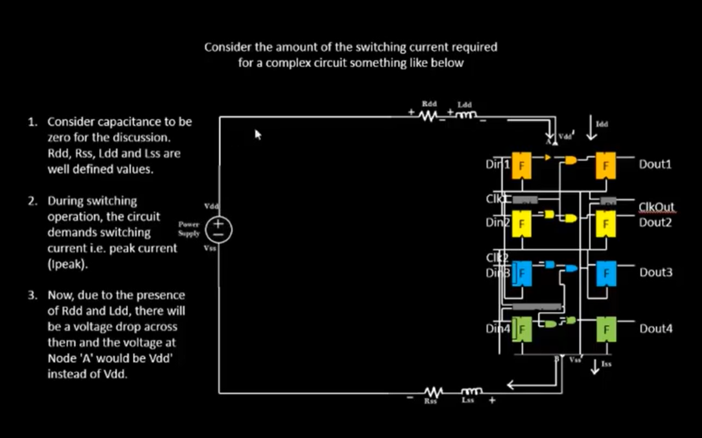

### Importance of Decoupling

Without adequate local decoupling:

```text
Switching Activity
        |
        v
Large Current Demand
        |
        v
Voltage Disturbance
        |
        v
Reduced Supply Voltage
        |
        v
Possible Reduction in Noise Margin
```

With decoupling:

```text
Switching Event
      |
      v
Local Charge Supplied by Capacitor
      |
      v
Reduced Short-Term Supply Disturbance
      |
      v
Power Network Recharges Capacitor
```

---

## 3.7 Noise Margin

Noise margin represents the amount of unwanted voltage disturbance that a digital circuit can tolerate while still correctly recognizing a logic level.

A digital signal must remain within appropriate voltage ranges for the receiving circuit to interpret it reliably.

A simplified representation is:

```text
Voltage
  |
  |        Logic 1
  |-----------------------
  |
  |       Noise Margin
  |
  |-----------------------
  |        Logic 0
  |
  +-----------------------> Time
```

If a voltage disturbance becomes large enough to move a signal outside the expected logic range, incorrect logic interpretation can occur.

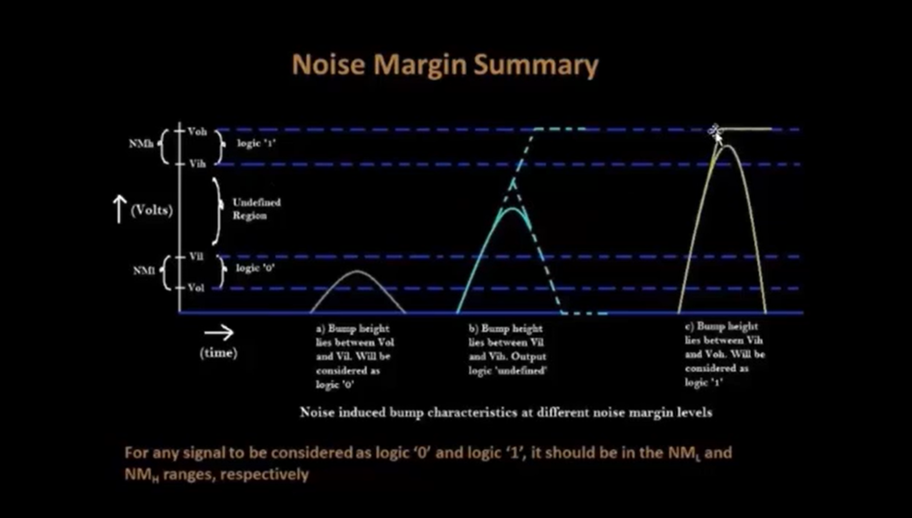

---

## 3.8 Ground Bounce

Ground bounce is a temporary disturbance in the local ground voltage caused by rapid changes in current through the parasitic resistance and inductance of the power and ground network.

The basic sequence is:

```text
Multiple Cells Switch
        |
        v
Transient Current
        |
        v
Parasitic Resistance and Inductance
        |
        v
Ground Voltage Disturbance
        |
        v
Ground Bounce
```

Ground bounce can affect the voltage levels observed by nearby circuits and can therefore influence signal integrity.

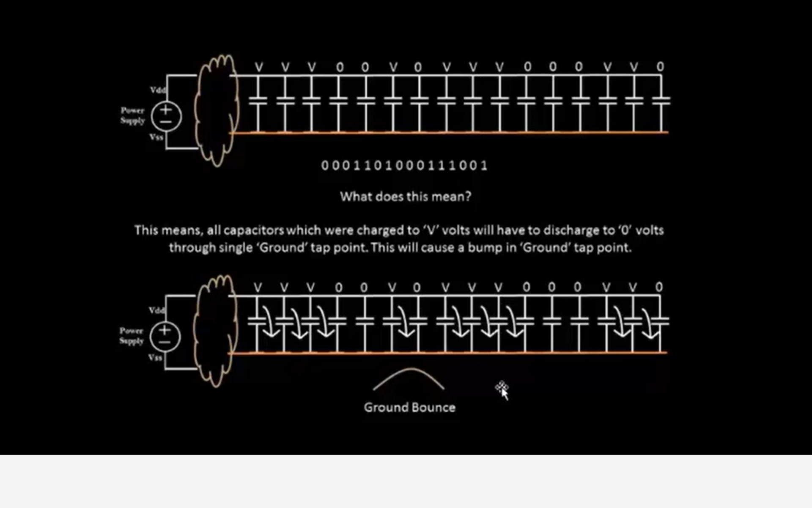

---

## 3.9 Voltage Droop

Voltage droop is a temporary reduction in the local supply voltage caused by increased current demand and the parasitic resistance and inductance of the supply network.

The sequence can be represented as:

```text
Switching Activity
        |
        v
Increased Current Demand
        |
        v
Voltage Drop Across Power Network
        |
        v
Lower Local VDD
        |
        v
Possible Reduction in Noise Margin
```

Decoupling capacitors help provide local charge during such transient conditions.

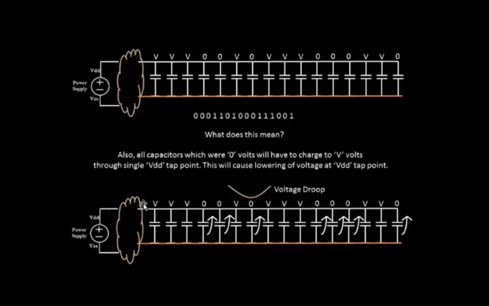

---

## 3.10 Pin Placement

Pins provide the physical connections between the internal circuit and external signals.

Pin placement must therefore be considered during floorplanning.

It can influence:

* routing distance
* routing congestion
* signal accessibility
* timing
* power distribution

The physical arrangement includes signal pins as well as supply connections such as `VDD` and `VSS`.

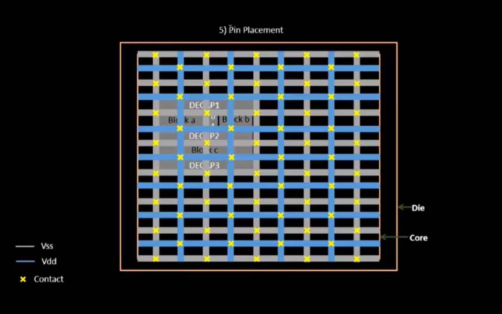

---

## 3.11 Logical Cell Placement Blockage

A placement blockage is a region in which standard cells are restricted or prevented from being placed.

Placement blockages can be used to reserve physical regions for:

* macros
* pins
* routing
* power structures
* other physical-design requirements

A simplified representation is:

```text
+--------------------------------+
|                                |
|      Standard Cell Region      |
|                                |
|     +--------------------+     |
|     |   BLOCKED REGION   |     |
|     |                    |     |
|     +--------------------+     |
|                                |
+--------------------------------+
```

Placement blockages provide additional control over the physical organization of the design.

---

## 3.12 Floorplan Flow Using OpenLane

The physical-design flow can be viewed as:

```text
RTL
 |
 v
Synthesis
 |
 v
Floorplanning
 |
 v
Placement
 |
 v
Clock Tree Synthesis
 |
 v
Routing
 |
 v
Final Physical Design
```

The floorplanning stage establishes the physical framework required for the later stages.

A general OpenLane floorplanning flow involves:

```text
Design Preparation
        |
        v
Technology and Library Setup
        |
        v
Synthesis
        |
        v
Floorplan Generation
        |
        v
Floorplan Inspection
        |
        v
Placement
```

The exact command sequence depends on the OpenLane version and environment being used.

---

## 3.13 Reviewing Floorplan Files

After floorplanning, the generated physical-design files can be inspected to understand the resulting physical implementation.

Important information includes:

* core dimensions
* die dimensions
* utilization
* aspect ratio
* pin locations
* pre-placed blocks
* standard-cell rows
* placement blockages
* power-related structures

Common physical-design file formats include:

```text
LEF
DEF
ODB
Verilog
SDC
Reports
```

The purpose of reviewing these files is to connect the logical design information with its physical representation.

---

## 3.14 Viewing the Floorplan in Magic

Magic is used to view and inspect the physical layout.

The layout-viewing flow uses the technology file together with the LEF and DEF information.

The command used for the floorplan visualization is:

```bash
magic -T /home/vsduser/Desktop/work/tools/openlane_working_dir/pdks/sky130A/libs.tech/magic/sky130A.tech \
  lef read ../../tmp/merged.lef \
  lef def read picorv32a.floorplan.def &
```

### Command Breakdown

```text
magic
```

Launches the Magic layout tool.

```text
-T /home/vsduser/Desktop/work/tools/openlane_working_dir/pdks/sky130A/libs.tech/magic/sky130A.tech
```

Specifies the SKY130A technology file.

```text
lef read ../../tmp/merged.lef
```

Loads the merged LEF containing the physical information required for the design.

```text
lef def read picorv32a.floorplan.def
```

Loads the floorplan DEF containing the physical floorplan information.

```text
&
```

Runs the command in the background.

The technology-file path is specific to the workshop environment and represents the SKY130A technology setup used for the design.

Magic provides a visual representation of the physical layout, allowing the floorplan and its physical organization to be inspected.

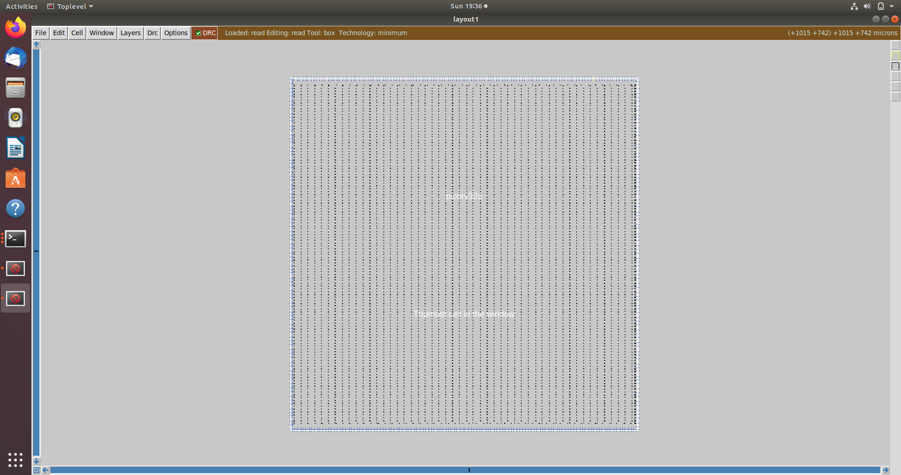

---

# 4. SK2 — Placement

Placement is the stage in which the logical cells from the synthesized netlist are assigned physical locations within the core.

The placement process must consider multiple physical objectives:

```text
Cell Density
     +
Wire Length
     +
Capacitance
     +
Timing
     +
Congestion
     +
Routability
```

---

## 4.1 Netlist Binding and Initial Placement

The synthesized netlist contains logical cells and the connections between them.

During placement, these logical cells are mapped to physical locations inside the core.

A simplified representation is:

```text
Logical Netlist

A ----+
      |
      AND ---- OUT
B ----+

        |
        v

Physical Placement

+--------------------------------+
|                                |
|       AND                      |
|        |                       |
|    A --+-- B                   |
|             \                  |
|              \---- OUT         |
|                                |
+--------------------------------+
```

The initial placement provides the starting physical arrangement of the standard cells.

The placement image from the practical work is shown below.

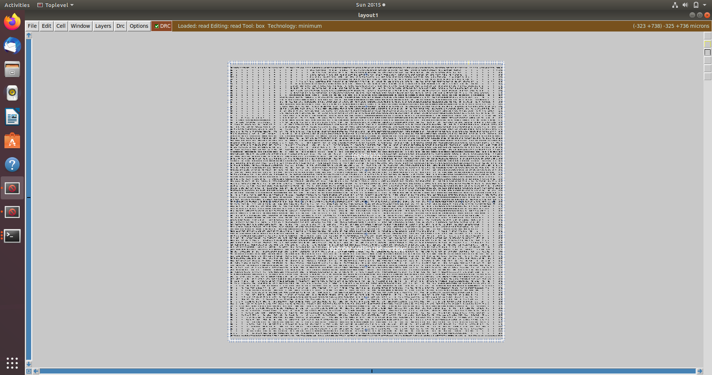

---

## 4.2 Placement Optimization

Initial placement is further optimized to improve the physical characteristics of the design.

One important consideration is the estimated wire length.

If two connected cells are placed far apart:

```text
Cell A --------------------------- Cell B
```

the interconnect becomes longer.

Longer interconnect can contribute to:

* increased resistance
* increased capacitance
* increased delay
* increased routing demand

Therefore, placement optimization attempts to position connected cells efficiently while also satisfying density, timing and congestion requirements.

---

## 4.3 Final Placement Optimization

Initial placement does not necessarily provide the final physical arrangement.

The placement is refined using several objectives:

```text
Initial Placement
       |
       v
Placement Evaluation
       |
       v
Wire-Length Optimization
       |
       v
Density and Congestion Analysis
       |
       v
Timing Consideration
       |
       v
Final Placement
```

A placement that minimizes wire length alone may still produce routing congestion. Therefore, several physical constraints must be considered together.

---

## 4.4 Need for Libraries and Characterization

Physical-design tools require detailed information about the standard cells used in the design.

A standard-cell library can contain information related to:

* logical function
* physical dimensions
* pin locations
* timing characteristics
* power characteristics
* capacitance
* drive strength
* technology information

A simplified representation is:

```text
STANDARD CELL LIBRARY
        |
        +---- Inverter
        |
        +---- NAND
        |
        +---- NOR
        |
        +---- Buffer
        |
        +---- Multiplexer
        |
        +---- Flip-Flop
```

Characterization provides the electrical and timing information required by implementation and analysis tools.

---

## 4.5 Congestion-Aware Placement Using RePlAce

Congestion occurs when many nets require routing resources in the same physical region.

A simplified representation is:

```text
              Many Nets
                 |
                 v

+--------------------------------+
| \ | / \ | / \ | / \ | / \ | / |
|  \|/   \|/   \|/   \|/   \|/  |
|                                |
|          CONGESTION            |
|                                |
+--------------------------------+
```

A placement may appear acceptable from a cell-density perspective while still being difficult to route.

Therefore, congestion must be considered during placement optimization.

**RePlAce** is a placement engine used in the OpenROAD/OpenLane physical-design flow. It is associated with placement optimization while considering physical objectives such as density, wire length and routability.

The goal is to obtain a placement that is suitable for the subsequent routing stages.

---

# 5. SK3 — Standard Cell Design Flow

Standard cells are reusable building blocks used in digital integrated circuits.

Examples include:

* Inverters
* NAND gates
* NOR gates
* Buffers
* Multiplexers
* Flip-flops

Before standard cells can be used effectively in a digital implementation flow, they must be designed, laid out and characterized.

The overall cell-design flow can be represented as:

```text
Technology Information
        |
        v
Circuit Design
        |
        v
Layout Design
        |
        v
Parasitic Extraction
        |
        v
Simulation
        |
        v
Characterization
        |
        v
Standard Cell Library
```

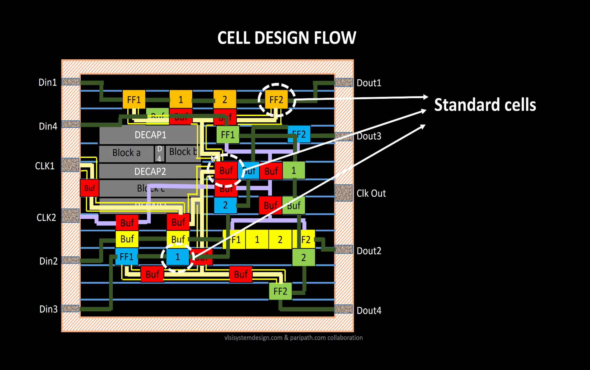

---

## 5.1 Inputs for Cell Design Flow

The standard-cell design flow requires several important inputs.

### Process Design Kit — PDK

The PDK provides technology-specific information required for circuit and layout design.

### DRC Rules

Design Rule Checking rules define the geometric constraints that the layout must satisfy.

### LVS Rules

Layout Versus Schematic rules are used to verify that the physical layout corresponds to the intended circuit.

### SPICE Models

SPICE models describe transistor behavior and are used for circuit simulation.

### Library and User-Defined Specifications

These define requirements related to the standard-cell library and the intended implementation.

The inputs can be summarized as:

```text
                CELL DESIGN FLOW
                       |
       +---------------+---------------+
       |               |               |
      PDK          DRC / LVS       SPICE Models
       |               |               |
       +---------------+---------------+
                       |
          Library Specifications
                       |
                       v
                 Cell Design
```

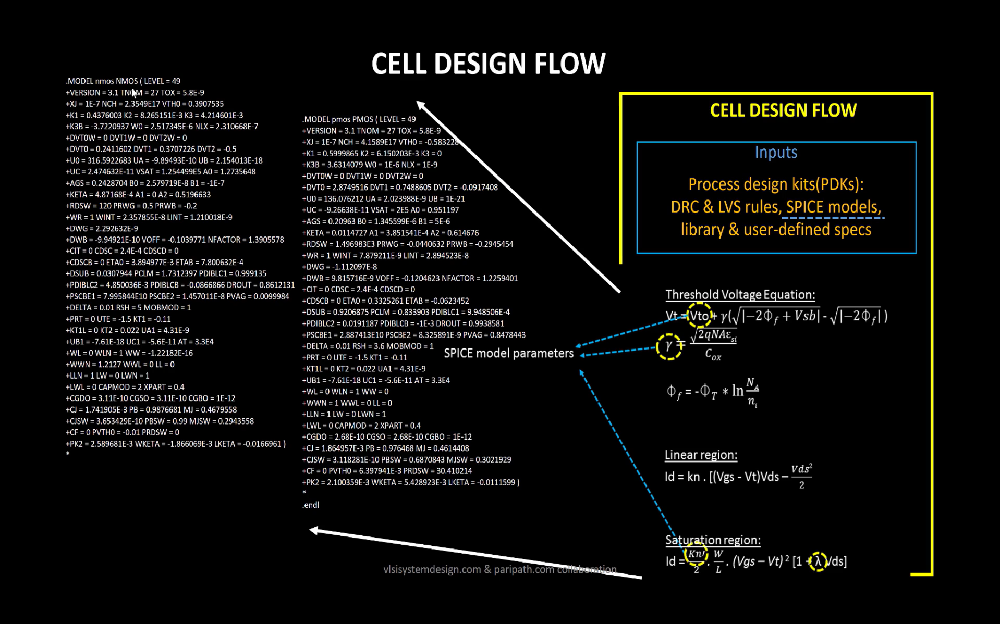

---

## 5.2 Circuit Design

The circuit-design stage develops the transistor-level circuit required to implement the desired logical function.

For a CMOS inverter, a simplified representation is:

```text
              VDD
               |
              PMOS
               |
               +------ OUT
               |
              NMOS
               |
              VSS

               |
              IN
```

The circuit must satisfy the required logical and electrical behavior.

Important parameters include:

* functionality
* power
* delay
* transition time
* drive capability

Circuit simulation is used to verify the electrical behavior before the physical layout is finalized.

The cell-design flow also introduces techniques such as **Euler paths** and **stick diagrams**, which assist in planning the transistor arrangement and physical layout.

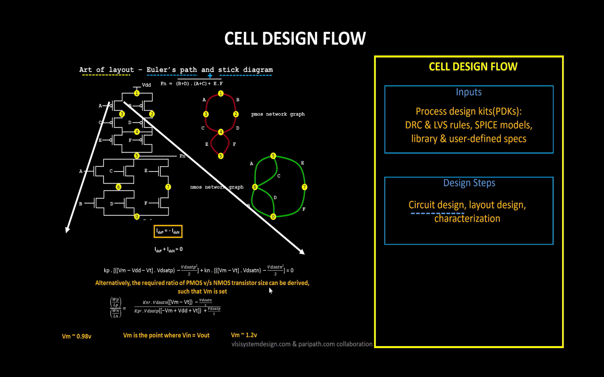

---

## 5.3 Layout Design

After circuit design, the physical layout of the cell is created.

The layout consists of physical structures such as:

* diffusion regions
* polysilicon
* contacts
* metal layers
* wells
* power rails
* signal connections

A simplified standard-cell structure is:

```text
+--------------------------------------+
|              VDD RAIL                |
|--------------------------------------|
|                                      |
|        TRANSISTOR / ROUTING          |
|              REGION                  |
|                                      |
|--------------------------------------|
|              VSS RAIL                |
+--------------------------------------+
```

Standard cells are generally designed with compatible dimensions so that they can be placed together in rows.

The layout must satisfy the physical design rules specified by the technology.

---

## 5.4 Typical Characterization Flow

After circuit and layout design, the cell is characterized to obtain the information required by the standard-cell library.

A simplified characterization flow is:

```text
Cell Specification
        |
        v
Circuit Design
        |
        v
Layout Design
        |
        v
Parasitic Extraction
        |
        v
Post-Layout Simulation
        |
        v
Timing Characterization
        |
        v
Power Characterization
        |
        v
Library Data
```

Characterization generates information that can later be used by synthesis, placement and timing-analysis tools.

---

# 6. SK4 — Timing Characterization

Timing characterization determines how a standard cell responds to input transitions and different output loading conditions.

The timing behavior of a cell depends on parameters such as:

* input transition
* output load
* input pin
* output pin
* rise or fall direction
* operating conditions

Two important timing concepts covered in this module are:

```text
Propagation Delay
        +
Transition Time
```

---

## 6.1 Timing Threshold Definitions

Timing measurements require defined voltage thresholds so that the same points on a waveform can be used consistently.

The threshold definitions include:

```text
slew_low_rise_thr
slew_high_rise_thr

slew_low_fall_thr
slew_high_fall_thr

in_rise_thr
in_fall_thr

out_rise_thr
out_fall_thr
```

The threshold levels are used to determine the input and output transition characteristics.

For a rising waveform:

```text
Voltage

VDD |                         ______
    |                      __/
80% |---------------------/
    |                   /
50% |------------------/
    |                /
20% |---------------/
    |             /
VSS |____________/
    +-----------------------------> Time
```

For a falling waveform:

```text
Voltage

VDD |----------------
    |               \
80% |----------------\
    |                 \
50% |------------------\
    |                   \
20% |-------------------\
    |                     \
VSS |_____________________\
    +-----------------------------> Time
```

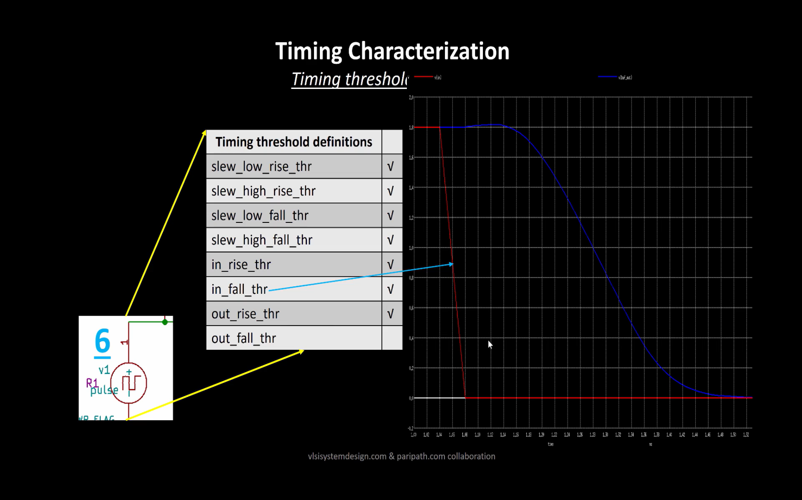

---

## 6.2 Propagation Delay

Propagation delay is the time difference between a defined transition at the input and the corresponding transition at the output.

A simplified representation is:

```text
Input
        ______
       /
------/

          |<---- Propagation Delay ---->|

Output
            ______
           /
----------/
```

Propagation delay can be characterized separately for different input and output transition combinations, such as:

```text
Input Rise  → Output Rise
Input Fall  → Output Fall
```

The measured delay can also depend on input slew and output load.

Therefore, standard-cell libraries contain timing information under different conditions rather than relying on one fixed delay value.

---

## 6.3 Transition Time

Transition time represents the time taken by a signal to move between two specified voltage thresholds.

For a rising signal:

```text
Voltage

VDD |                  /
    |                 /
80% |----------------/
    |              /
20% |-------------/
    |           /
VSS |__________/
    +----------------------> Time
              <---->
          Rise Transition
```

For a falling signal:

```text
Voltage

VDD |---------
    |        \
80% |---------\
    |          \
20% |-----------\
    |            \
VSS |_____________\
    +----------------------> Time
               <---->
           Fall Transition
```

The transition-time characterization in the practical work shows the defined voltage thresholds and the measured input and output slew values.

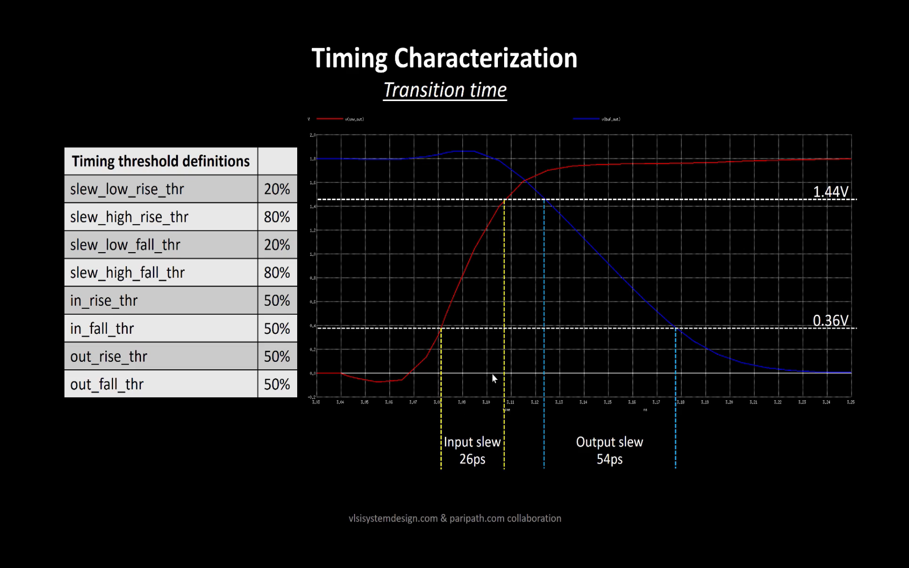

### Propagation Delay vs Transition Time

| Parameter             | Meaning                                                                         |
| --------------------- | ------------------------------------------------------------------------------- |
| **Propagation Delay** | Time between a defined input transition and the corresponding output transition |
| **Transition Time**   | Time taken by a signal to move between two defined voltage thresholds           |

Both parameters are important for understanding the timing behavior of a standard cell.

---

# 7. Module 2 Practical Flow

The complete Module 2 flow can be summarized as:

```text
                    SYNTHESIZED NETLIST
                            |
                            v
                    +---------------+
                    | FLOORPLANNING |
                    +---------------+
                            |
            +---------------+---------------+
            |               |               |
            v               v               v
       Core / Die      Pre-Placed       Pin Placement
       Dimensions         Cells
            |               |               |
            +---------------+---------------+
                            |
                            v
                    POWER INTEGRITY
                            |
              +-------------+-------------+
              |             |             |
              v             v             v
           Decoupling   Ground Bounce  Voltage Droop
           Capacitors
              |
              v
         Noise Margin
              |
              v
        FLOORPLAN REVIEW
              |
              v
             MAGIC
              |
              v
       INITIAL PLACEMENT
              |
              v
    PLACEMENT OPTIMIZATION
              |
        +-----+-----+
        |           |
        v           v
    Wire Length  Congestion
        |           |
        +-----+-----+
              |
              v
       FINAL PLACEMENT
              |
              v
    STANDARD CELL LIBRARIES
              |
              v
       CELL DESIGN FLOW
              |
       +------+------+
       |             |
       v             v
 Circuit Design   Layout Design
       |             |
       +------+------+
              |
              v
        CHARACTERIZATION
              |
              v
     TIMING CHARACTERIZATION
              |
       +------+------+
       |             |
       v             v
Propagation      Transition
  Delay             Time
```

---

# 8. Key Learnings

### Floorplanning

I learned that floorplanning establishes the physical framework of a chip. Core size, die size, utilization, aspect ratio, pre-placed cells, pin locations and placement blockages all influence the later stages of physical design.

### Utilization and Aspect Ratio

I understood how the area occupied by the netlist is related to the available core area through the utilization factor, and how the height-to-width relationship determines the aspect ratio of the core.

### Pre-Placed Cells

I learned that important blocks and IPs need suitable physical locations before automated standard-cell placement because their locations influence the remaining placement and routing.

### Power Integrity

The study of switching current, decoupling capacitors, noise margin, ground bounce and voltage droop helped me understand how switching activity can affect the supply and ground networks.

### Placement

I learned that placement is not simply the process of assigning locations to cells. Wire length, capacitance, density, timing and congestion must all be considered.

### Standard-Cell Libraries

I understood why physical-design tools require detailed standard-cell library information, including physical, logical, timing and power characteristics.

### Cell Design

I learned that a standard cell passes through circuit design, layout design, simulation and characterization before the required library information is generated.

### Timing Characterization

I learned how timing thresholds are defined and how propagation delay and transition time describe different aspects of a cell's timing behavior.

---

# 9. Conclusion

Module 2 provided a detailed understanding of important physical-design concepts, beginning with chip floorplanning and continuing through placement, standard-cell design and timing characterization.

I learned how the core and die are defined, how utilization and aspect ratio describe the physical organization of the design, and why pre-placed cells and pin locations are important during floorplanning.

The concepts of decoupling capacitors, noise margin, ground bounce and voltage droop helped me understand the effect of switching activity on the power and ground networks.

The placement section showed how logical cells are converted into physical locations and how wire length, capacitance, timing, density and congestion influence placement optimization.

The standard-cell design section provided an understanding of the inputs required for cell design, followed by circuit design, layout design and characterization.

Finally, timing characterization introduced timing thresholds, propagation delay and transition time, connecting the electrical behavior of standard cells with the timing information used by digital implementation tools.

Overall, this module helped establish a clear connection between the **logical representation of a digital design** and its **physical implementation**, providing a stronger understanding of the stages involved in transforming a synthesized design into a physical layout.

---
