# PD_MODULE_3 
# Design Library Cell Using Magic Layout and ngspice Characterization 
 
## Overview 
 
This module explores the physical design and electrical characterization of a CMOS inverter using the SKY130 Process Design Kit (PDK). It connects semiconductor device fundamentals with the practical steps involved in creating a layout, understanding process layers, checking layout geometry, extracting a circuit representation, and simulating its time-domain response. 
 
The work begins with CMOS fabrication concepts and the complementary operation of PMOS and NMOS transistors. It then moves through the SKY130 technology setup in Magic, construction and inspection of a custom inverter layout, Design Rule Checking (DRC), extraction of layout information, SPICE deck preparation, and transient analysis using ngspice. 
 
Timing characteristics, including rise time, fall time, cell rise delay, and cell fall delay, are examined from the simulated response. 
 
The central design example is a CMOS inverter, a fundamental digital standard cell whose behavior illustrates the relationship between transistor-level design, physical layout, parasitic effects, and circuit performance. 
 
--- 
 
## Contents 
 
1. [Introduction](#introduction) 
2. [Objectives](#objectives) 
3. [Semiconductor Fabrication and CMOS Technology](#semiconductor-fabrication-and-cmos-technology) 
4. [CMOS Inverter: Structure and Operation](#cmos-inverter-structure-and-operation) 
5. [Tools and Technology Files](#tools-and-technology-files) 
6. [The 16-Mask CMOS Fabrication Process](#the-16-mask-cmos-fabrication-process) 
7. [OpenLane Flow Configuration](#openlane-flow-configuration) 
8. [SKY130 Technology Setup in Magic](#sky130-technology-setup-in-magic) 
9. [Custom CMOS Inverter Layout](#custom-cmos-inverter-layout) 
10. [Physical Layers and Layout Inspection](#physical-layers-and-layout-inspection) 
11. [Layout Extraction and SPICE Generation](#layout-extraction-and-spice-generation) 
12. [SPICE Deck and Device Models](#spice-deck-and-device-models) 
13. [Transient Analysis with ngspice](#transient-analysis-with-ngspice) 
14. [Rise Time and Fall Time](#rise-time-and-fall-time) 
15. [Cell Rise Delay and Cell Fall Delay](#cell-rise-delay-and-cell-fall-delay) 
16. [Design Rule Checking (DRC)](#design-rule-checking-drc) 
17. [Results and Observations](#results-and-observations) 
18. [Conclusion](#conclusion) 

 
--- 
 
## Introduction 
 
Physical design converts a circuit's logical and electrical description into geometric shapes on semiconductor layers. The layout defines where devices are formed and how their terminals are interconnected. Since fabrication follows physical patterns, the geometry must satisfy the manufacturing constraints of the selected process. 
 
CMOS (Complementary Metal-Oxide-Semiconductor) technology uses complementary NMOS and PMOS transistors to implement logic functions. A CMOS inverter is a basic logic cell: it produces a high output for a low input and a low output for a high input. 
 
Although its logical function is simple, its physical implementation involves transistor regions, gate material, contacts, metal routing, wells, supply connections, and process-specific geometric rules. 
 
The SKY130 PDK provides technology definitions and device information for designing with the SKY130 process. Magic uses the technology definitions to create and inspect layout geometry and perform design-rule checks. 
 
Layout extraction produces an electrical representation that can be used in a SPICE simulation. ngspice then evaluates the circuit response over time, making it possible to study switching transitions and timing parameters. 
 
This module follows that flow from CMOS fundamentals to layout-level simulation and characterization. 
 
--- 
 
## Objectives 
 
- Understand the fundamentals of semiconductor fabrication and CMOS technology. 
- Explain the complementary operation of PMOS and NMOS transistors. 
- Understand the structure and Boolean function of a CMOS inverter. 
- Identify the role of the SKY130 Process Design Kit and technology file. 
- Set up the Magic layout environment for the selected technology. 
- Create and inspect a custom CMOS inverter layout. 
- Recognize polysilicon, active, contact, and metal interconnect layers. 
- Understand Design Rule Checking and interpret layout violations. 
- Extract layout connectivity and parasitic information. 
- Prepare a SPICE representation for circuit-level simulation. 
- Run transient analysis in ngspice and inspect input/output waveforms. 
- Understand rise time, fall time, and propagation delay. 
- Relate physical geometry and parasitic effects to circuit timing. 
 
--- 
 
## Semiconductor Fabrication and CMOS Technology 
 
### Semiconductor Devices 
 
A semiconductor is a material whose electrical conductivity lies between that of a conductor and an insulator and can be controlled through doping, electric fields, temperature, and illumination. 
 
Silicon is widely used in integrated-circuit manufacturing because its material properties and mature fabrication processes support dense, reliable electronic devices. 
 
Doping introduces controlled concentrations of impurities into semiconductor material. 
 
- **N-type semiconductor:** Contains donor impurities that contribute electrons as majority carriers. 
- **P-type semiconductor:** Contains acceptor impurities that create holes as majority carriers. 
 
These regions form the basis of MOS transistor structures. 
 
### MOSFET Fundamentals 
 
A MOSFET (Metal-Oxide-Semiconductor Field-Effect Transistor) is a voltage-controlled device. Its gate voltage controls the formation of a conductive channel between the source and drain terminals. 
 
A MOSFET has four principal terminals: 
 
- **Gate (G):** Controls channel formation through the applied electric field. 
- **Drain (D):** One terminal of the channel through which current flows. 
- **Source (S):** The other channel terminal. 
- **Body (B):** The semiconductor region in which the device is formed. 
 
The operating behavior depends on device type, terminal voltages, dimensions, threshold voltage, and process parameters. 
 
### NMOS and PMOS Transistors 
 
**NMOS** devices use an electron-conduction channel. In a typical enhancement-mode NMOS transistor, a sufficiently positive gate-to-source voltage forms a channel and allows current to flow between drain and source. 
 
**PMOS** devices use a hole-conduction channel. In a typical enhancement-mode PMOS transistor, a sufficiently negative gate-to-source voltage relative to its source turns the device on. 
 
In CMOS logic, the NMOS transistor commonly forms the pull-down network, while the PMOS transistor forms the pull-up network. Their complementary control reduces static power consumption in ideal steady-state logic, apart from leakage and other non-ideal effects. 
 
### CMOS Fabrication 
 
CMOS fabrication builds transistor structures and interconnects through a sequence of process operations. The exact sequence depends on the fabrication technology and its process integration. 
 
Typical operations include: 
 
1. Wafer preparation and surface cleaning. 
2. Formation of wells and isolation regions. 
3. Deposition or growth of thin films. 
4. Photolithography to pattern selected regions. 
5. Etching to remove material from exposed regions. 
6. Doping or implantation to establish device regions. 
7. Gate, spacer, source, and drain formation. 
8. Contact formation and interconnect patterning. 
9. Passivation and final processing. 
 
--- 
 
## CMOS Inverter: Structure and Operation 
 
### Inverter Structure 
 
A CMOS inverter consists of one PMOS transistor and one NMOS transistor. 
 
The PMOS source is connected to the positive supply, VDD, and the NMOS source is connected to ground, VSS or GND. 
 
Their gates are connected together to form the input. Their drains are connected together to form the output. 
 
The PMOS transistor provides a path from VDD to the output, while the NMOS transistor provides a path from the output to ground. 
 
### Circuit Operation 
 
**Input LOW (logic 0):** 
 
- The PMOS transistor is ON. 
- The NMOS transistor is OFF. 
- The output is pulled toward VDD and represents logic 1. 
 
**Input HIGH (logic 1):** 
 
- The PMOS transistor is OFF. 
- The NMOS transistor is ON. 
- The output is pulled toward ground and represents logic 0. 
 
### Truth Table 
 
| Input A | PMOS | NMOS | Output Y | 
|---|---|---|---| 
| 0 | ON | OFF | 1 | 
| 1 | OFF | ON | 0 | 
 
The Boolean expression for the inverter is: 
 
$$ 
Y = \overline{A} 
$$ 
 
### Voltage Transfer and Switching 
 
The inverter's voltage-transfer characteristic describes the relationship between its input voltage and output voltage. 
 
At a low input voltage, the output is near the supply voltage. At a high input voltage, the output is near ground. Between these regions, both devices may conduct during the switching transition. 
 
The switching threshold depends on transistor characteristics, device sizing, supply voltage, and process parameters. 
 
The inverter's dynamic response also depends on the load and parasitic capacitances. 
 
--- 
 
## Tools and Technology Files 
 
### Magic VLSI Layout Tool 
 
Magic is a VLSI layout editor used to create, view, and verify integrated-circuit layouts. 
 
With a compatible technology file loaded, Magic interprets layout layers and checks geometric constraints according to the selected process rules. 
 
In this module, Magic is used to: 
 
- Create and edit the CMOS inverter layout. 
- Inspect device regions and interconnect geometry. 
- Examine individual physical layers. 
- Run Design Rule Checks. 
- Extract layout connectivity and parasitic information. 
 
### SKY130 Process Design Kit (PDK) 
 
A Process Design Kit provides the technology-specific information required to design and verify circuits for a fabrication process. 
 
The SKY130 PDK includes layer definitions, design rules, device information, and model files for compatible design and simulation tools. 
 
A consistent PDK and tool configuration is essential because layer names, geometry constraints, device parameters, and model references must match the selected process. 
 
### Technology File 
 
The technology file describes how the layout tool interprets the process layers. 
 
It defines layer mappings and technology-specific constraints used during editing and verification. 
 
### ngspice 
 
ngspice is a SPICE-based circuit simulator. It evaluates electrical behavior using a circuit netlist, device models, sources, and analysis commands. 
 
Transient analysis is used in this module to observe the inverter's output as its input changes with time. 
 
### OpenLane 
 
OpenLane is an automated digital implementation flow that integrates tools for physical design. 
 
Its flow configuration controls the execution of implementation steps and related settings. The OpenLane screenshot in this module documents a flow configuration activity. 
 
--- 
 
## The 16-Mask CMOS Fabrication Process 
 
Fabricating a CMOS inverter begins with a bare silicon wafer and gradually builds the transistor structures and interconnections required for circuit operation. 
 
The process involves a sequence of photolithography, oxidation, doping, deposition, etching, and metallization operations. Each mask defines a particular pattern that is transferred onto the wafer during fabrication. 
 
The complete process can be divided into eight major stages, covering the formation of the active regions, wells, transistor gates, source and drain regions, local interconnects, and higher-level metal layers. 
 
The following sections describe the major fabrication stages and explain how the individual operations contribute to the formation of a CMOS integrated circuit. 
 
### 1. Substrate Selection 
 
The fabrication process begins with a silicon wafer that serves as the foundation for the integrated circuit. 
 
For the process described in the reference example, a **p-type silicon substrate** is selected. The substrate provides the physical base on which the transistor structures and other semiconductor regions are formed. 
 
The electrical properties of the substrate depend on its doping concentration and crystal orientation. 
 
The reference example specifies a relatively lightly doped substrate with a concentration on the order of \(10^{15}\ \text{cm}^{-3}\) and a `<100>` crystal orientation. 
 
The `<100>` orientation is commonly used in silicon fabrication because of its favorable properties for forming silicon–oxide interfaces. 
 
Before the fabrication sequence begins, the wafer is cleaned to remove contaminants and prepare the surface for subsequent processing. 
 
**Purpose of this stage:** 
 
- Provides the semiconductor foundation for the CMOS devices. 
- Establishes the initial substrate doping and crystal orientation. 
- Prepares a clean surface for the formation of active regions and wells. 
 
### 2. Creating the Active Region (Mask 1) 
 
The first mask defines the active regions in which transistor structures will eventually be formed. 
 
A stack of silicon dioxide (SiO₂), silicon nitride (Si₃N₄), and photoresist is prepared on the wafer surface. 
 
In the reference process, the approximate thicknesses are: 
 
- Silicon dioxide: 40 nm 
- Silicon nitride: 80 nm 
- Photoresist: 1 µm 
 
The photoresist is exposed through **Mask 1** and developed to create the desired pattern. 
 
The patterned oxide and nitride layers protect selected portions of the wafer during the subsequent oxidation process. 
 
Field oxide is then grown in the exposed regions using **LOCOS (Local Oxidation of Silicon)**. 
 
During LOCOS oxidation, oxide grows laterally beneath the edge of the nitride mask. This produces a tapered region commonly known as the **bird's beak**. 
 
The bird's-beak effect is a characteristic feature of LOCOS isolation and results from the lateral encroachment of oxide beneath the masking structure. 
 
After oxidation, the silicon nitride layer is removed, leaving the intended active regions separated by field oxide. 
 
**Purpose of this stage:** 
 
- Defines the regions reserved for transistor formation. 
- Creates field oxide for electrical isolation between active areas. 
- Establishes the initial geometry of the device regions. 
 
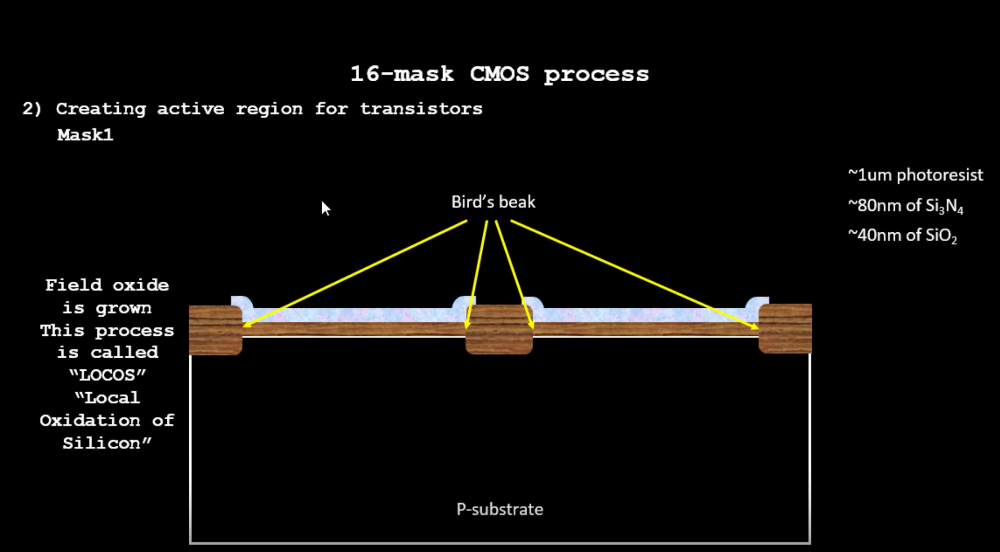 
 
### 3. N-Well and P-Well Formation (Mask 2) 
 
CMOS technology requires both NMOS and PMOS transistors on the same integrated circuit. 
 
These transistors are formed in semiconductor regions with different doping types. 
 
In the reference process, **Mask 2** is used during the well-formation stage to define the regions for the required well implants. 
 
Boron is used to form the p-well, while phosphorus is used to form the n-well. 
 
The wafer undergoes ion implantation, introducing dopant atoms into the selected semiconductor regions. 
 
Following implantation, a high-temperature drive-in diffusion process redistributes the dopants and helps activate them electrically. 
 
This produces the n-well and p-well regions required for the formation of complementary MOS transistors. 
 
The NMOS transistor is formed in the p-well region, while the PMOS transistor is formed in the n-well region. 
 
**Purpose of this stage:** 
 
- Establishes the semiconductor regions needed for NMOS and PMOS devices. 
- Provides the appropriate doping environments for complementary transistor operation. 
- Supports the formation of CMOS devices on the same wafer. 
 
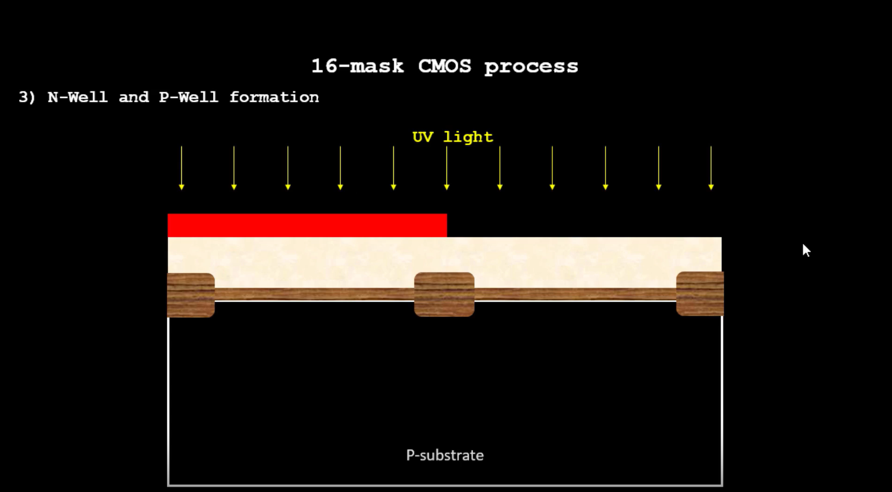 
 
### 4. Gate Formation (Masks 4, 5, and 6) 
 
The gate structure controls the formation of the conducting channel between the source and drain terminals of a MOS transistor. 
 
Gate formation begins with surface preparation and threshold-voltage adjustment. 
 
A sacrificial oxide layer may be used during the preparation process and subsequently removed using dilute hydrofluoric acid (HF). 
 
Implantation steps are used to adjust the threshold-voltage characteristics of the transistor devices. 
 
In the reference process, Masks 4 and 5 are associated with the threshold-adjustment implants for the transistor regions. 
 
A thin gate oxide is formed over the channel region, followed by the deposition of polysilicon. 
 
The polysilicon is doped to reduce its electrical resistance. 
 
**Mask 6** defines the gate pattern. The exposed polysilicon is etched to create the final gate structures. 
 
The gate is positioned over the channel region between the source and drain, allowing the applied gate voltage to control channel conduction. 
 
**Purpose of this stage:** 
 
- Establishes the gate dielectric and gate electrode. 
- Defines the channel-control structure of the MOS transistor. 
- Helps determine the transistor's electrical characteristics, including threshold voltage and channel dimensions. 
 
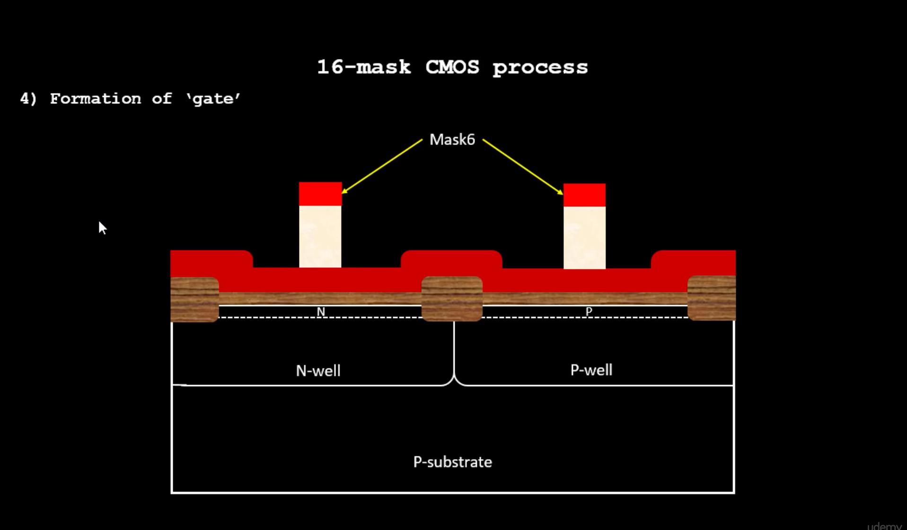 
 
### 5. Lightly Doped Drain (LDD) Formation (Masks 7 and 8) 
 
Lightly Doped Drain (LDD) structures are introduced to improve transistor behavior, particularly in devices where strong electric fields occur near the drain region. 
 
As transistor dimensions decrease, the electric field near the drain can become sufficiently strong to produce undesirable effects. 
 
Two important effects are: 
 
**Hot-electron effect** 
 
Carriers accelerated by a strong electric field can gain enough energy to damage the device structure or become trapped in the gate dielectric, potentially degrading transistor performance over time. 
 
**Short-channel effect** 
 
When the channel becomes very short, the drain electric field can influence the channel region and reduce the gate's ability to control the transistor. 
 
LDD structures reduce the abruptness of the doping transition near the drain and help manage the electric field. 
 
In the reference process: 
 
- **Mask 7** is used for the phosphorus implant that forms the lightly doped n-type regions. 
- **Mask 8** is used for the boron implant that forms the lightly doped p-type regions. 
 
Sidewall spacers are subsequently formed along the gate edges. 
 
These spacers are typically created by depositing a dielectric material and performing anisotropic etching, leaving material along the sides of the gate. 
 
The spacers help control the position of the heavier source and drain implants performed in the next stage. 
 
**Purpose of this stage:** 
 
- Creates lightly doped extensions near the channel. 
- Helps reduce electric-field-related effects near the drain. 
- Establishes the geometry required for the subsequent source and drain implants. 
 
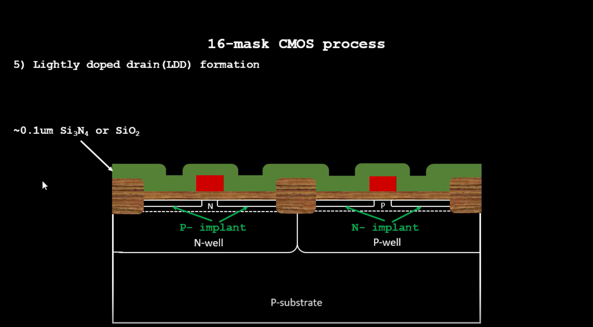 
 
### 6. Source and Drain Formation (Masks 9 and 10) 
 
The source and drain regions provide the electrical terminals through which current enters and leaves the MOS transistor channel. 
 
After the gate and sidewall spacers are formed, the source and drain regions are created using heavier doping. 
 
A thin screen oxide may be grown before implantation to help reduce ion channeling during the doping process. 
 
The reference process uses two implantation steps: 
 
- Arsenic implantation for the n-type source and drain regions of NMOS devices. 
- Boron implantation for the p-type source and drain regions of PMOS devices. 
 
The gate and sidewall spacers help determine the placement of the heavily doped regions relative to the channel. 
 
After implantation, a high-temperature annealing process activates the dopants and helps repair damage caused by implantation. 
 
The resulting source and drain regions provide conductive terminals on either side of the channel. 
 
**Purpose of this stage:** 
 
- Forms the heavily doped source and drain regions. 
- Establishes the electrical terminals of the transistor. 
- Completes the principal semiconductor regions required for MOSFET operation. 
 
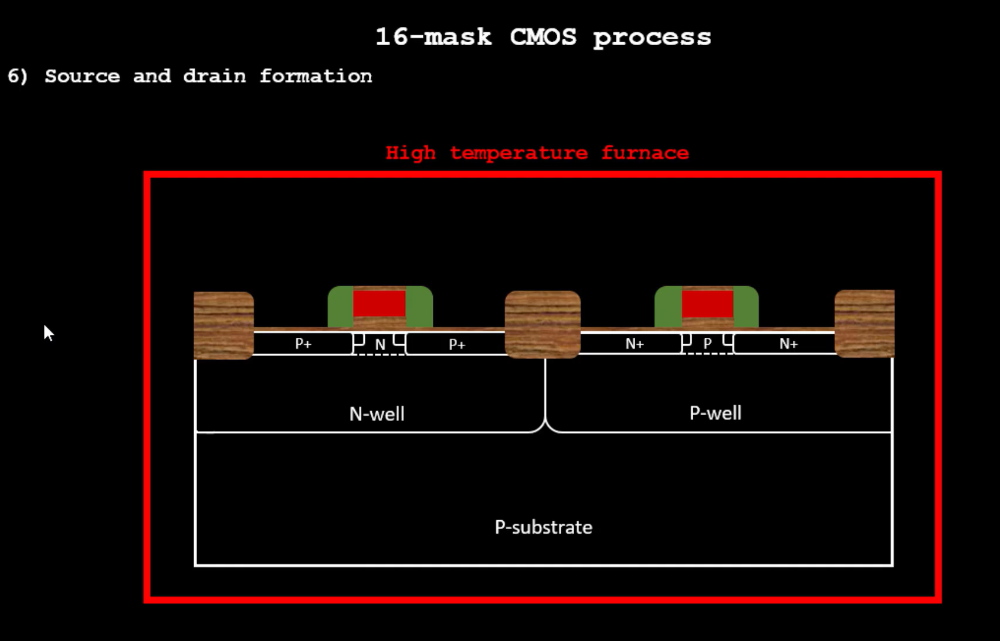 
 
### 7. Local Interconnect and Contact Formation (Mask 11) 
 
Once the transistor structures are formed, electrical connections must be established between the gate, source, and drain terminals. 
 
The local interconnect stage creates short-range electrical connections between device terminals and the interconnect system. 
 
A dielectric layer covering the transistor regions is selectively opened to expose the required contact areas. 
 
In the reference process, a thin oxide layer is removed using HF to expose the relevant silicon surfaces. 
 
Titanium is then deposited over the wafer. 
 
During a subsequent annealing process, titanium reacts with silicon at the appropriate interfaces to form a conductive silicide layer. 
 
The reference example describes a titanium-based local-interconnect process involving a nitrogen ambient and an annealing temperature of approximately 650–700 °C. 
 
**Mask 11** defines the relevant contact or local-interconnect regions. 
 
These contacts provide electrical access to the transistor terminals and establish connections to the higher-level interconnect structure. 
 
**Purpose of this stage:** 
 
- Creates electrical contacts to the transistor terminals. 
- Establishes local connections between device regions. 
- Prepares the circuit for higher-level metal routing. 
 
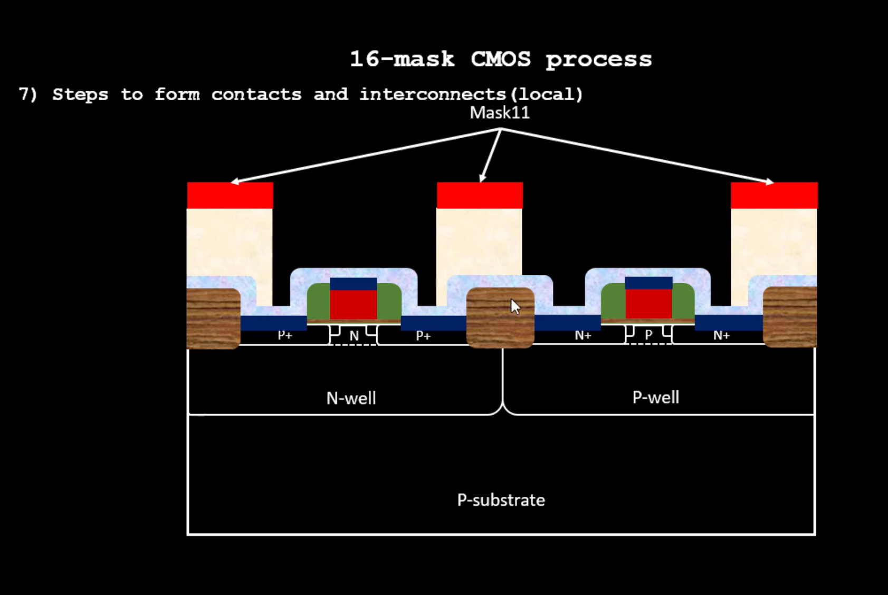 
 
### 8. Higher-Level Metal Formation (Masks 12–16) 
 
After the transistor contacts and local interconnects are formed, additional metal layers are constructed to connect the devices into a complete integrated circuit. 
 
These layers provide the routing paths needed to connect individual transistors and circuit blocks. 
 
The process involves repeated cycles of dielectric deposition, contact-hole formation, metal deposition, patterning, and planarization. 
 
**Mask 12 — Contact and Plug Formation** 
 
A dielectric layer is deposited over the existing structures and planarized using Chemical Mechanical Planarization (CMP). 
 
Contact holes are formed in the dielectric, and conductive materials such as titanium nitride and tungsten are used to create contact plugs. 
 
CMP removes excess material and produces a more uniform surface for subsequent processing. 
 
**Metal 1 Formation** 
 
A metal layer is deposited and patterned to form the first major interconnect level. 
 
This layer provides connections between transistor terminals and other circuit elements. 
 
**Mask 14 — Higher-Level Contact Formation** 
 
An additional dielectric layer is deposited and planarized. 
 
Mask 14 defines the contact openings required to connect the next interconnect level to the underlying metal. 
 
The contact holes are filled with conductive material, creating vertical electrical connections between layers. 
 
**Mask 15 — Next Metal Pattern** 
 
Mask 15 defines the next metal routing pattern. 
 
This metal level extends the interconnect network and allows connections to be routed across a larger area of the chip. 
 
**Mask 16 — Final Passivation Opening** 
 
A protective passivation layer, commonly formed using a dielectric such as silicon nitride, is deposited over the completed interconnect stack. 
 
The passivation layer protects the underlying structures from contamination and environmental damage. 
 
Mask 16 defines openings in the passivation layer to expose the bond pads or other designated terminal regions. 
 
These exposed pads provide the electrical interface between the integrated circuit and its external connections. 
 
**Purpose of this stage:** 
 
- Builds the metal interconnect network. 
- Connects transistor terminals and circuit elements. 
- Creates vertical connections between metal layers. 
- Provides a protective passivation layer and openings for external electrical connections. 
 
The fabrication sequence transforms a bare silicon wafer into a CMOS structure containing complementary transistors and the interconnects needed to connect them. 
 
Each stage contributes a specific physical feature to the finished integrated circuit, from the semiconductor regions and gate structures to the contact network and upper metal layers. 
 
--- 
 
## OpenLane Flow Configuration 
 
### OpenLane Flow 
 
OpenLane is an automated RTL-to-GDSII implementation flow used in digital physical design. 
 
It coordinates implementation stages and uses configuration settings to control how the flow runs. 
 
Flow variables can influence the behavior of selected stages, resets, and execution settings. 
 
Changes must be consistent with the flow version and configuration format in use. 
 
### Flow Reset Variable 
 
The screenshot documents a change involving an OpenLane flow-reset variable followed by running the flow. 
 
The effect of a configuration change depends on the variable's definition and the selected flow setup. 
 
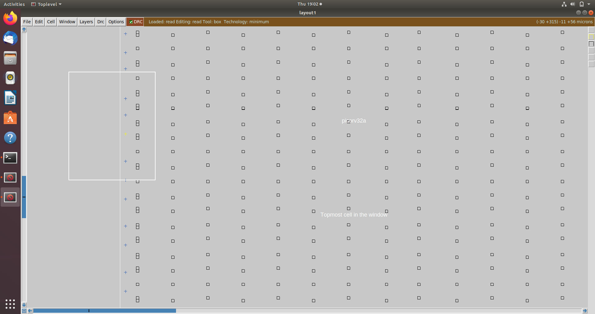 
 
--- 
 
## SKY130 Technology Setup in Magic 
 
### Technology Setup 
 
Before creating a layout, Magic must load the correct technology information. 
 
The technology setup determines how the tool recognizes layers, displays them, and checks their geometric relationships. 
 
An incorrect or missing technology configuration can lead to incorrect layer interpretation or invalid verification results. 
 
### Setting Up Magic 
 
The Magic environment is prepared with the technology configuration required for SKY130 layout work. 
 
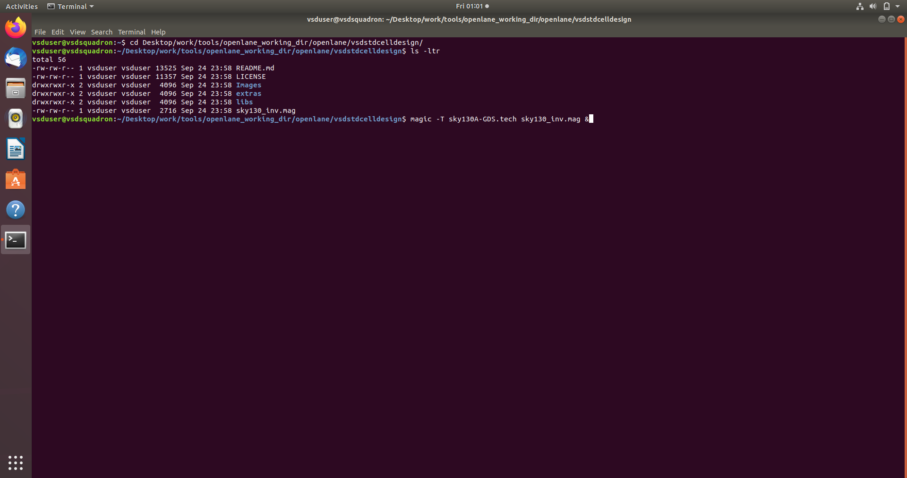 
 
### Copying the SKY130 Technology File 
 
The SKY130 technology file is made available to the layout environment so that Magic can interpret the process layers and apply the corresponding design rules. 
 
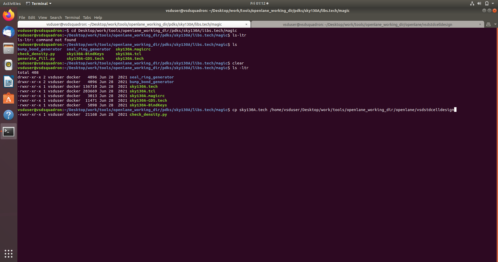 
 
--- 
 
## Custom CMOS Inverter Layout 
 
### Layout Design Concept 
 
A layout represents circuit devices and connections through shapes on physical layers. 
 
The CMOS inverter layout must implement the same connectivity as the transistor-level circuit. 
 
The main layout elements include: 
 
- PMOS device region and its well structure. 
- NMOS device region and its substrate or well structure. 
- Shared polysilicon gate connection for the input. 
- Common drain connection for the output. 
- PMOS source connection to VDD. 
- NMOS source connection to ground. 
- Contacts and metal interconnects. 
- Well and substrate connections required by the process. 
 
### Layout Connectivity 
 
The PMOS and NMOS gates are connected to the same input net. Their drains are connected to the output net. 
 
The PMOS source is connected to VDD, and the NMOS source is connected to ground. 
 
Correct connectivity is essential: a layout may look geometrically plausible but still fail to implement the intended circuit if a terminal or interconnect is missing or connected incorrectly. 
 
### Custom SKY130 CMOS Inverter Layout 
 
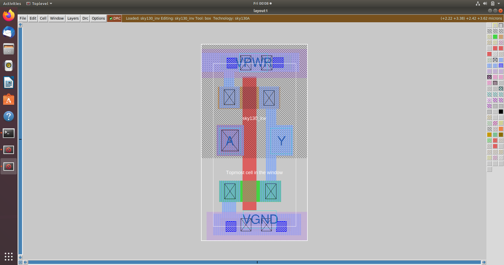 
 
--- 
 
## Physical Layers and Layout Inspection 
 
### Layer-Based Representation 
 
A semiconductor layout is divided into layers that correspond to physical structures or fabrication operations. 
 
The layer stack allows transistors and interconnects to be represented as overlapping and connected geometries. 
 
Common layout-layer categories include: 
 
- **Active/diffusion:** Defines semiconductor regions used for transistor source and drain structures. 
- **Well layers:** Define regions in which devices of a particular type are formed. 
- **Polysilicon or gate layer:** Defines transistor gate structures and, where permitted, gate-level routing. 
- **Contact layers:** Connect device regions or lower-level conductors to interconnect layers. 
- **Metal layers:** Carry electrical signals and supply connections across the layout. 
- **Via layers:** Connect adjacent metal levels. 
 
The exact layer names and permitted geometries are defined by the technology. 
 
### Polysilicon Geometry 
 
The gate layer crosses the active region to form the transistor channel. 
 
Gate dimensions are important because they influence device behavior, while spacing and enclosure rules support manufacturability. 
 
### Metal Interconnect 
 
Metal layers connect transistor terminals and route signals through the circuit. 
 
Multiple metal layers support more flexible routing and help manage congestion in larger layouts. 
 
--- 
 
## Physical Layers and Layout Inspection 
 
### Transistor Identification 
 
The PMOS and NMOS devices occupy different semiconductor regions in the physical layout. Their gate, source, and drain connections must correspond to the intended inverter circuit. 
 
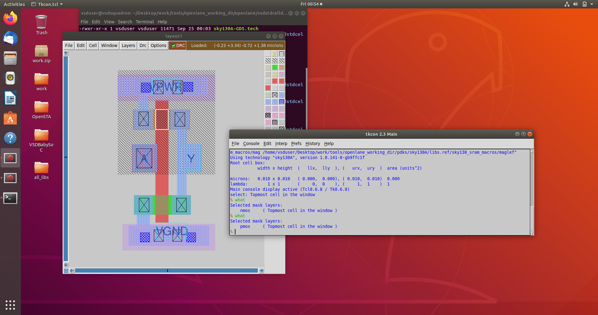 
 
--- 
 
## Layout Extraction and SPICE Generation 
 
### Purpose of Layout Extraction 
 
Layout extraction translates physical geometry into an electrical representation. 
 
It identifies devices and connectivity from the shapes and layer relationships in the layout. 
 
Depending on the extraction setup, it can also estimate parasitic resistance and capacitance associated with devices and interconnects. These parasitics can influence transition times and propagation delay. 
 
### Extracted Layout Information 
 
Magic extraction can produce an `.ext` file containing extracted layout information. 
 
The extracted data can be processed into a SPICE-compatible circuit description for simulation. 
 
The extraction setup must be consistent with the technology and the intended simulation flow. 
 
Device recognition, terminal connectivity, and model references should be checked before interpreting simulation results. 
 
### Creating EXT and SPICE Files 
 
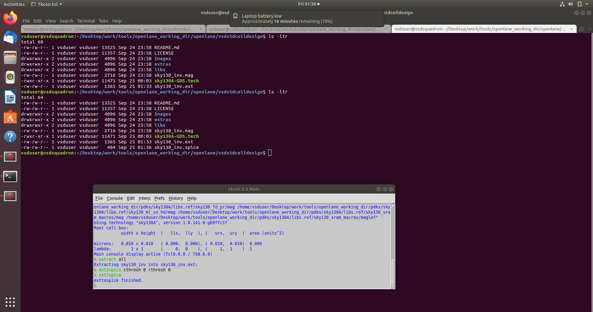 
 
### SKY130 Inverter SPICE File 
 
The generated SPICE representation describes the inverter's electrical connectivity using transistor instances and associated node names. 
 
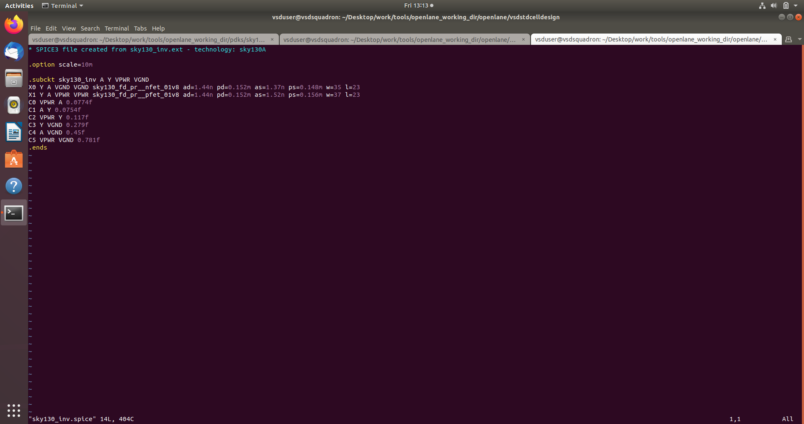 
 
--- 
 
## SPICE Deck and Device Models 
 
### What Is a SPICE Deck? 
 
A SPICE deck is a text-based description of a circuit and the instructions used to simulate it. 
 
It contains the circuit elements, device model references, sources, analysis commands, and optional measurement or output directives. 
 
For a CMOS inverter, a SPICE deck commonly includes: 
 
1. NMOS and PMOS transistor instances. 
2. Model definitions or references to model files. 
3. A DC supply source. 
4. An input voltage source, often configured as a pulse. 
5. An output load, if required by the experiment. 
6. Transient analysis settings. 
7. Measurement statements or waveform output commands. 
 
### Device Models 
 
A MOSFET model describes the electrical behavior of a transistor under different terminal voltages and operating conditions. 
 
Model parameters represent characteristics such as threshold behavior, current drive, and parasitic effects. 
 
For meaningful simulation, the model files and device instances must correspond to the intended process and device types. 
 
### SPICE Deck Inspection 
 
The SPICE deck is inspected to verify that the circuit description, model references, source definitions, node connections, and simulation commands are consistent. 
 
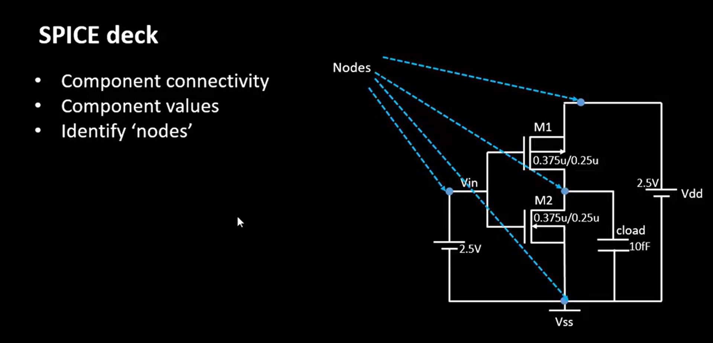 
 
--- 
 
## Fixing the Extracted Netlist and Running the First Simulation 
 
### Edited SKY130 Inverter SPICE File 
 
The SPICE file may be edited to align the extracted circuit with the required model references and simulation setup. 
 
The circuit topology and node connections must remain consistent with the intended layout. 
 
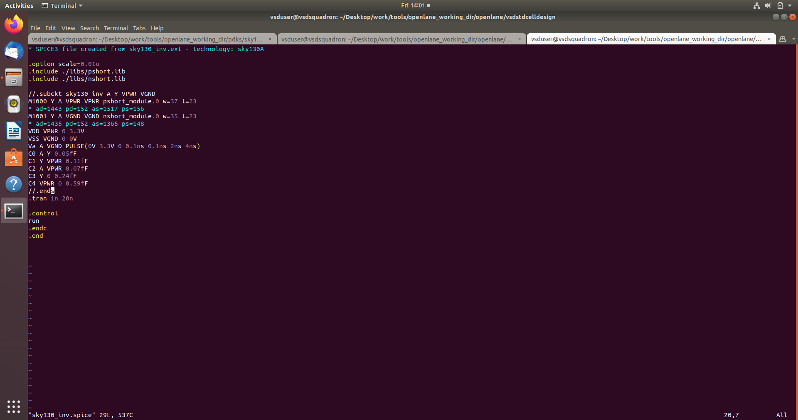 
 
### Running ngspice 
 
ngspice is a SPICE-based circuit simulator. It evaluates electrical behavior using a circuit netlist, device models, sources, and analysis commands. 
 
Transient analysis is used in this module to observe the inverter's output as its input changes with time. 
 
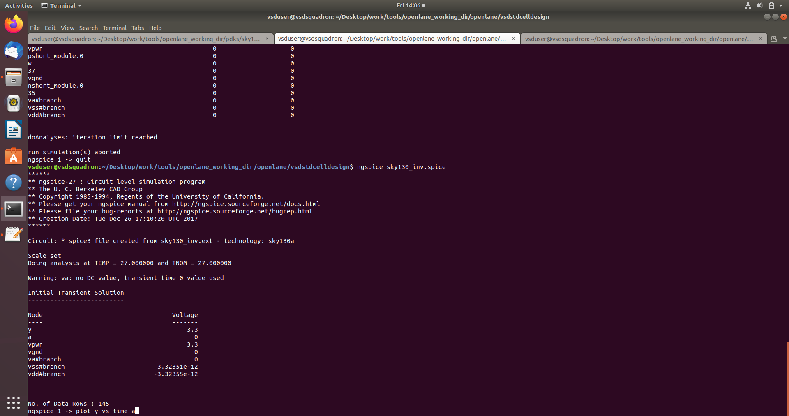 
 
--- 
 
## Transient Analysis and Delay/Transition-Time Extraction 
 
### What Is Transient Analysis? 
 
Transient analysis calculates how voltages and currents change over time. 
 
Unlike a DC operating-point analysis, which evaluates a steady-state condition, transient analysis follows the circuit response to time-varying input signals. 
 
For a CMOS inverter, a changing input voltage causes the output to transition between logic levels. 
 
The output transition is not instantaneous because transistor drive capability and circuit capacitance limit how quickly the output node can charge or discharge. 
 
### Input Pulse 
 
A pulse source can be used to apply repeated low-to-high and high-to-low transitions to the inverter input. 
 
The pulse parameters determine the low and high levels, delay, rise and fall times, pulse width, and repetition period. 
 
### Simulation Procedure 
 
1. Load the SPICE deck into ngspice. 
2. Confirm that the required model files are accessible. 
3. Check the supply and input source definitions. 
4. Set the transient-analysis time interval and simulation step. 
5. Execute the simulation. 
6. Plot the input and output voltages against time. 
7. Inspect the switching transitions and measure timing parameters. 
 
### Transient Analysis Waveform 
 
The transient waveform shows how the inverter output responds to changes in the input. 
 
The output is logically inverted, while the finite transition intervals reveal the circuit's dynamic response. 
 
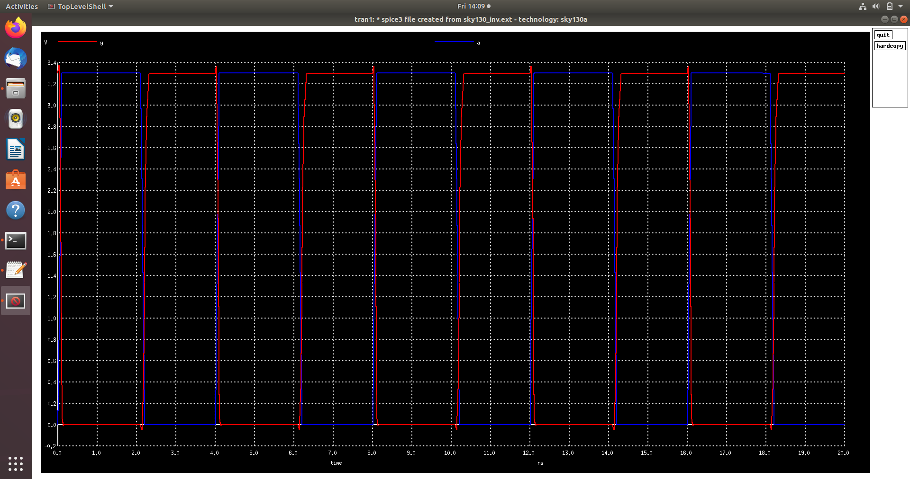 
 
### Rise Time

Rise time (tr) is the time required for a signal to move from a low voltage level to a high voltage level.

A common convention measures the interval between 10% and 90% of the voltage swing.

A shorter rise time represents a faster rising transition under the stated measurement conditions.

### Fall Time

Fall time (tf) is the time required for a signal to move from a high voltage level to a low voltage level.

A common convention measures the interval between 90% and 10% of the voltage swing.

Here, t90% is the time at which the falling signal crosses the 90% threshold, and t10% is the time at which it crosses the 10% threshold.

The subtraction gives a positive time interval.

A shorter fall time represents a faster falling transition under the stated measurement conditions.

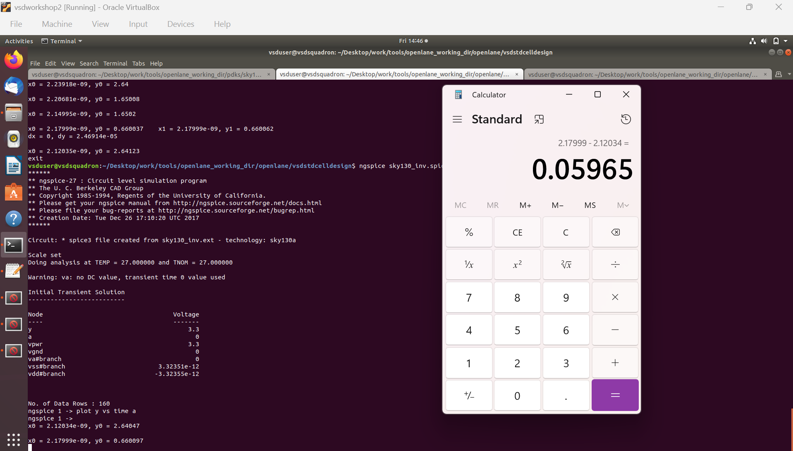

### Cell Rise Delay

Cell rise delay, commonly represented by tPLH, is the propagation delay associated with the output transition from low to high.

For a CMOS inverter, a low-to-high output transition generally follows a high-to-low input transition.

The PMOS pull-up path charges the output node toward VDD.

The delay depends on the PMOS drive capability, output capacitance, input transition, supply voltage, and parasitic effects.

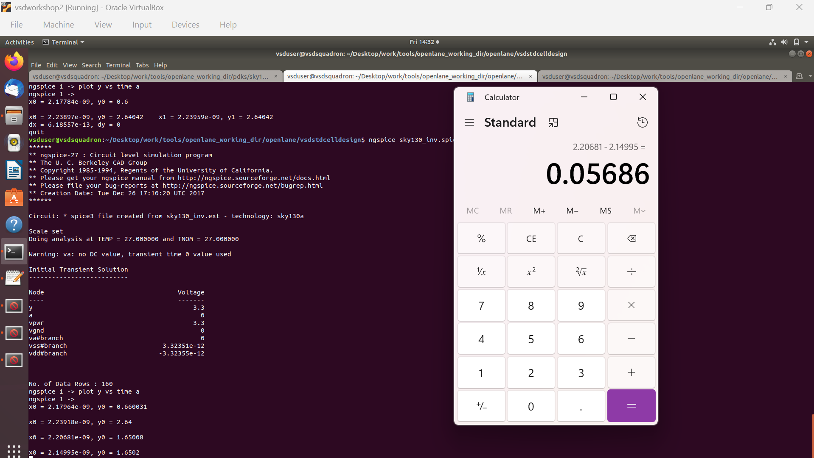

### Cell Fall Delay

Cell fall delay, commonly represented by tPHL, is the propagation delay associated with the output transition from high to low.

For a CMOS inverter, a high-to-low output transition generally follows a low-to-high input transition.

The NMOS pull-down path discharges the output node toward ground.

The delay depends on the NMOS drive capability, output capacitance, input transition, supply voltage, and parasitic effects.

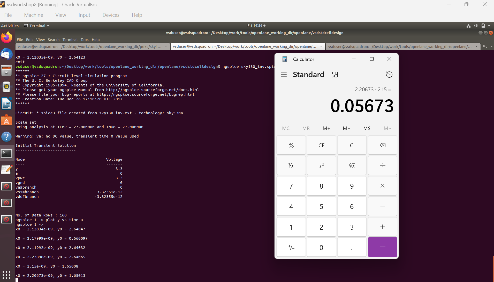
 
### Timing Results 
 
| Parameter | Measured Value | 
|---|---:| 
| Rise Time | 0.05954 | 
| Fall Time | 0.05965 | 
| Cell Rise Delay | 0.05686 | 
| Cell Fall Delay | 0.05673 | 
 
**Note:** The values are reproduced as provided. The measurement unit was not specified. 
 
### Average Propagation Delay 
 
The average propagation delay is commonly expressed as: 
 
$$ 
t_{pd} = \frac{t_{PLH} + t_{PHL}}{2} 
$$ 
 
where: 
 
- \(t_{PLH}\) is the low-to-high output propagation delay. 
- \(t_{PHL}\) is the high-to-low output propagation delay. 
 
Propagation delay is distinct from rise time and fall time. 
 
Rise and fall times describe the duration of an output transition, while propagation delay measures the timing offset between the input and output transitions. 
 
--- 
 
## Exploring the DRC Rule Deck (Metal3 and Poly) 
 
## Design Rule Checking (DRC) 
 
### What Is Design Rule Checking? 
 
Design Rule Checking verifies whether the geometry of a layout satisfies the manufacturing constraints defined by the process technology. 
 
Rules are established to control dimensions and relationships between shapes. Depending on the layer and process, these may include: 
 
- Minimum width of a shape. 
- Minimum spacing between shapes. 
- Required enclosure of one layer by another. 
- Minimum overlap between layers. 
- Contact and via dimensions. 
- Well, active, and gate geometry restrictions. 
 
### Why DRC Is Important 
 
A layout that violates a design rule may be difficult or impossible to manufacture reliably. 
 
DRC identifies geometric conditions that require investigation before the layout is treated as verified. 
 
A DRC-clean result confirms that the checked geometry satisfies the rules applied by the tool. It does not, by itself, prove that the circuit is electrically correct or that every possible manufacturing issue has been eliminated. 
 
### Inspecting a DRC Error 
 
When a violation is reported, the affected geometry and the associated rule must be examined. 
 
The rule definition explains the required constraint; the layout view helps locate the shape responsible for the violation. 
 
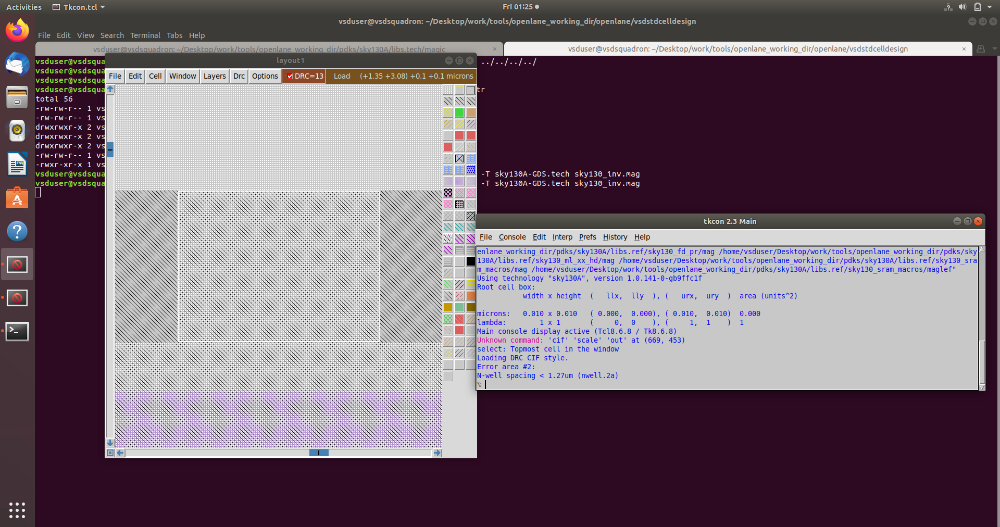 
 
### Metal 3 Layer 
 
The Metal 3 view highlights geometry on the third metal interconnect layer. 
 
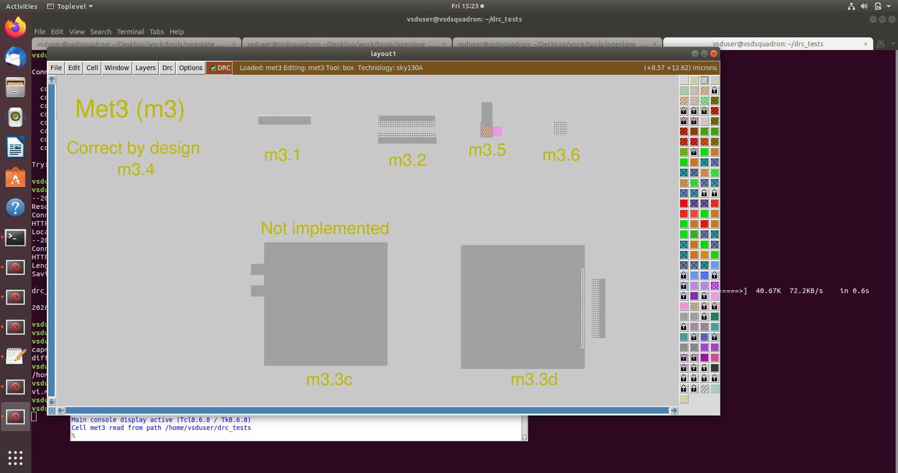 
 
### M3.3C Test Structure Inspection 
 
The M3.3C test structure contains an arrangement of contact or via cuts within a Metal3 region. 
 
The structure is examined at a finer zoom level to inspect the individual shapes and their relative positions. 
 
The reference example reports a total of 22 DRC violations for the selected structure. 
 
#### VIA2 Inspection 
 
The `paint m3contact` command and `cif see VIA2` command can be used to isolate and inspect the VIA2-related mask geometry. 
 
The selected contact region can then be examined using the `box` command. 
 
The measured dimensions of the selected structure are: 
 
$$ 
0.050\ \mu m \times 0.130\ \mu m 
$$ 
 
The corresponding area is: 
 
$$ 
A = 0.050 \times 0.130 
$$ 
 
$$ 
A = 0.0065\ \mu m^2 
$$ 
 
This measurement provides the physical dimensions of the selected contact region. 
 
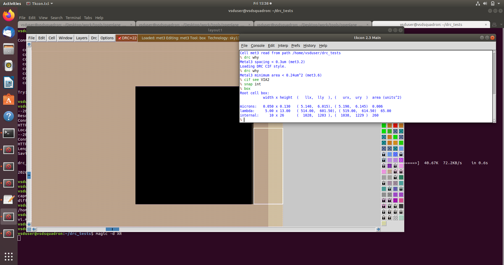 
 
### Poly Layer Inspection 
 
The polysilicon layer defines the gate structures of MOS transistors and may also be used for other permitted layout geometries. 
 
Poly-related design rules control the dimensions and spacing of polysilicon shapes. 
 
The selected geometry is examined in the layout to inspect its dimensions and area. 
 
The measured dimensions of the selected geometry are: 
 
$$ 
0.315\ \mu m \times 0.195\ \mu m 
$$ 
 
The corresponding area is: 
 
$$ 
A = 0.315 \times 0.195 
$$ 
 
$$ 
A = 0.061425\ \mu m^2 
$$ 
 
The shape is identified as Poly.9 in the reference rule deck. 
 
The exact geometric condition associated with the rule depends on the selected technology's design-rule definition. 
 
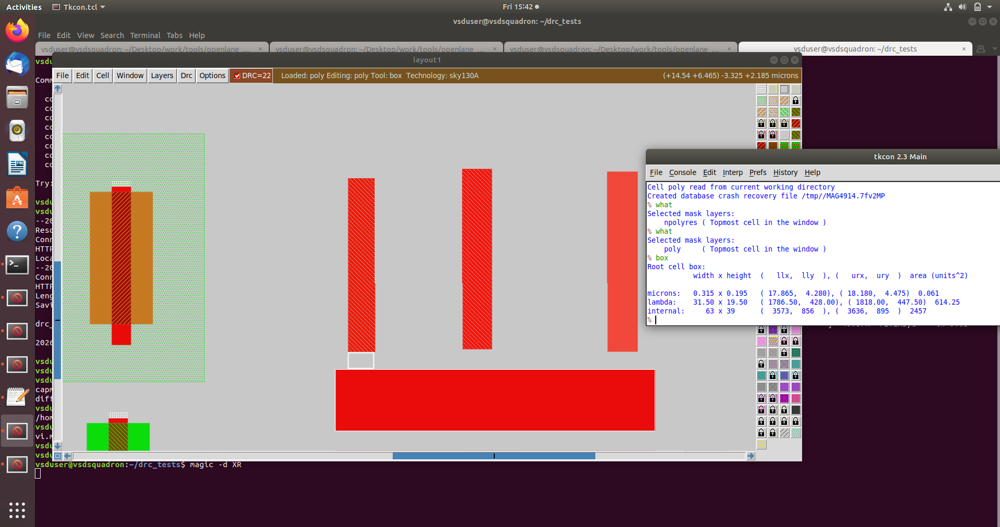 
 
--- 
 
## Results and Observations 
 
The layout and simulation sequence demonstrates how a simple logic cell is represented and evaluated at physical and circuit levels. 
 
- A CMOS inverter uses complementary PMOS and NMOS devices to produce an inverted logic output. 
- The technology file defines how the layout tool interprets the SKY130 layers and design constraints. 
- The physical layout represents transistor regions, gate structures, contacts, and interconnects. 
- Layer inspection helps identify geometry used for device formation and signal routing. 
- DRC checks the layout against the technology's geometric rules. 
- Extraction translates physical geometry into a circuit representation and may include parasitic effects. 
- A SPICE deck connects the circuit representation to device models, voltage sources, and simulation commands. 
- Transient analysis displays the time-domain response of the inverter. 
- Rise time and fall time characterize the speed of output transitions. 
- Cell rise and fall delays characterize the time relationship between input and output transitions. 
- Device sizing, load capacitance, and parasitic resistance and capacitance can influence the measured timing values. 
 
### Layout Inspection Measurements 
 
| Inspection | Dimensions | Area | 
|---|---|---:| 
| M3.3C Test Structure | 0.050 × 0.130 µm | 0.0065 µm² | 
| Poly Layer | 0.315 × 0.195 µm | 0.061425 µm² | 
 
--- 
 
## Conclusion 
 
This module presents a structured study of a SKY130 CMOS inverter, beginning with semiconductor fabrication and transistor operation and progressing through technology setup, physical layout, layer inspection, design rule checking, extraction, and SPICE simulation. 
 
The inverter provides a practical example of how circuit connectivity is translated into physical geometry and how that geometry can affect electrical behavior. 
 
Transient analysis and timing measurements illustrate the distinction between output transition time and input-to-output propagation delay. 
 
Together, these topics establish a foundation for understanding standard-cell layout design, physical verification, and circuit characterization in VLSI physical design. 
 

