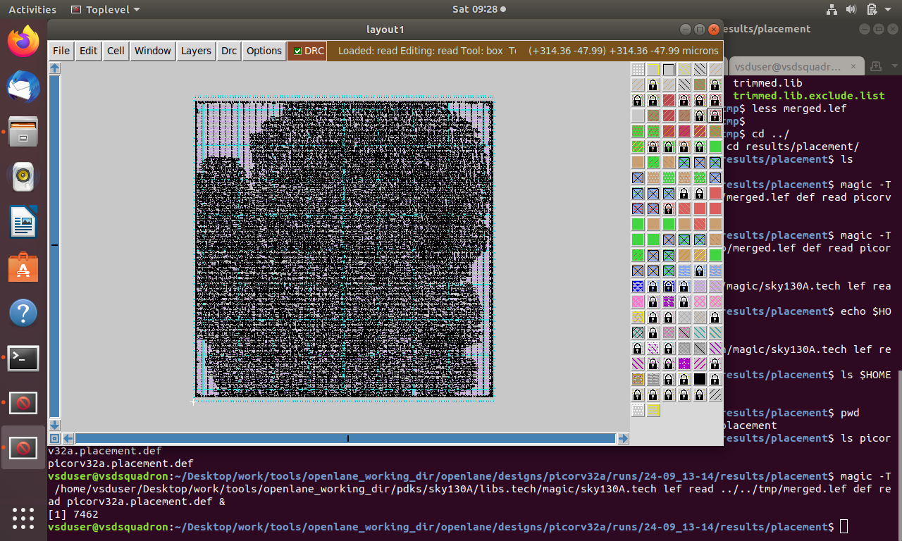
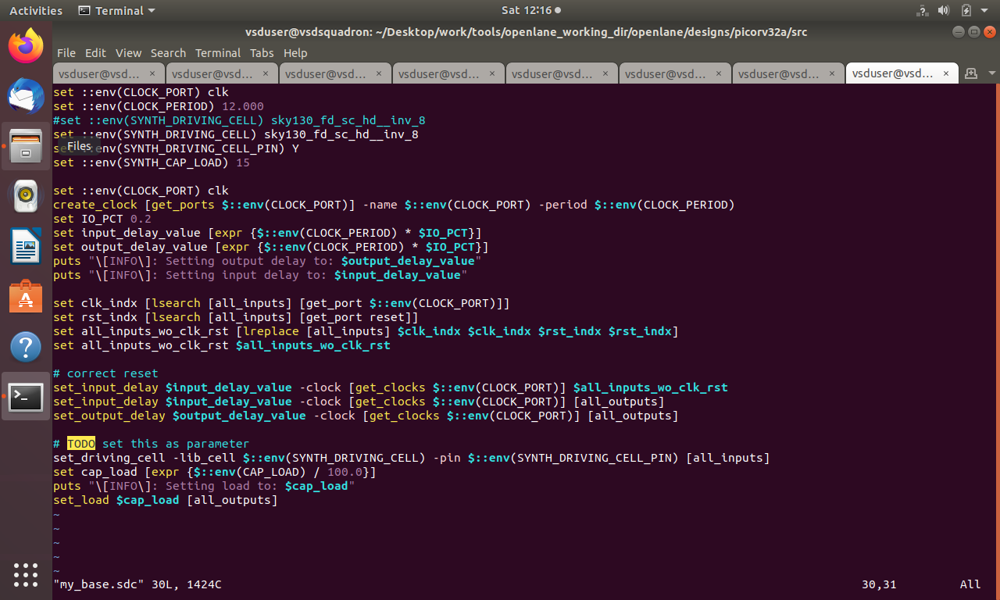
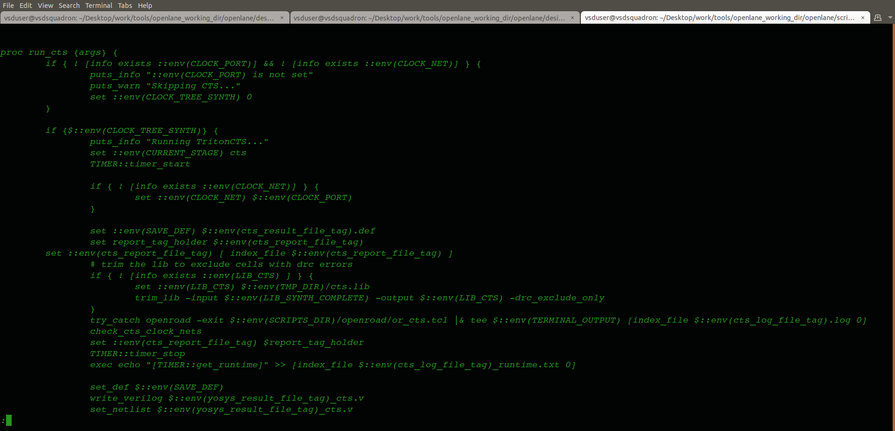
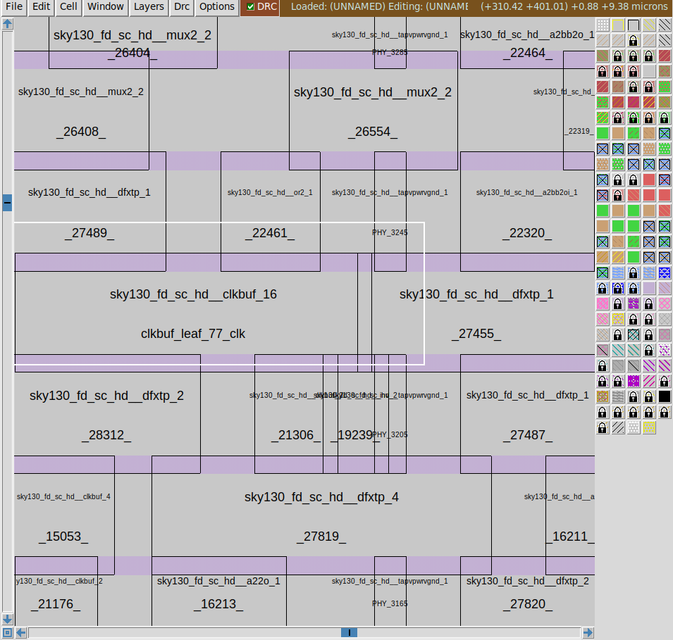
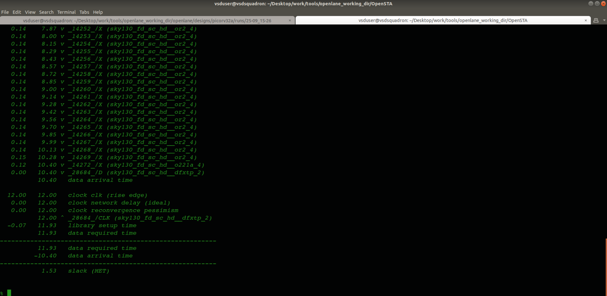
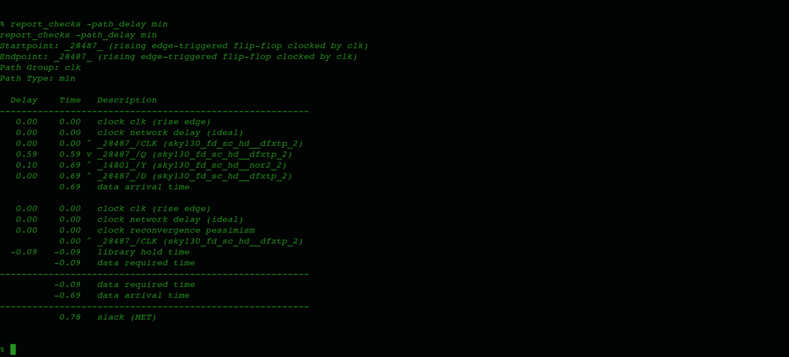
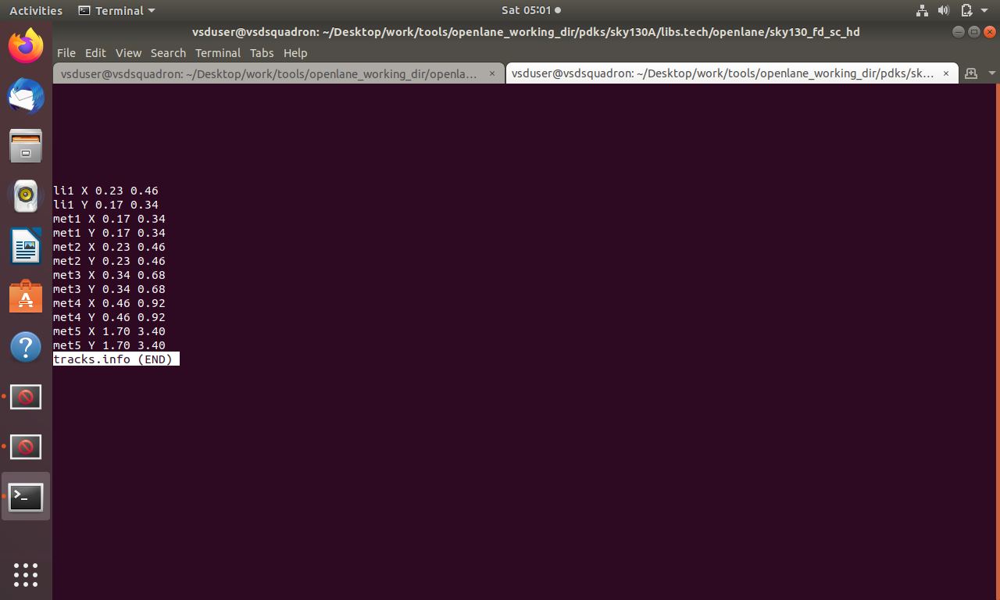

# Physical Design – Module 4
## Clock Tree Synthesis, Timing Analysis, and Physical Design Optimization

---

## Introduction

Physical Design is an important stage in the VLSI design process that transforms a synthesized netlist into a physical layout suitable for manufacturing.

This module focuses on the physical implementation of the `picorv32a` design using the OpenLane and OpenROAD toolchain with the SkyWater SKY130 standard-cell technology.

The practical work covers standard-cell placement, Clock Tree Synthesis (CTS), clock distribution, setup and hold timing analysis, clock skew, crosstalk, and timing optimization.

The repository documents the implementation workflow through configuration files, technology files, timing analysis screenshots, and physical design results.

---

## Table of Contents

1. [Objectives](#1-objectives)
2. [Tools and Technologies](#2-tools-and-technologies)
3. [Technology Libraries and Physical Files](#3-technology-libraries-and-physical-files)
4. [Physical Design Flow](#4-physical-design-flow)
5. [Synthesis and Placement](#5-synthesis-and-placement)
6. [Timing Constraints and Configuration](#6-timing-constraints-and-configuration)
7. [Clock Tree Synthesis](#7-clock-tree-synthesis)
8. [Clock Buffers and Clock Distribution](#8-clock-buffers-and-clock-distribution)
9. [Setup and Hold Timing Analysis](#9-setup-and-hold-timing-analysis)
10. [Clock Skew and Crosstalk](#10-clock-skew-and-crosstalk)
11. [Timing Reports and Slack Analysis](#11-timing-reports-and-slack-analysis)
12. [Physical Design Configuration and Routing Information](#12-physical-design-configuration-and-routing-information)
13. [Key Observations](#13-key-observations)
14. [Conclusion](#14-conclusion)

---

# 1. Objectives

The objectives of this module are:

- Understand the physical design flow from synthesis to physical implementation.
- Study the placement of standard cells and its effect on circuit timing.
- Understand the purpose and operation of Clock Tree Synthesis.
- Analyze clock buffer insertion and clock distribution.
- Study setup and hold timing requirements.
- Understand clock latency and clock skew.
- Examine the effects of crosstalk and interconnect delay.
- Interpret timing reports and slack values.
- Understand the role of Liberty, LEF, SDC, and Tcl configuration files.
- Explore timing analysis and physical design optimization using OpenROAD.

---

# 2. Tools and Technologies

| Tool / Technology | Purpose |
|---|---|
| OpenLane | Automated RTL-to-GDSII physical design flow |
| OpenROAD | Physical implementation and optimization |
| Yosys | RTL synthesis |
| OpenSTA | Static Timing Analysis |
| SKY130 | 130 nm process technology |
| Verilog | Hardware description language |
| Liberty (.lib) | Standard-cell timing and power information |
| LEF (.lef) | Physical cell and technology information |
| SDC | Timing constraints |
| Tcl | Configuration and automation scripts |
| Docker | Execution environment |

---

# 3. Technology Libraries and Physical Files

Technology files provide the information required by physical design tools to understand the characteristics of standard cells, routing layers, and timing behavior.

## 3.1 Standard-Cell Libraries

The SKY130 standard-cell library provides the timing and electrical characteristics of the cells used in the design.

The library files examined in this module include fast, slow, and typical timing characterization corners.

### Fast Corner Library

The fast corner represents characterized conditions under which cells operate relatively quickly. It is useful for examining minimum-delay behavior and hold timing.


### Slow Corner Library

The slow corner represents characterized conditions under which cells operate relatively slowly. It is relevant to maximum-delay and setup timing analysis.


### Typical Corner Library

The typical corner represents nominal characterized operating conditions and is used for nominal timing evaluation.


## 3.2 LEF File

The LEF format describes the physical characteristics of standard cells and technology layers.

It contains information such as cell dimensions, pin locations, and routing-related physical information required for placement and routing.

### SKY130 LEF File


---

# 4. Physical Design Flow

The physical design flow converts the synthesized netlist into a physical implementation by organizing cells, constructing the clock network, routing connections, and evaluating timing.

## 4.1 Flow Overview

```text
RTL Design
    |
    v
Synthesis
    |
    v
Floorplanning
    |
    v
Standard-Cell Placement
    |
    v
Placement Optimization
    |
    v
Clock Tree Synthesis
    |
    v
Clock Distribution
    |
    v
Timing Analysis
    |
    v
Routing and Optimization
    |
    v
Physical Verification
```

## 4.2 Main Stages

**Synthesis:** Converts RTL into a gate-level netlist using standard cells from the selected library.

**Floorplanning:** Defines the core area and establishes the physical design boundaries.

**Placement:** Assigns physical locations to standard cells.

**Clock Tree Synthesis:** Builds a clock distribution network using clock buffers and other clock cells.

**Routing:** Creates physical interconnections between cells using metal layers.

**Timing Analysis:** Evaluates whether the implemented design satisfies its timing constraints.

---

# 5. Synthesis and Placement

## 5.1 Running Synthesis

Synthesis transforms the RTL design into a gate-level netlist by mapping logic into standard cells.

The synthesized netlist serves as the input for physical implementation.

The synthesis stage establishes the logical structure of the design before placement and clock tree synthesis.

### Synthesis Execution


## 5.2 Standard-Cell Placement

Placement assigns physical locations to standard cells within the core area.

The placement process considers cell density, wirelength, connectivity, and timing requirements.

A suitable placement helps reduce interconnect delay and supports timing optimization.

### Placement Result



## 5.3 Expanded Placement

Expanded placement provides a closer view of the physical arrangement of cells and their distribution within the core.

It helps visualize the placement structure and the spatial relationships between standard cells.

### Expanded Placement Result


---

# 6. Timing Constraints and Configuration

Timing constraints define the operating requirements of the design and provide the information required for Static Timing Analysis.

The Synopsys Design Constraints (SDC) format is commonly used to specify clock definitions, input and output delays, and timing uncertainty.

## 6.1 Base SDC File

The base constraint file used in this module is `my_base.sdc`.

It is associated with the timing requirements of the design.

Typical SDC constraints include:

- Clock period and clock definition.
- Input and output delays.
- Clock uncertainty.
- Input transition times.
- Output loads.

### Base SDC Configuration



## 6.2 Pre-CTS Configuration

The pre-CTS configuration is associated with the physical design flow before clock tree synthesis.

The configuration provides settings used during the implementation stage preceding CTS.


## 6.3 New Configuration

The Tcl configuration file contains design or flow settings used during physical implementation.

Configuration parameters must be consistent with the selected technology, design, and timing requirements.

### New Configuration File


---

# 7. Clock Tree Synthesis

## 7.1 Introduction to CTS

Clock Tree Synthesis (CTS) is the process of constructing a clock distribution network that delivers the clock signal from its source to the sequential elements of a digital circuit.

In synchronous digital circuits, flip-flops rely on a clock signal to coordinate data capture and state transitions.

As the number of clock sinks increases, distributing the clock signal becomes more challenging because of:

- Capacitive loading.
- Long interconnect distances.
- Clock insertion delay.
- Clock arrival-time differences.
- Clock skew.
- Signal transition requirements.

CTS inserts clock buffers and organizes the clock network to manage these effects.

## 7.2 Objectives of CTS

The main objectives of CTS are:

1. Distribute the clock signal to all required clock sinks.
2. Control clock skew between sequential elements.
3. Maintain acceptable clock transition times.
4. Manage clock insertion delay and network loading.
5. Support setup and hold timing requirements.
6. Improve clock distribution across the physical design.

## 7.3 Clock Tree Structure

A clock tree generally consists of a clock source, intermediate clock buffers, branching points, and clock sinks.

The clock signal propagates through the distribution network to reach the sequential elements.

The structure of the clock tree influences clock latency, skew, power consumption, and timing behavior.

### Clock Tree Synthesis


### Clock Tree Synthesis – Second View


## 7.4 CTS Configuration

The CTS configuration script is `cts.tcl`.

It contains settings associated with the clock tree synthesis process and the construction of the clock distribution network.

### CTS Tcl Configuration



---

# 8. Clock Buffers and Clock Distribution

## 8.1 Clock Buffers

Clock buffers are inserted into the clock network to drive the capacitive load of clock sinks.

They help distribute the clock signal across the design while managing electrical loading and transition times.

The number, size, and placement of clock buffers influence clock insertion delay, skew, and power consumption.

## 8.2 Clock Buffer Insertion

Clock buffer insertion divides a large clock load into smaller loads that can be driven by individual buffers.

The buffer network helps maintain clock signal integrity and supports clock distribution across physically separated sequential elements.

### Clock Buffering



## 8.3 Clock Net Shielding

Clock net shielding is a routing technique used to reduce unwanted coupling between clock nets and neighboring signal wires.

Shielding can improve signal integrity by reducing capacitive coupling, although it also consumes additional routing resources.

### Clock Net Shielding


---

# 9. Setup and Hold Timing Analysis

Setup and hold timing are fundamental requirements of sequential circuits.

They define the timing window during which data must remain stable around the active clock edge of a receiving flip-flop.

## 9.1 Setup Time

Setup time is the minimum duration for which the data input of a flip-flop must remain stable before the active clock edge.

A setup violation occurs when data arrives too late to satisfy the timing requirement.

### Setup Timing Condition

For a simplified register-to-register path:

\[
T_{cq} + T_{comb} + T_{setup} \leq T_{period}
\]

Where:

- \(T_{cq}\) is the clock-to-Q delay of the launching flip-flop.
- \(T_{comb}\) is the combinational logic and interconnect delay.
- \(T_{setup}\) is the setup time of the capturing flip-flop.
- \(T_{period}\) is the clock period.

The actual setup requirement also depends on clock arrival times and timing uncertainty.

## 9.2 Hold Time

Hold time is the minimum duration for which data must remain stable after the active clock edge.

A hold violation occurs when data reaches the capturing flip-flop too early.

Hold timing is particularly sensitive to minimum data path delay and clock arrival-time differences.

### Hold Timing Condition

For a simplified register-to-register path:

\[
T_{cq,min} + T_{comb,min} \geq T_{hold}
\]

The actual hold requirement depends on the launch and capture clock arrival times and the timing constraints of the design.

## 9.3 Setup Timing Analysis with an Ideal Clock

An ideal clock assumes that clock distribution delay and skew are not modeled as physical clock network effects.

Ideal-clock timing analysis is useful for examining data path timing before accounting for the implemented clock tree.

### Setup Timing Analysis – Ideal Clock


### Setup Timing Analysis – Second View


## 9.4 Hold Time Analysis

Hold analysis evaluates minimum data path delay and checks whether data remains stable for the required interval after the active clock edge.

A negative hold slack indicates that the minimum-delay requirement is violated.

### Hold Time Analysis


## 9.5 Setup and Hold Process

Setup and hold checks evaluate the timing relationship between the launching and capturing sequential elements.

Both checks are required because a path that satisfies setup timing may still violate hold timing.

### Setup and Hold Process


---

# 10. Clock Skew and Crosstalk

## 10.1 Clock Skew

Clock skew is the difference in clock arrival times at two sequential elements.

It occurs because the clock signal travels through different combinations of buffers and interconnects.

### Types of Clock Skew

- **Positive skew:** The capture clock arrives later than the launch clock.
- **Negative skew:** The capture clock arrives earlier than the launch clock.
- **Zero skew:** The clock arrives at both registers at the same time.

Clock skew affects setup and hold timing differently depending on its direction and magnitude.

## 10.2 Crosstalk

Crosstalk is unwanted electrical coupling between neighboring signal interconnects.

Switching activity on one net can influence the voltage or propagation delay of a nearby net through capacitive or inductive coupling.

Crosstalk can affect:

- Signal transition times.
- Propagation delay.
- Timing margins.
- Signal integrity.

## 10.3 Crosstalk-Induced Delta Delay

Crosstalk-induced delta delay is the change in propagation delay caused by the switching activity of neighboring nets.

Depending on the relative switching directions and timing, coupling can increase or decrease the delay of a signal.

### Impact of Crosstalk, Delta Delay, and Skew


---

# 11. Timing Reports and Slack Analysis

Static Timing Analysis (STA) verifies whether the timing requirements of a digital circuit are satisfied.

It evaluates signal arrival times and required arrival times to identify timing violations without requiring input-vector simulation.

## 11.1 Timing Slack

Slack is the difference between the required arrival time and the actual arrival time of a signal.

For setup analysis:

\[
\text{Setup Slack} =
\text{Required Arrival Time} -
\text{Data Arrival Time}
\]

### Slack Interpretation

| Slack | Meaning |
|---|---|
| Positive slack | Timing requirement is satisfied |
| Zero slack | Timing requirement is met at the boundary |
| Negative slack | Timing violation exists |

Setup and hold slack are evaluated using their respective maximum-delay and minimum-delay timing requirements.

## 11.2 Maximum-Delay Analysis

Maximum-delay analysis checks whether data arrives before the setup deadline.

It evaluates the longest relevant data paths and identifies setup timing violations.

Negative maximum-delay slack indicates that the data path does not meet its setup requirement.

### Maximum-Delay Slack



## 11.3 Minimum-Delay Analysis

Minimum-delay analysis checks whether data arrives late enough to satisfy hold requirements.

It evaluates the shortest relevant data paths and identifies hold timing violations.

Negative minimum-delay slack indicates that the hold requirement is violated.

### Minimum-Delay Slack



## 11.4 Delay Tables

Timing reports and delay tables provide information about cell delays, interconnect delays, signal arrival times, required arrival times, and timing slack.

They help identify critical paths and understand the contribution of cells and interconnects to the overall timing behavior.

### Delay Tables


---

# 12. Physical Design Configuration and Routing Information

Physical design tools rely on configuration files and routing information to establish the physical implementation environment.

This section documents the supporting files associated with the workflow.

## 12.1 Converting Labels to Ports

The conversion of labels to ports is a physical design preparation step associated with the design's connectivity and interface representation.

### Convert Labels to Ports


## 12.2 Converting Grid Information to Track Information

Routing track information defines the locations of routing tracks used by the physical design tools.

Grid information can be converted into track information to support routing setup.

### Convert Grid Info to Track Info


## 12.3 Routing Track Information

The `tracks.info` file contains routing track information used in the physical implementation flow.

Routing tracks define the locations where signal wires can be placed on the available routing layers.

### Tracks Information



---

# 13. Key Observations

1. **Placement affects timing:** The physical locations of cells influence interconnect length and signal propagation delay.

2. **Clock buffering supports distribution:** Clock buffers help distribute the clock signal across the design while managing capacitive loading.

3. **CTS influences sequential timing:** Clock insertion delay and skew affect setup and hold timing behavior.

4. **Setup and hold checks are complementary:** Maximum-delay and minimum-delay analyses are both required for timing verification.

5. **Crosstalk affects signal integrity:** Coupling between neighboring interconnects can influence propagation delay and timing margins.

6. **Technology files support physical implementation:** Liberty, LEF, and SDC files provide information required for timing analysis and physical design.

7. **Timing reports support optimization:** Slack values and path reports help identify timing violations and evaluate the timing behavior of the design.

---

# 14. Conclusion

This module explores the physical design workflow using OpenLane, OpenROAD, and the SkyWater SKY130 standard-cell technology.

The practical work covers synthesis, standard-cell placement, Clock Tree Synthesis, clock buffering, setup and hold timing analysis, clock skew, crosstalk, and timing report interpretation.

The screenshots and supporting files document the different stages of the workflow and provide a visual record of the physical design process.

Through this work, the relationship between physical implementation, clock distribution, interconnect effects, and timing verification can be understood more clearly.


---

**Note:** All screenshots should be uploaded to the `images/` folder. The image links above use the original filenames with URL-encoded spaces and special characters. GitHub is case-sensitive, so make sure the filenames match exactly.
