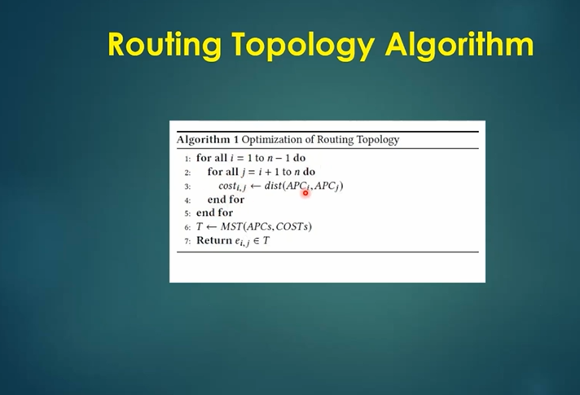

# Physical Design – Module 5
## Final Steps for RTL-to-GDSII Using TritonRoute and OpenSTA

---

## Introduction

The final stages of the RTL-to-GDSII flow involve completing the physical implementation of a digital design through power distribution, detailed routing, design rule checking, and timing analysis.

This module focuses on the final physical design stages using the OpenLane and OpenROAD toolchain, with particular emphasis on TritonRoute and OpenSTA.

The practical work covers maze routing using Lee's algorithm, power distribution network construction, global and detailed routing, routing connectivity, design rule checking, and the generation of final post-route files.

The repository documents the workflow through technical explanations, commands, configuration concepts, and screenshots captured during the implementation process.

---

## Table of Contents

1. [Objectives](#1-objectives)
2. [Tools and Technologies](#2-tools-and-technologies)
3. [Overview of the RTL-to-GDSII Flow](#3-overview-of-the-rtl-to-gdsii-flow)
4. [Maze Routing and Lee's Algorithm](#4-maze-routing-and-lees-algorithm)
5. [Design Rule Checking](#5-design-rule-checking)
6. [Power Distribution Network](#6-power-distribution-network)
7. [Power Straps and Standard-Cell Power Connections](#7-power-straps-and-standard-cell-power-connections)
8. [Global and Detailed Routing](#8-global-and-detailed-routing)
9. [TritonRoute and Routing Configuration](#9-tritonroute-and-routing-configuration)
10. [TritonRoute Features](#10-tritonroute-features)
11. [Routing Connectivity and Optimization](#11-routing-connectivity-and-optimization)
12. [Routing Topology and Final Post-Route Files](#12-routing-topology-and-final-post-route-files)
13. [Final Design Verification](#13-final-design-verification)
14. [Key Observations](#14-key-observations)
15. [Conclusion](#15-conclusion)

---

# 1. Objectives

The main objectives of this module are:

- Understand the final stages of the RTL-to-GDSII physical design flow.
- Study maze routing and Lee's algorithm for finding routing paths.
- Understand the purpose of Design Rule Checking (DRC).
- Learn the construction of a Power Distribution Network (PDN).
- Understand the connection between power straps and standard-cell power pins.
- Differentiate between global routing and detailed routing.
- Study the operation and features of TritonRoute.
- Understand routing guides and routing connectivity.
- Examine intra-layer and inter-layer routing.
- Study routing topology and the generation of final post-route files.
- Understand the role of OpenSTA in post-route timing analysis.

---

# 2. Tools and Technologies

| Tool / Technology | Purpose |
|---|---|
| OpenLane | Automated RTL-to-GDSII physical design flow |
| OpenROAD | Physical implementation and optimization |
| TritonRoute | Detailed routing |
| OpenSTA | Static Timing Analysis |
| Yosys | RTL synthesis |
| SKY130 | Open-source 130 nm process technology |
| LEF | Physical cell and technology information |
| DEF | Physical design placement and routing representation |
| SDC | Timing constraints |
| SPEF | Parasitic information for timing analysis |
| Tcl | Flow configuration and automation |
| Docker | Execution environment |

---

# 3. Overview of the RTL-to-GDSII Flow

The RTL-to-GDSII flow converts a hardware description into a physical layout suitable for fabrication.

After synthesis, floorplanning, placement, and clock tree synthesis, the design proceeds through power distribution, routing, timing verification, and physical verification.

## 3.1 Physical Design Flow

```text
RTL Design
    |
    v
Synthesis
    |
    v
Floorplanning
    |
    v
Power Distribution Network
    |
    v
Standard-Cell Placement
    |
    v
Clock Tree Synthesis
    |
    v
Global Routing
    |
    v
Detailed Routing (TritonRoute)
    |
    v
Design Rule Checking
    |
    v
Parasitic Extraction
    |
    v
Post-Route Timing Analysis (OpenSTA)
    |
    v
Final Layout Generation
    |
    v
GDSII
```

## 3.2 Final Implementation Stages

The final implementation stages focus on establishing physical connectivity while satisfying electrical, timing, and manufacturing constraints.

The major activities include:

1. Constructing the power distribution network.
2. Generating global routing guides.
3. Performing detailed routing.
4. Checking physical design rules.
5. Extracting parasitic information.
6. Performing post-route timing analysis.
7. Generating final physical design files.

---

# 4. Maze Routing and Lee's Algorithm

## 4.1 Introduction to Maze Routing

Maze routing is a pathfinding technique used to determine a valid connection between two points in a routing grid.

In VLSI physical design, routing connects pins and terminals using metal layers while avoiding obstacles and respecting routing constraints.

Maze routing explores possible paths through a grid until a valid connection is found.

The method is useful for understanding how routing algorithms search for paths between source and destination points.

## 4.2 Lee's Algorithm

Lee's algorithm is a grid-based pathfinding algorithm that uses a wavefront expansion process to find a path between two points.

The algorithm explores neighboring grid locations in successive steps until the destination is reached.

Once the destination is found, the path is reconstructed by tracing backward through the explored grid.

## 4.3 Steps of Lee's Algorithm

1. **Initialization:** Mark the source point as the starting location.
2. **Wavefront expansion:** Explore neighboring grid cells and assign distance values.
3. **Obstacle avoidance:** Exclude blocked or unavailable grid locations.
4. **Destination detection:** Continue expanding until the destination is reached.
5. **Backtracking:** Trace the shortest discovered path from destination to source.
6. **Path reconstruction:** Record the final route through the grid.

## 4.4 Advantages and Limitations

### Advantages

- Systematic path exploration.
- Finds a shortest path in an unweighted grid when a path exists.
- Handles obstacles by excluding blocked locations.
- Provides a simple foundation for understanding maze routing.

### Limitations

- Can require substantial memory for large routing grids.
- May explore many unnecessary grid locations.
- Does not inherently account for all physical routing costs, such as congestion, wire delay, and layer preferences.

## 4.5 Maze Routing Illustration

The following screenshot documents the maze routing concept and its application to routing path exploration.

### Maze Routing


## 4.6 Lee's Algorithm Conclusion

Lee's algorithm demonstrates how a routing path can be identified through systematic grid exploration.

In practical VLSI routing, additional considerations such as routing layers, congestion, design rules, and wire costs are necessary to generate physically feasible routes.

---

# 5. Design Rule Checking

## 5.1 Introduction to DRC

Design Rule Checking (DRC) is the process of verifying whether a physical layout satisfies the manufacturing rules of the selected semiconductor technology.

These rules define restrictions on the physical geometry of the layout to ensure that the design can be manufactured reliably.

DRC is an important verification stage in the physical design flow.

## 5.2 Common Design Rules

Design rules may include:

- Minimum wire width.
- Minimum spacing between metal wires.
- Minimum spacing between vias.
- Minimum enclosure requirements.
- Minimum area requirements.
- Restrictions on overlapping or improperly connected shapes.

The exact rules depend on the selected process technology and its design rule manual.

## 5.3 DRC and Routing

During routing, the physical design tools must create connections while respecting design rules.

A DRC violation may occur when a route violates spacing, width, enclosure, or other physical constraints.

The routing and verification stages identify and help resolve such violations.

## 5.4 DRC-Clean Layout

A DRC-clean result indicates that the checked layout satisfies the applicable design rules under the verification conditions used.

DRC cleanliness alone does not establish that all other requirements, such as timing, electrical connectivity, or antenna constraints, have been satisfied.

### DRC-Clean Result


---

# 6. Power Distribution Network

## 6.1 Introduction to PDN

A Power Distribution Network (PDN) distributes power and ground connections throughout the physical design.

It supplies the required power to standard cells, macros, and other components while maintaining acceptable voltage levels.

A properly constructed PDN is essential for reliable circuit operation.

## 6.2 Purpose of the Power Distribution Network

The PDN is designed to:

- Distribute power and ground across the chip.
- Provide electrical connections to standard cells and macros.
- Reduce voltage drop along power paths.
- Support current delivery to different regions of the design.
- Provide a structured power connection between the power source and circuit components.

## 6.3 Components of a PDN

A power distribution network can include:

1. Power and ground pins.
2. Power rings.
3. Power straps.
4. Standard-cell power rails.
5. Macro power connections.
6. Vias connecting power conductors across metal layers.

The exact structure depends on the design floorplan and technology.

## 6.4 PDN Construction Flow

```text
Power and Ground Definition
          |
          v
Power Ring Generation
          |
          v
Power Strap Generation
          |
          v
Power Rail Connection
          |
          v
Standard-Cell and Macro Connections
          |
          v
Power Connectivity Verification
```

## 6.5 PDN Configuration

In OpenROAD-based flows, PDN generation can be configured using Tcl commands.

An illustrative command is:

```tcl
pdngen
```

This command invokes the configured power distribution network generation process.

The actual configuration must define the appropriate power nets, layers, and geometry for the selected design and technology.

---

# 7. Power Straps and Standard-Cell Power Connections

## 7.1 Power Straps

Power straps are wider metal conductors used to distribute power and ground across the core.

They connect to the power distribution structure and provide paths for delivering current to the cells and macros.

Power straps are typically placed on designated metal layers and connected through vias.

## 7.2 Standard-Cell Power Connections

Standard cells receive power and ground through their designated power pins and the power rails in the placement rows.

The power distribution network must connect these rails to the broader power network.

Proper connectivity is essential for ensuring that the standard cells receive the required supply voltage.

## 7.3 Macro Power Connections

Macros, such as RAM blocks, may have dedicated power pins and physical power requirements.

The PDN must provide suitable connections between the macro power pins and the chip-level power distribution network.

### Macro Cell (RAM)

The following screenshot documents the macro-cell RAM component associated with the physical design workflow.


## 7.4 Power Distribution Considerations

Important factors in PDN design include:

- Metal layer selection.
- Strap width and spacing.
- Via connectivity.
- Current demand.
- Voltage drop.
- Macro placement and power pin locations.
- Connectivity between power rails and the main power network.

---

# 8. Global and Detailed Routing

## 8.1 Global Routing

Global routing determines approximate paths for connections between design components.

It divides the routing region into a routing resource grid and identifies paths through the available routing resources.

Global routing produces routing guides that help the detailed routing stage establish actual wire connections.

### Objectives of Global Routing

- Estimate routing paths.
- Manage routing congestion.
- Allocate routing resources.
- Identify potential routing bottlenecks.
- Generate routing guides for detailed routing.

## 8.2 Detailed Routing

Detailed routing converts the approximate routing paths into actual physical wire segments and vias.

It works with the detailed geometry of the design and must satisfy routing constraints and design rules.

Detailed routing considers:

- Exact wire locations.
- Routing layer selection.
- Via placement.
- Design rule restrictions.
- Connectivity requirements.
- Local congestion and routing obstacles.

## 8.3 Global Routing vs Detailed Routing

| Feature | Global Routing | Detailed Routing |
|---|---|---|
| Purpose | Determines approximate routing paths | Creates actual physical connections |
| Representation | Routing resource grid | Physical wires and vias |
| Output | Routing guides | Detailed routed geometry |
| Main concern | Congestion and resource allocation | Connectivity and design rule compliance |
| Level of detail | Coarse | Fine-grained |

## 8.4 Routing Flow

```text
Placed and Clocked Design
          |
          v
Global Routing
          |
          v
Routing Guide Generation
          |
          v
Detailed Routing
          |
          v
Design Rule Checking
          |
          v
Parasitic Extraction
          |
          v
Post-Route Timing Analysis
```

---

# 9. TritonRoute and Routing Configuration

## 9.1 Introduction to TritonRoute

TritonRoute is a detailed routing engine used in the OpenROAD physical design flow.

It converts routing guides into detailed physical connections while considering routing constraints and design rules.

The detailed routing process establishes the actual metal segments and vias needed to connect the design.

## 9.2 Role of TritonRoute

TritonRoute performs detailed routing operations such as:

- Processing routing guides.
- Establishing connections between pins.
- Handling routing across metal layers.
- Managing routing obstacles.
- Resolving routing conflicts.
- Supporting design rule compliance.

## 9.3 TritonRoute in the Physical Design Flow

```text
Global Routing
      |
      v
Routing Guides
      |
      v
TritonRoute
      |
      v
Detailed Wire and Via Generation
      |
      v
Routing Verification
      |
      v
Post-Route Design
```

## 9.4 TritonRoute Command

An illustrative OpenROAD command for detailed routing is:

```tcl
detailed_route
```

The command invokes the detailed routing stage using the design and routing configuration loaded into the OpenROAD environment.

The actual command options and behavior depend on the installed OpenROAD version and the flow configuration.

---

# 10. TritonRoute Features

## 10.1 Feature 1: Honors Pre-Processed Route Guides

Routing guides are generated during global routing and indicate the approximate regions through which connections should pass.

TritonRoute uses these guides as a basis for detailed routing.

The guides help direct the routing process toward the paths selected during global routing.

### Importance of Routing Guides

- Provide routing direction.
- Support the use of allocated routing resources.
- Help coordinate global and detailed routing.
- Reduce unnecessary exploration outside the planned routing regions.

## 10.2 Feature 2: Inter-Guide Connectivity

Inter-guide connectivity refers to establishing connections between routing guides associated with the same net.

A net may require multiple guides across different routing regions.

The detailed router must connect these guide segments into a continuous electrical path.

## 10.3 Feature 3: Intra-Layer and Inter-Layer Routing

### Intra-Layer Routing

Intra-layer routing establishes connections within the same metal layer.

The route remains on a single routing layer unless a layer transition is required.

### Inter-Layer Routing

Inter-layer routing establishes connections between different metal layers.

Vias are used to connect conductors across metal layers.

The selection of routing layers and vias depends on the available routing resources and design constraints.

## 10.4 Routing Layers and Connectivity

A physical connection may travel across multiple routing layers to reach its destination.

A typical connection can involve:

```text
Source Pin
    |
    v
Metal Layer 1
    |
    v
Via
    |
    v
Metal Layer 2
    |
    v
Via
    |
    v
Destination Pin
```

This illustrates the general concept of inter-layer routing.

## 10.5 Feature 4: Connectivity Handling

TritonRoute must establish complete electrical connections between the terminals of each routed net.

Connectivity handling involves:

- Connecting source and destination pins.
- Joining separate routing segments.
- Managing layer transitions.
- Avoiding disconnected wire segments.
- Resolving routing conflicts while preserving connectivity.

---

# 11. Routing Connectivity and Optimization

## 11.1 Routing Connectivity

Routing connectivity ensures that the physical implementation contains continuous electrical paths between the terminals belonging to each net.

A connected net must have a valid physical path between its required terminals.

Connectivity verification helps identify open connections and incomplete routing.

## 11.2 Routing Obstacles

Routing obstacles are physical regions that restrict the placement of wires or vias.

Examples include:

- Macro blockages.
- Existing routed wires.
- Restricted routing regions.
- Design rule spacing constraints.
- Pin access limitations.

The detailed router must account for these obstacles while establishing valid routes.

## 11.3 Routing Optimization

Routing optimization attempts to improve the quality of the physical connections while preserving electrical connectivity.

Possible considerations include:

- Wirelength.
- Routing congestion.
- Design rule compliance.
- Via count.
- Signal delay.
- Routing resource utilization.

## 11.4 Routing Topology

Routing topology describes the arrangement of branches and connections that form a net's physical routing structure.

For multi-terminal nets, the topology determines how the terminals are interconnected through the routing network.

The routing topology affects wirelength, routing resource usage, and parasitic characteristics.

### Routing Topology

The following screenshot documents the routing topology associated with the physical design workflow.



---

# 12. Routing Topology and Final Post-Route Files

## 12.1 Routing Topology Algorithm

The routing topology algorithm determines how a net's terminals are interconnected through a routing structure.

For a multi-terminal net, the routing topology defines the branching arrangement that connects the terminals.

The physical router then implements this topology using actual wire segments and vias while respecting routing constraints.

## 12.2 Final Post-Route Files

After detailed routing, the physical design flow produces files that describe the routed design and its physical characteristics.

Common post-route outputs include:

| File Format | Purpose |
|---|---|
| DEF | Physical placement and routing information |
| LEF | Physical cell and technology information |
| Verilog | Gate-level connectivity representation |
| SPEF | Extracted parasitic information |
| SDC | Timing constraints |
| GDSII | Physical layout representation for fabrication |
| Timing reports | Timing analysis results |
| DRC reports | Physical design rule verification results |

The exact files generated depend on the flow configuration and the stages that have been completed.

## 12.3 DEF and Routed Geometry

The DEF file can contain physical implementation information such as component placement, pins, nets, and routing geometry.

After routing, the routed design representation can be used for further physical analysis and verification.

## 12.4 Parasitic Extraction

Parasitic extraction estimates the resistance and capacitance associated with the physical interconnects.

These parasitic values influence signal propagation delay and can be used during post-route timing analysis.

## 12.5 Post-Route Timing Analysis

Post-route timing analysis evaluates the design using the timing constraints and available parasitic information.

It helps determine whether the routed implementation satisfies the required timing constraints.

---

# 13. Final Design Verification

## 13.1 Design Rule Checking

DRC verifies whether the physical layout satisfies the applicable manufacturing rules.

A DRC-clean result indicates that the checked layout passes the rules included in the verification run.

### Final DRC Result


## 13.2 Timing Verification Using OpenSTA

OpenSTA is a static timing analysis engine used to evaluate timing paths in a digital circuit.

It calculates arrival times, required arrival times, and timing slack using the design, timing constraints, and available delay information.

Post-route timing analysis can include extracted interconnect parasitics to account for the physical effects of routing.

### Timing Verification Flow

```text
Routed Netlist
      |
      v
Timing Constraints (SDC)
      |
      v
Parasitic Information
      |
      v
OpenSTA
      |
      v
Arrival Time and Required Time
      |
      v
Setup and Hold Slack
      |
      v
Timing Verification
```

## 13.3 Final Implementation Checklist

- [ ] Power distribution network generated.
- [ ] Global routing completed.
- [ ] Detailed routing completed.
- [ ] Routing connectivity checked.
- [ ] Design rule checking performed.
- [ ] Parasitic information generated, where applicable.
- [ ] Post-route timing analysis performed.
- [ ] Final physical design files generated.

These items represent the major verification stages of the final physical design workflow.

---

# 14. Key Observations

1. **Maze routing:** Lee's algorithm demonstrates systematic path exploration for finding connections between source and destination points.

2. **Design rule checking:** DRC verifies whether the physical layout satisfies the applicable manufacturing rules.

3. **Power distribution:** The PDN distributes power and ground connections to standard cells and macros.

4. **Power straps:** Power straps provide electrical paths between the main power network and local power connections.

5. **Global routing:** Global routing determines approximate paths and generates routing guides.

6. **Detailed routing:** TritonRoute converts routing guides into detailed physical wires and vias.

7. **Routing connectivity:** Continuous electrical paths must be established between the required terminals of each net.

8. **Routing topology:** The arrangement of connections influences wirelength, routing resources, and parasitic characteristics.

9. **Post-route analysis:** Parasitic extraction and timing verification help evaluate the behavior of the physically routed design.

---

# 15. Conclusion

This module explores the final stages of the RTL-to-GDSII physical design flow using the OpenLane and OpenROAD toolchain.

The work covers maze routing using Lee's algorithm, design rule checking, power distribution network construction, global and detailed routing, TritonRoute features, routing connectivity, and routing topology.

The final stages also involve parasitic extraction, post-route timing analysis using OpenSTA, and the generation of physical design output files.

The screenshots and supporting documentation provide a visual record of the routing and verification concepts studied in this module.


---

**Note:** All screenshots should be uploaded to the `images/` folder. The image links use the original filenames shown in your screenshot, with URL encoding for spaces and parentheses. GitHub is case-sensitive, so make sure the filenames match exactly.
