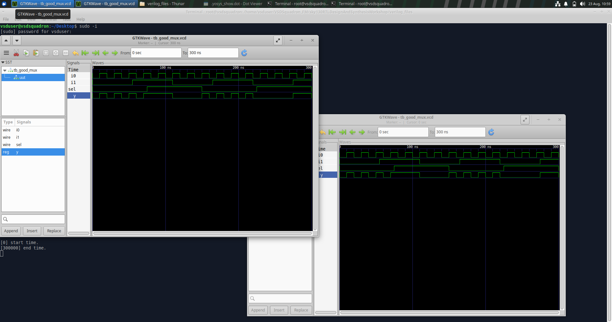

# VSDBabySoC – RTL Design, Synthesis and Gate-Level Simulation

## Overview

This repository documents my understanding of the complete RTL-to-Gate-Level design flow using the VSDBabySoC design.

The work begins with RTL simulation and functional verification, followed by synthesis, logic optimization, technology mapping, gate-level netlist generation and Gate-Level Simulation (GLS).

As a supporting study of RTL coding styles and their effect on synthesized hardware, I have also included experiment on `good_mux` . These experiments cover RTL functional simulation and Gate-Level Simulation.

The objective of this work is not only to obtain a working netlist, but to understand what happens to the RTL description at every stage of the design flow.

---

# 1. Repository Structure

The repository is organized to keep the RTL source files, testbenches, synthesized netlist and supporting screenshots separate.

```text
VSDBabySoC/
│
├── README.md
│
├── src/
│   ├── module/
│   │   ├── vsdbabysoc.v
│   │   ├── rvmyth.v
│   │   ├── clk_gate.v
│   │
│   ├── testbench/
│       └── testbench.v
│
│
│── lib/
│   ├── avsdpll.lib
│   ├── avsddac.lib
│   └── sky130_fd_sc_hd__tt_025C_1v80.lib
│
├── netlist/
│   └── baby_soc_netlist_new.v
│
├── mux/
│   ├── good_mux_rtl_simulation
│   ├── good_mux_graphical_rep
│   ├── good_mux_netlist.v
│   └── comparision of funcional simulation of goodmux vs gate level simulation
│
└── images/
    ├── pre_synth_gls
    ├── vsdbabysoc_rtl
    ├── rvmyth_hierarchy
    ├── synthesis_statistics
    ├── abc_technology_mapping
    ├── post_optimization_statistics
    ├── post_synth_gls
   
```

---

# 2. Tools Used

| Tool | Purpose |
|------|---------|
| Icarus Verilog | RTL and Gate-Level Simulation |
| GTKWave | Waveform visualization and analysis |
| Yosys | RTL synthesis and netlist generation |
| ABC | Logic optimization and technology mapping |
| SKY130 Libraries | Standard-cell technology mapping |
| Git | Version control |
| GitHub | Repository management and documentation |

---

# 3. Overall RTL-to-Gate-Level Flow

The complete flow followed in this work is:

```text
                 RTL Design
                     │
                     ▼
              RTL Simulation
                     │
                     ▼
          RTL Functional Testing
                     │
                     ▼
                 Synthesis
                     │
                     ▼
            Logic Optimization
                     │
                     ▼
           Technology Mapping
                     │
                     ▼
            Gate-Level Netlist
                     │
                     ▼
          Gate-Level Simulation
                     │
                     ▼
       Pre-Synthesis vs Post-Synthesis
                Comparison
```

The purpose of this flow is to verify that the intended functionality described at RTL is preserved after synthesis and technology mapping.

---

# 4. RTL Simulation

RTL simulation is the first verification stage.

At this stage, the design is simulated using the original RTL description before it is converted into gates.

The main purpose is to verify the functional behaviour of the design and establish a reference waveform.

```text
RTL Design
    │
    ▼
RTL Simulation
    │
    ▼
Reference Behaviour
```

The RTL simulation therefore becomes the baseline against which the synthesized gate-level implementation can later be compared.

---

# 5. Good MUX Experiment

Before working with the complete VSDBabySoC flow, I studied the RTL implementations of a multiplexer.

This experiment was used to understand:

- RTL coding style
- Combinational logic
- Complete assignments
- RTL simulation
- Synthesis interpretation
- Gate-Level Simulation

The experiments help demonstrate that the way RTL is written can influence the hardware inferred during synthesis.

---

# 5.1 Good MUX

A 2:1 multiplexer contains two data inputs, one select input and one output.

```text
                 ┌─────────────┐
        A ──────►│             │
                 │    2:1 MUX  ├────► Y
        B ──────►│             │
                 │             │
      SEL ──────►│             │
                 └─────────────┘
```

Its functional behaviour is:

```text
SEL = 0  →  Y = A
SEL = 1  →  Y = B
```

A properly specified combinational MUX should define its output for every possible input and select condition.

---

## 5.1.1 Good MUX RTL Simulation

The RTL simulation was performed using Icarus Verilog.

Example command:

```bash
iverilog good_mux.v tb_good_mux.v
gtkwave tb_good_mux.vcd
```

### Good MUX RTL Waveform & graphical representation


The waveform is used to verify that the output follows the selected input.

---

## 5.1.2 Good MUX RTL Simulation vs Gate-Level Simulation 

After synthesis, the generated gate-level implementation was simulated and compared to the RTL simulation



The GLS waveform verifies that the synthesized implementation maintains the intended MUX functionality.

---

# 5.2 Bad MUX

The bad MUX experiment was performed to understand the consequences of incomplete combinational assignments.

In combinational logic, the output should be assigned for every possible condition.

If an output is not assigned under some condition, the synthesis tool may infer storage behaviour such as a latch.

This experiment demonstrates why RTL coding style matters during synthesis.

---

## 5.2.1 Bad MUX RTL

Add the actual RTL source file:

```text
mux/bad_mux.v
```

---

## 5.2.2 Bad MUX Testbench

Add the testbench used for the experiment:

```text
mux/bad_mux_tb.v
```

---

## 5.2.3 Bad MUX RTL Simulation

Example command:

```bash
iverilog -o bad_mux_sim mux/bad_mux.v mux/bad_mux_tb.v
./bad_mux_sim
gtkwave bad_mux.vcd
```

### Bad MUX RTL Waveform


The waveform demonstrates the behaviour of the incompletely specified combinational circuit.

---

## 5.2.4 Bad MUX Functional Testing

Different combinations of inputs and control signals were applied during functional testing.

### Bad MUX Functional Testing


The observed behaviour demonstrates the importance of complete combinational assignments.

---

## 5.2.5 Bad MUX Gate-Level Simulation

The synthesized gate-level implementation was also simulated.

### Bad MUX GLS


The gate-level result helps demonstrate how synthesis interprets the RTL description.

---

# 5.3 Learning from the MUX Experiments

The good_mux and bad_mux experiments demonstrate an important RTL design principle:

```text
RTL Coding Style
       │
       ▼
Synthesis Interpretation
       │
       ▼
Inferred Hardware
```

Therefore, RTL design is not only about obtaining the expected simulation output.

The designer must also understand how synthesis interprets the RTL and what hardware structure can be inferred from it.

---

# 6. VSDBabySoC

VSDBabySoC is used as the main design for studying the complete RTL-to-gate-level flow.

The design integrates major functional blocks including:

```text
             ┌──────────────┐
             │    avsdpll   │
             │     PLL      │
             └──────┬───────┘
                    │
                  Clock
                    │
                    ▼
             ┌──────────────┐
             │    rvmyth    │
             │  RISC-V Core │
             └──────┬───────┘
                    │
              Digital Output
                    │
                    ▼
             ┌──────────────┐
             │    avsddac   │
             │     DAC      │
             └──────┬───────┘
                    │
                    ▼
                   OUT
```

The PLL provides the clocking function.

The RISC-V based core performs the digital processing.

The DAC provides the digital-to-analog interface represented in the VSDBabySoC design.

---

# 7. VSDBabySoC Source Files

The RTL source files used for the VSDBabySoC experiment should be added to the repository.

Example:

```text
src/
├── module/
│   ├── vsdbabysoc.v
│   ├── rvmyth.v
│   ├── clk_gate.v
│   └── [other required RTL modules]
│
├── include/
│   └── [required include files]
│
└── lib/
    ├── avsdpll.lib
    ├── avsddac.lib
    └── sky130_fd_sc_hd__tt_025C_1v80.lib
```

Only files actually required by the design should be included.

---

# 8. VSDBabySoC Testbench

The testbench applies the required inputs to VSDBabySoC and observes the output signals.

Add the actual testbench file here:

```text
testbench/testbench.v
```

The important signals observed during simulation include signals such as:

```text
reset
VCO_IN
ENb_CP
ENb_VCO
REF
VREFL
VREFH
OUT
```

> Update this list to match the exact signals present in my final testbench.

---

# 9. VSDBabySoC RTL Simulation

The first stage of the VSDBabySoC experiment is simulation of the original RTL design.

The purpose is to establish a functional reference before synthesis.

Example compilation flow:

```bash
iverilog -DPRE_SYNTH_SIM \
-I src/include/ \
-I [VERILOG_MODEL_PATH] \
-I src/module/ \
src/module/testbench.v

./a.out
```

The generated waveform can then be opened using:

```bash
gtkwave [PRE_SYNTH_VCD_FILE]
```

> Replace the placeholders with the actual paths and filenames used in my experiment.

### VSDBabySoC RTL Simulation


The RTL waveform provides the reference behaviour for later gate-level verification.

---

# 10. Understanding Synthesis

Synthesis converts an RTL description into a structural representation consisting of logic elements.

Conceptually:

```text
RTL
 │
 ▼
Elaboration
 │
 ▼
Logic Optimization
 │
 ▼
Technology Mapping
 │
 ▼
Gate-Level Netlist
```

The RTL describes the intended behaviour, while the synthesized netlist describes how that behaviour is implemented using available hardware cells.

Therefore:

```text
RTL
=
Behavioural / Register-Transfer Description
```

while:

```text
Netlist
=
Structural Hardware Description
```

---

# 11. Reading RTL into Yosys

The synthesis process begins by loading the required Verilog source files into Yosys.

Example:

```bash
yosys

read_verilog src/module/vsdbabysoc.v
read_verilog -I src/include src/module/rvmyth.v
read_verilog -I src/include src/module/clk_gate.v
```

Additional RTL files required by the design hierarchy should also be loaded.

The important requirement is that Yosys must have access to all modules required to elaborate the top-level design.

### RTL Loaded into Yosys


---

# 12. Loading the Technology Libraries

Synthesis requires information about the cells available in the target technology.

Liberty files contain information such as:

- Cell functionality
- Input and output pins
- Timing characteristics
- Drive information
- Sequential-cell behaviour
- Other characteristics required during synthesis and mapping

The relevant libraries used in this flow include the PLL, DAC and SKY130 standard-cell libraries.

Example:

```bash
read_liberty -lib src/lib/avsdpll.lib
read_liberty -lib src/lib/avsddac.lib
read_liberty -lib src/lib/sky130_fd_sc_hd__tt_025C_1v80.lib
```

The standard-cell library can be thought of as the set of hardware building blocks available to the synthesis tool.

---

# 13. RTL Synthesis

The top-level module is specified during synthesis.

```bash
synth -top vsdbabysoc
```

The synthesis process transforms the RTL description into a structural representation.

The top-level module tells Yosys which module represents the complete design to be synthesized.

---

# 14. Synthesis Statistics

After synthesis, Yosys reports statistics about the resulting design.

The statistics can include:

- Number of wires
- Number of wire bits
- Number of cells
- Number of modules
- Number of sequential elements
- Number of combinational elements

### Synthesis Statistics


These statistics provide a quantitative view of the hardware inferred from the RTL.

---

# 15. Structural Verification

After synthesis, the design can be checked for structural issues using:

```bash
check
```

The `check` command is useful for identifying structural problems in the synthesized design.

### Yosys Structural Check


---

# 16. Sequential Cell Mapping

Sequential elements such as flip-flops need to be mapped to cells available in the target technology library.

For the SKY130 standard-cell library:

```bash
dfflibmap -liberty src/lib/sky130_fd_sc_hd__tt_025C_1v80.lib
```

This stage replaces generic sequential representations with technology-specific sequential cells.

This is an important step in moving from technology-independent synthesis to technology-aware implementation.

---

# 17. Logic Optimization

The synthesized design can be optimized using:

```bash
opt
```

Optimization attempts to simplify the circuit while preserving its intended functionality.

Possible transformations include:

- Removing redundant logic
- Simplifying Boolean expressions
- Propagating constants
- Removing unused portions of the design
- Simplifying connections

---

# 18. Combinational Technology Mapping

ABC is used for combinational optimization and technology mapping.

```bash
abc -liberty src/lib/sky130_fd_sc_hd__tt_025C_1v80.lib
```

The combinational logic is optimized and mapped to cells available in the selected technology library.

Examples of standard-cell types include:

```text
AND
OR
NAND
NOR
XOR
XNOR
INV
MUX
```

### Technology Mapping


---

# 19. Visualizing the Synthesized Design

The synthesized design can be visualized using:

```bash
show vsdbabysoc
```

### Synthesized Design


The graph provides a structural view of the synthesized circuit.

At this stage, the design is no longer represented only as behavioural RTL. It has been transformed into interconnected hardware elements.

---

# 20. Preparing the Final Netlist

Before generating the final gate-level Verilog netlist, the design can be flattened and cleaned.

```bash
flatten
setundef -zero
clean -purge
rename -enumerate
```

## Flatten

```bash
flatten
```

The `flatten` command removes hierarchical boundaries and produces a flattened representation of the design.

## Set Undefined Values

```bash
setundef -zero
```

This converts undefined values into zero for the purpose of preparing the final representation.

## Clean

```bash
clean -purge
```

This removes unnecessary objects from the design.

## Rename

```bash
rename -enumerate
```

This provides systematic names to internal objects.

---

# 21. Gate-Level Netlist Generation

The final synthesized representation is written as a Verilog netlist.

Example:

```bash
write_verilog -noattr [FINAL_NETLIST_NAME].v
```

Replace `[FINAL_NETLIST_NAME]` with the exact filename generated during my VSDBabySoC synthesis.

For example:

```text
netlist/
└── [FINAL_NETLIST_NAME].v
```

### Generated Gate-Level Netlist


The generated file represents the synthesized gate-level implementation rather than the original RTL.

---

# 22. What Changes After Synthesis?

The RTL and gate-level descriptions may look very different even though they implement the same intended functionality.

For example, RTL such as:

```verilog
if (sel)
    y = b;
else
    y = a;
```

may be represented after synthesis using a MUX cell or a combination of standard cells.

Conceptually:

```text
        ┌───────────┐
A ─────►│           │
B ─────►│   MUX /   ├────► Y
SEL ───►│   Logic   │
        └───────────┘
```

The synthesized implementation may also use an equivalent combination of simpler standard cells.

Therefore:

```text
RTL internal structure
        ≠
Gate-Level internal structure
```

The important requirement is that the intended functionality remains correct.

---

# 23. Gate-Level Simulation

Gate-Level Simulation simulates the synthesized netlist instead of the original RTL.

The verification concept is:

```text
                 RTL
                  │
                  ▼
          RTL Simulation
                  │
                  ▼
          Reference Behaviour
                  │
                  │
              Synthesis
                  │
                  ▼
          Gate-Level Netlist
                  │
                  ▼
            GLS Simulation
                  │
                  ▼
          Functional Comparison
```

GLS provides an additional verification stage after synthesis.

---

# 24. Pre-Synthesis Simulation

The pre-synthesis simulation uses the original RTL implementation.

The testbench is compiled with the RTL design.

Example:

```bash
iverilog -DPRE_SYNTH_SIM \
-I src/include/ \
-I [VERILOG_MODEL_PATH] \
-I src/module/ \
src/module/testbench.v

./a.out
```

The generated waveform can be opened using:

```bash
gtkwave [PRE_SYNTH_VCD_FILE]
```

### Pre-Synthesis Waveform


This waveform represents the expected functional behaviour before synthesis.

---

# 25. Post-Synthesis Gate-Level Simulation

For post-synthesis simulation, the generated gate-level netlist and the required technology Verilog models are used.

Example:

```bash
iverilog -DPOST_SYNTH_SIM \
-I src/include/ \
-I [VERILOG_MODEL_PATH] \
-I src/module/ \
src/module/testbench.v

./a.out
```

The resulting waveform can be opened using:

```bash
gtkwave [POST_SYNTH_VCD_FILE]
```

### Post-Synthesis GLS


This simulation operates on the synthesized gate-level representation.

---

# 26. Pre-Synthesis vs Post-Synthesis Comparison

The most important verification step is comparison of the pre-synthesis and post-synthesis waveforms.

### Waveform Comparison


The comparison should focus on important observable signals and outputs.

Internal signal names and structures may change after synthesis.

Therefore, the goal is not necessarily:

```text
Every internal waveform is identical
```

Instead, the goal is:

```text
Expected RTL Functionality
            ≈
Observed Gate-Level Functionality
```

---

# 27. Why Internal Waveforms Can Differ

Synthesis can perform several transformations, including:

- Logic optimization
- Removal of redundant logic
- Constant propagation
- Logic merging
- Boolean simplification
- Technology mapping
- Changing internal signal names
- Flattening hierarchy
- Replacing RTL constructs with standard cells

As a result, the internal structure of the gate-level design can differ significantly from the RTL.

Therefore, internal signals should not automatically be expected to have the same names or shapes.

The comparison should focus on meaningful observable signals and outputs.

---

# 28. RTL vs Gate-Level Design

| RTL | Gate-Level |
|-----|------------|
| Behaviour-oriented | Structure-oriented |
| Higher abstraction | Lower abstraction |
| Describes intended hardware behaviour | Describes synthesized cell connectivity |
| Technology independent | Technology mapped |
| Easier to read and modify | More detailed and complex |
| Used for functional verification | Used for post-synthesis verification |

The transition from RTL to gate-level representation is one of the main concepts demonstrated in this work.

---

# 29. Role of the Standard-Cell Library

The standard-cell library determines the set of cells available to implement the synthesized circuit.

The process can be represented as:

```text
RTL Logic
    │
    ▼
Generic Logic
    │
    ▼
Technology Mapping
    │
    ▼
SKY130 Standard Cells
```

Instead of representing logic using arbitrary ideal gates, the synthesis tool maps the design to actual cells available in the selected technology.

Therefore, the same RTL can potentially produce different gate-level implementations when synthesized using different technology libraries.

---

# 30. Important Concepts Learned

## RTL

Register Transfer Level is an abstraction used to describe data transfers between registers and the combinational logic operating on that data.

## Synthesis

Synthesis converts RTL into a structural hardware representation.

## Logic Optimization

Logic optimization simplifies the design while attempting to preserve its functionality.

## Technology Mapping

Technology mapping converts generic logic into cells available in the selected semiconductor technology.

## Standard Cell

A standard cell is a pre-designed digital building block such as an inverter, NAND gate, NOR gate or flip-flop.

## Netlist

A netlist describes the cells in the design and the connections between those cells.

## Gate-Level Simulation

Gate-Level Simulation verifies the behaviour of the synthesized hardware representation.

---

# 31. Key Observations

### Observation 1 – RTL Coding Matters

The good_mux and bad_mux experiments demonstrated that different RTL coding styles can lead to different hardware interpretations.

### Observation 2 – Synthesis Changes Structure

The synthesized netlist can look very different from the original RTL.

### Observation 3 – Technology Libraries Matter

The available standard-cell library determines the cells used during technology mapping.

### Observation 4 – RTL Simulation and GLS Serve Different Purposes

RTL simulation verifies the intended behaviour of the design.

GLS verifies that the synthesized gate-level implementation maintains the expected behaviour.

### Observation 5 – Internal Signals Can Change

Synthesis can rename, optimize or remove internal signals.

Therefore, pre-synthesis and post-synthesis waveforms should be compared using meaningful observable signals.

---

# 32. Complete Synthesis Command Flow

The main synthesis flow can be summarized as:

```bash
yosys

read_verilog src/module/vsdbabysoc.v
read_verilog -I src/include src/module/rvmyth.v
read_verilog -I src/include src/module/clk_gate.v

read_liberty -lib src/lib/avsdpll.lib
read_liberty -lib src/lib/avsddac.lib
read_liberty -lib src/lib/sky130_fd_sc_hd__tt_025C_1v80.lib

synth -top vsdbabysoc

dfflibmap -liberty src/lib/sky130_fd_sc_hd__tt_025C_1v80.lib

opt

abc -liberty src/lib/sky130_fd_sc_hd__tt_025C_1v80.lib

check

show vsdbabysoc

flatten
setundef -zero
clean -purge
rename -enumerate

write_verilog -noattr [FINAL_NETLIST_NAME].v
```

> Replace `[FINAL_NETLIST_NAME]` with the actual VSDBabySoC netlist filename generated during my experiment.

---

# 33. Complete Verification Flow

```text
                 ┌─────────────────┐
                 │    RTL Design   │
                 └────────┬────────┘
                          │
                          ▼
                 ┌─────────────────┐
                 │ RTL Simulation  │
                 └────────┬────────┘
                          │
                          ▼
                 ┌─────────────────┐
                 │ Functional Test│
                 └────────┬────────┘
                          │
                          ▼
                 ┌─────────────────┐
                 │    Synthesis    │
                 └────────┬────────┘
                          │
                          ▼
                 ┌─────────────────┐
                 │  Optimization   │
                 └────────┬────────┘
                          │
                          ▼
                 ┌─────────────────┐
                 │ Technology Map  │
                 └────────┬────────┘
                          │
                          ▼
                 ┌─────────────────┐
                 │ Gate-Level      │
                 │ Netlist         │
                 └────────┬────────┘
                          │
                          ▼
                 ┌─────────────────┐
                 │      GLS        │
                 └────────┬────────┘
                          │
                          ▼
                 ┌─────────────────┐
                 │ Pre/Post Compare│
                 └─────────────────┘
```

---

# 34. Files to Add

The repository should contain the actual files used during the experiments.

## RTL Files

```text
[ ] vsdbabysoc.v
[ ] rvmyth.v
[ ] clk_gate.v
[ ] Other required RTL modules
```

## Testbench Files

```text
[ ] VSDBabySoC testbench
[ ] good_mux_tb.v
[ ] bad_mux_tb.v
```

## MUX RTL Files

```text
[ ] good_mux.v
[ ] bad_mux.v
```

## Netlist

```text
[ ] Final synthesized VSDBabySoC netlist
```

## Simulation / Technology Models

```text
[ ] Required SKY130 Verilog models
[ ] Required PLL model
[ ] Required DAC model
[ ] Other files required for GLS
```

> Only add files that are actually required for reproducing the work and that can be legally redistributed.

---

# 35. Screenshots to Add

Place the screenshots inside the `images/` folder.

The recommended screenshots are:

```text
[ ] Good MUX RTL simulation
[ ] Good MUX RTL functional testing
[ ] Good MUX GLS

[ ] Bad MUX RTL simulation
[ ] Bad MUX RTL functional testing
[ ] Bad MUX GLS

[ ] VSDBabySoC RTL simulation
[ ] RTL loaded into Yosys
[ ] Synthesis statistics
[ ] Yosys structural check
[ ] Technology mapping
[ ] Synthesized design
[ ] Generated netlist
[ ] Pre-synthesis GLS
[ ] Post-synthesis GLS
[ ] Pre-synthesis vs post-synthesis comparison
```

---

# 36. Evidence of Understanding

The repository is organized around the reasoning behind each stage of the flow rather than only presenting commands.

The key relationships demonstrated are:

```text
RTL Coding
     │
     ▼
Simulation Behaviour
     │
     ▼
Synthesis Interpretation
     │
     ▼
Inferred Hardware
     │
     ▼
Technology Mapping
     │
     ▼
Gate-Level Netlist
     │
     ▼
Gate-Level Simulation
     │
     ▼
Functional Verification
```

This demonstrates the relationship between the RTL description, the synthesis process and the final hardware representation.

---

# 37. Final Learning Outcome

This work provided practical exposure to the complete RTL-to-gate-level digital design flow.

The good_mux and bad_mux experiments provided an understanding of the relationship between RTL coding style and inferred hardware.

The VSDBabySoC experiment extended this understanding to a larger design and covered:

```text
RTL Design
     ↓
RTL Simulation
     ↓
Functional Verification
     ↓
Yosys Synthesis
     ↓
Logic Optimization
     ↓
Sequential Cell Mapping
     ↓
Combinational Technology Mapping
     ↓
Gate-Level Netlist
     ↓
Gate-Level Simulation
     ↓
Pre/Post Synthesis Comparison
```

The main learning is that successful RTL design is not limited to writing syntactically correct Verilog.

A designer must also understand:

- How RTL is interpreted by synthesis
- What hardware is inferred
- How optimization changes the design
- How technology libraries affect the implementation
- How a gate-level netlist differs from RTL
- Why post-synthesis verification is necessary

---

# 38. Conclusion

The experiments documented in this repository demonstrate the transition from a high-level RTL description to a technology-mapped gate-level implementation.

The good_mux and bad_mux experiments demonstrate the importance of writing RTL that accurately describes the intended combinational behaviour.

The VSDBabySoC experiment demonstrates the larger synthesis flow, including RTL elaboration, optimization, sequential-cell mapping, technology mapping and netlist generation.

Finally, Gate-Level Simulation provides a way to verify that the synthesized implementation maintains the intended functional behaviour.

The complete flow can therefore be summarized as:

```text
                 RTL
                  │
                  ▼
          RTL Verification
                  │
                  ▼
              Synthesis
                  │
                  ▼
            Optimization
                  │
                  ▼
        Technology Mapping
                  │
                  ▼
         Gate-Level Netlist
                  │
                  ▼
                GLS
                  │
                  ▼
        Functional Verification
```

This repository represents my understanding of how RTL code is transformed into a technology-mapped implementation and how the resulting gate-level design can be verified.
