# VSDBabySoC – RTL Design, Synthesis and Gate-Level Simulation

## Overview

This repository documents my understanding of the RTL-to-Gate-Level flow using VSDBabySoC.

The work covers RTL simulation, functional verification, Yosys synthesis, logic optimization, technology mapping, gate-level netlist generation and Gate-Level Simulation (GLS).

A small Good MUX study is also included to understand how RTL coding style can affect synthesis and inferred hardware.

The objective is to understand what happens to an RTL design at each stage rather than simply generating a final netlist.

---

## 1. Repository Structure

```text
VSDBabySoC/
│
├── README.md
│
├── src/
│   ├── module/
│   │   ├── vsdbabysoc.v
│   │   ├── rvmyth.v
│   │   └── clk_gate.v
│   │
│   └── testbench/
│       └── testbench.v
│
├── lib/
│   ├── avsdpll.lib
│   ├── avsddac.lib
│   └── sky130_fd_sc_hd__tt_025C_1v80.lib
│
├── netlist/
│   └── babysoc_netlist.v
│
├── images/
│   ├── babysoc_rtl.png
│   ├── rvmyth_hierarchy.png
│   ├── synthesis_statistics.png
│   ├── abc_technology_mapping.png
│   ├── post_optimization_statistics.png
│   ├── pre_synth_gls.png
│   └── post_synth_gls.png
│
└── mux/
    ├── good_mux.v
    ├── bad_mux.v
    ├── good_mux_rtl_simulation.png
    ├── good_mux_graphical_rep.png
    ├── good_mux_netlist.png
    └── good_mux_rtl_vs_gls.png
```

---

## 2. Tools Used

| Tool             | Purpose                                   |
| ---------------- | ----------------------------------------- |
| Icarus Verilog   | RTL and Gate-Level Simulation             |
| GTKWave          | Waveform visualization                    |
| Yosys            | RTL synthesis and netlist generation      |
| ABC              | Logic optimization and technology mapping |
| SKY130 Libraries | Technology-specific cell mapping          |
| Git              | Version control                           |
| GitHub           | Repository management and documentation   |

---

## 3. RTL-to-Gate-Level Flow

The complete flow followed in this work is:

```text
RTL Design
    ↓
RTL Simulation
    ↓
Functional Verification
    ↓
Synthesis
    ↓
Logic Optimization
    ↓
Technology Mapping
    ↓
Gate-Level Netlist
    ↓
Gate-Level Simulation
    ↓
Pre-Synthesis vs Post-Synthesis Comparison
```

The purpose of this flow is to verify that the intended functionality described at RTL is preserved after synthesis and technology mapping.

---

## 4. Good MUX 

Before working with VSDBabySoC, I studied MUX implementations to understand the relationship between RTL coding style and synthesized hardware.

A 2:1 MUX has two data inputs, one select signal and one output.

```text
                 ┌─────────────┐
        A ──────►│             │
        B ──────►│    2:1 MUX  ├────► Y
      SEL ──────►│             │
                 └─────────────┘
```

Its expected behaviour is:

```text
SEL = 0  →  Y = A
SEL = 1  →  Y = B
```

The experiment demonstrates that combinational RTL should completely specify the required output behaviour.

### Good MUX RTL Simulation

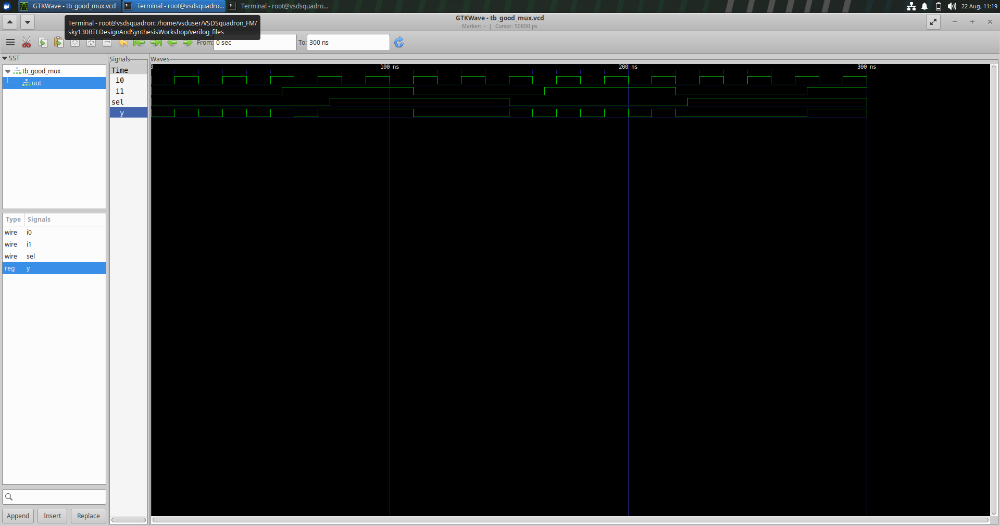

### Good MUX Graphical Representation

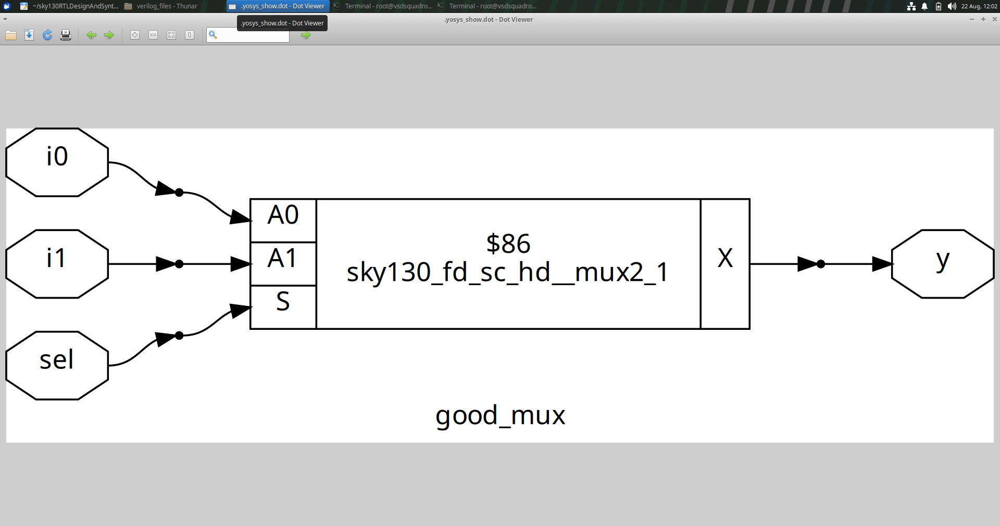

### Good MUX Synthesized Netlist

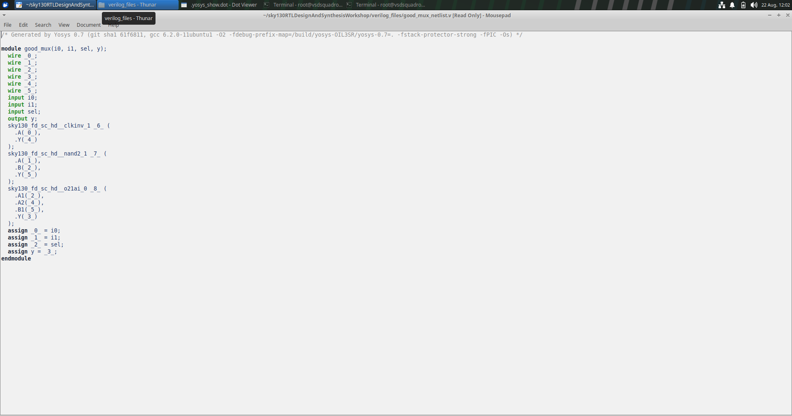

### Good MUX RTL vs Gate-Level Simulation


The GLS waveform confirms that the synthesized implementation maintains the intended MUX functionality.

The main learning from the MUX experiment is:

```text
RTL Coding Style
       ↓
Synthesis Interpretation
       ↓
Inferred Hardware
```

---

## 5. VSDBabySoC

VSDBabySoC is the main design used for studying the complete RTL-to-gate-level flow.

The design integrates major blocks including the PLL, RISC-V based processor core and DAC.

```text
             ┌──────────────┐
             │    avsdpll   │
             │     PLL      │
             └──────┬───────┘
                    │
                  Clock
                    │
                    ▼
             ┌──────────────┐
             │    rvmyth    │
             │  RISC-V Core │
             └──────┬───────┘
                    │
              Digital Output
                    │
                    ▼
             ┌──────────────┐
             │    avsddac   │
             │     DAC      │
             └──────┬───────┘
                    │
                    ▼
                   OUT
```

The PLL provides the clocking function, the rvmyth block performs the digital processing, and the DAC provides the output interface.

---

## 6. Design Under Test

The main Design Under Test is:

```text
vsdbabysoc
```

The main RTL file is:

[vsdbabysoc.v](src/module/vsdbabysoc.v)

Supporting RTL modules are:


[rvmyth.v](src/module/rvmyth.v)
[clk_gate.v](src/module/clk_gate.v)

The testbench is:


[testbench.v](src/testbench/testbench.v)


The testbench provides the required stimulus to the VSDBabySoC and observes its output behaviour.

---
## 7. Reading RTL into Yosys

The synthesis process begins by loading the required Verilog modules into Yosys.

```bash
yosys

read_verilog src/module/vsdbabysoc.v
read_verilog -I src/include src/module/rvmyth.v
read_verilog -I src/include src/module/clk_gate.v
```
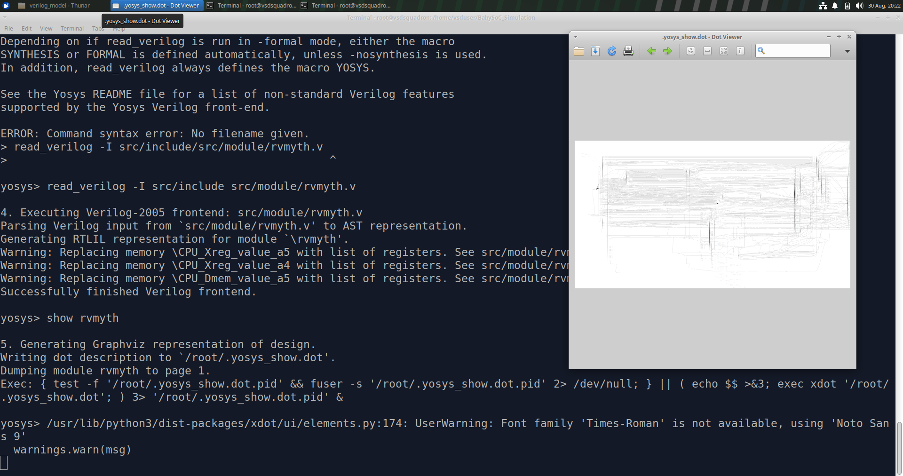
All modules required by the VSDBabySoC hierarchy must be available so that Yosys can correctly elaborate the top-level design.

---

## 8. Loading Technology Libraries

Synthesis requires information about the hardware cells available in the target technology.

The Liberty files contain information about the available cells and their characteristics.

The libraries used are:

```text
lib/avsdpll.lib
lib/avsddac.lib
lib/sky130_fd_sc_hd__tt_025C_1v80.lib
```

They are loaded using:

```bash
read_liberty -lib src/lib/avsdpll.lib 

read_liberty -lib src/lib/avsddac.lib 

read_liberty -lib src/lib/sky130_fd_sc_hd__tt_025C_1v80.lib
```

The SKY130 standard-cell library provides the cells that can be used during technology mapping.

---

## 9. RTL Synthesis

The top-level module is specified using:

```bash
synth -top vsdbabysoc
```
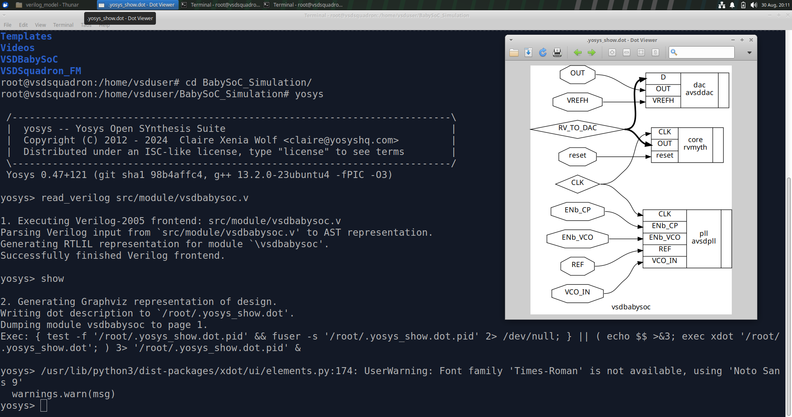

Yosys processes the RTL and converts it into a synthesized representation.

The top-level module identifies the complete design that must be synthesized.

---

## 10. Synthesis Statistics

After synthesis, Yosys reports statistics describing the resulting design.

These can include:

* Number of wires
* Number of wire bits
* Number of cells
* Sequential elements
* Combinational elements

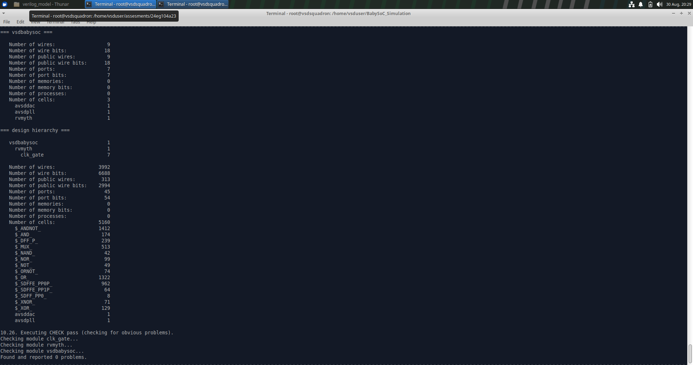

These statistics provide a quantitative view of the hardware inferred from the RTL.

---

## 11. Sequential Cell Mapping

Sequential elements such as flip-flops must be mapped to cells available in the target technology.

```bash
dfflibmap -liberty lib/sky130_fd_sc_hd__tt_025C_1v80.lib
```

This maps generic sequential elements to technology-specific sequential cells.

---

## 12. Logic Optimization

The synthesized design can be optimized using:

```bash
opt
```

Optimization attempts to simplify the circuit without changing its intended functionality.

Typical transformations include:

* Constant propagation
* Removal of redundant logic
* Boolean simplification
* Removal of unused logic
* Simplification of connections

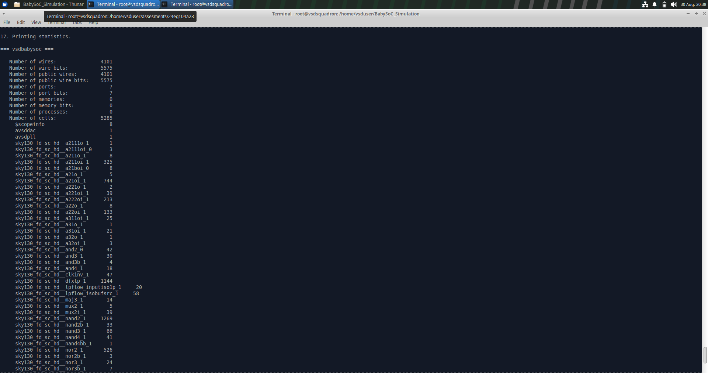

---

## 13. Technology Mapping with ABC

ABC performs combinational logic optimization and technology mapping.

```bash
abc -liberty lib/sky130_fd_sc_hd__tt_025C_1v80.lib
```

The generic combinational logic is mapped to cells available in the SKY130 library.

```text
Generic Logic
      ↓
     ABC
      ↓
SKY130 Standard Cells
```

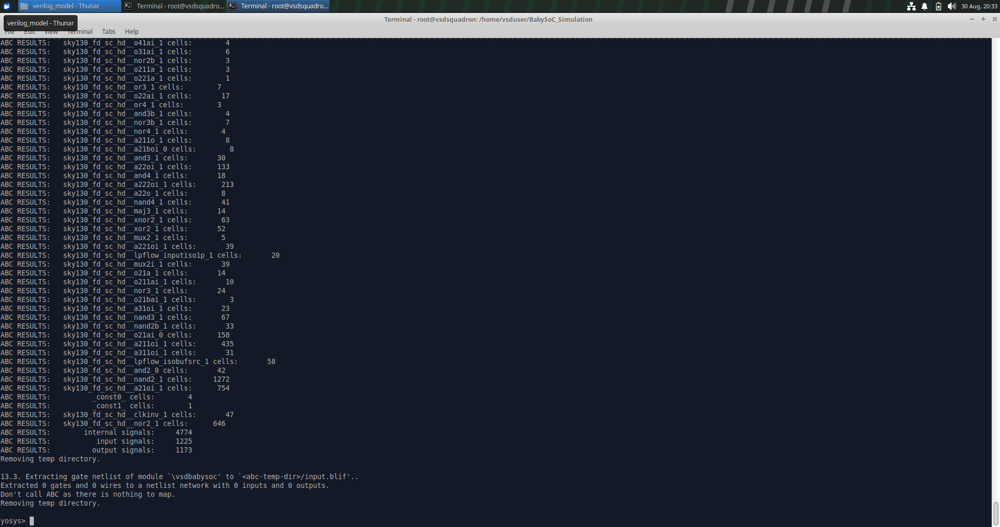

---

## 14. Synthesized Design Visualization

The synthesized design can be visualized using:

```bash
show vsdbabysoc
```


The generated representation provides a structural view of the synthesized hardware.

It helps demonstrate the transformation from RTL-level logic into interconnected hardware cells.

---

## 15. Preparing the Final Netlist

Before writing the final gate-level netlist, the design is flattened and cleaned.

```bash
flatten
setundef -zero
clean -purge
rename -enumerate
```

The purpose of these commands is:

```text
flatten
→ Removes hierarchical boundaries

setundef -zero
→ Converts undefined values to zero

clean -purge
→ Removes unnecessary design objects

rename -enumerate
→ Systematically renames internal objects
```

---

## 16. Gate-Level Netlist Generation

The final synthesized representation is written as a Verilog netlist.

```bash
write_verilog -noattr netlist/babysoc_netlist_new.v
```

The generated file is stored at:

[Netlist](netlist/baby_soc_netlist_new.v)


The netlist represents the synthesized implementation rather than the original RTL description.

---

## 17. RTL vs Gate-Level Representation

The gate-level implementation may look very different from the RTL even though the intended functionality is the same.

For example:

```verilog
if (sel)
    y = b;
else
    y = a;
```

may be implemented using a MUX cell or an equivalent combination of standard cells.

Therefore:

```text
RTL Structure
     ≠
Gate-Level Structure
```

while the desired relationship is:

```text
RTL Functionality
     =
Gate-Level Functionality
```

Synthesis can optimize, merge, remove, rename and restructure internal logic.

---

## 18. Gate-Level Simulation

Gate-Level Simulation uses the synthesized netlist instead of the original RTL.

The verification flow is:

```text
             RTL
              ↓
       RTL Simulation
              ↓
      Reference Behaviour
              ↓
          Synthesis
              ↓
       Gate-Level Netlist
              ↓
        GLS Simulation
              ↓
      Functional Comparison
```

GLS provides an additional verification stage after synthesis.

---

## 19. Pre-Synthesis GLS Reference

The pre-synthesis simulation represents the original RTL implementation and provides the reference waveform.

For pre-synthesis simulation, the following command was used:

```bash
iverilog -o ./pre_synth_sim.out -DPRE_SYNTH_SIM src/module/testbench.v -I src/include -I src/module/
```

### What this command does

| Command                  | Purpose                                           |
| ------------------------ | ------------------------------------------------- |
| `iverilog`               | Compiles the Verilog files                        |
| `-o ./pre_synth_sim.out` | Creates the simulation output file with this name |
| `-DPRE_SYNTH_SIM`        | Defines the macro for pre-synthesis simulation    |
| `src/module/testbench.v` | Testbench used to simulate the design             |
| `-I src/include`         | Adds the include folder                           |
| `-I src/module/`         | Adds the module folder                            |

This simulation checks the RTL design before converting it into a gate-level netlist.


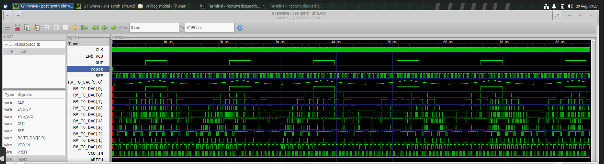

The important input and output signals are observed to establish the expected functional behaviour.

---

## 20. Post-Synthesis GLS

The post-synthesis simulation uses:

```text
Testbench
     +
Gate-Level Netlist
     +
Required Technology Verilog Models
```
Unlike pre-synthesis simulation, this stage does not use only the original RTL logic. The synthesized netlist and standard cell models are used.

The command used was:

```bash
sudo iverilog -DPOST_SYNTH_SIM -DFUNCTIONAL \
-I src/include/ \
-I ../../sky130RTLDesignAndSynthesisWorkshop/my_lib/verilog_model/ \
-I src/module/ \
src/module/testbench.v
```

The resulting waveform represents the behaviour of the synthesized gate-level implementation.

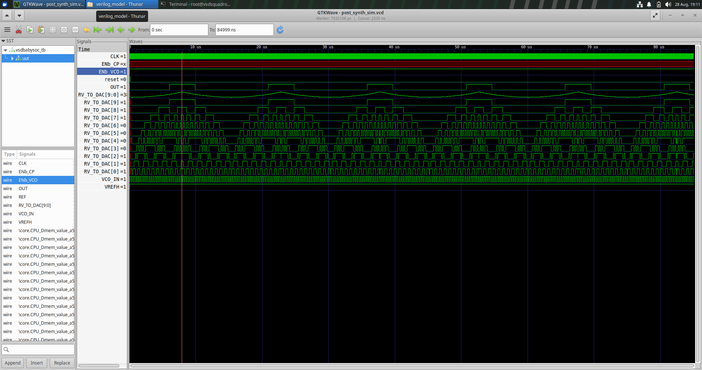

---

## 21. Pre-Synthesis vs Post-Synthesis Comparison

The pre-synthesis and post-synthesis waveforms are compared to verify that synthesis has preserved the intended functionality.

The comparison focuses on meaningful observable signals such as inputs, reset, clock-related behaviour and outputs.

The goal is:

```text
Expected RTL Behaviour
        ↓
Synthesized Implementation
        ↓
Observed GLS Behaviour
```
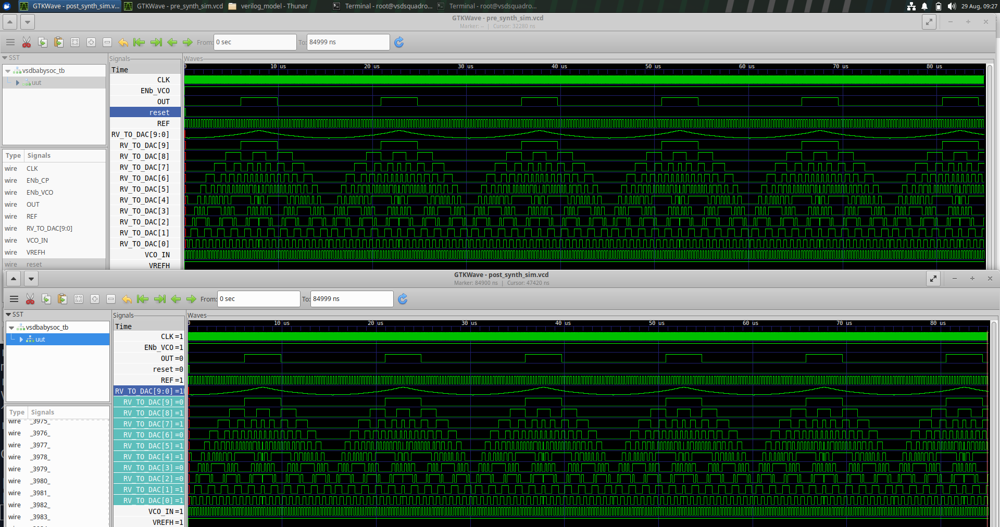

Internal signals may differ because synthesis can change the internal implementation.

---

## 22. Why Internal Waveforms Can Differ

Synthesis may perform:

* Logic optimization
* Constant propagation
* Logic merging
* Redundant logic removal
* Technology mapping
* Hierarchy flattening
* Internal signal renaming

Therefore, the internal gate-level structure does not have to be identical to the RTL structure.

A different internal waveform does not automatically indicate a functional error.

The important comparison is the behaviour of the relevant observable signals and outputs.

---

## 23. RTL vs Gate-Level

| RTL                              | Gate-Level                           |
| -------------------------------- | ------------------------------------ |
| Higher abstraction               | Lower abstraction                    |
| Behaviour-oriented               | Structure-oriented                   |
| Easier to read                   | More detailed                        |
| Technology independent           | Technology mapped                    |
| Describes intended functionality | Describes cell connectivity          |
| Used for functional verification | Used for post-synthesis verification |

---

## 24. Role of the SKY130 Standard-Cell Library

The standard-cell library determines which technology-specific cells can be used during mapping.

The relationship is:

```text
RTL
 ↓
Generic Logic
 ↓
Technology Mapping
 ↓
SKY130 Standard Cells
```

Examples of standard-cell types include:

```text
INV
NAND
NOR
AND
OR
XOR
MUX
D Flip-Flop
```

Therefore, the selected technology library influences the structure of the final gate-level netlist.

---

## 25. Important Observations

### RTL Coding Matters

The MUX experiments demonstrated that RTL coding style influences how synthesis interprets the design.

### Synthesis Changes Structure

The gate-level netlist can be structurally very different from the RTL.

### Optimization Changes the Implementation

Redundant or unnecessary logic may be simplified or removed while preserving functionality.

### Technology Libraries Matter

The available technology library determines the cells used during technology mapping.

### GLS Is Important

RTL simulation verifies the original RTL, while GLS verifies the synthesized gate-level implementation.

### Internal Signals Can Change

Synthesis may rename, optimize or remove internal signals, so functional comparison should focus on meaningful signals and outputs.

---

## 26. Complete Synthesis Command Flow

```bash
yosys

read_verilog src/module/vsdbabysoc.v
read_verilog -I src/include src/module/rvmyth.v
read_verilog -I src/include src/module/clk_gate.v

read_liberty -lib lib/avsdpll.lib
read_liberty -lib lib/avsddac.lib
read_liberty -lib lib/sky130_fd_sc_hd__tt_025C_1v80.lib

synth -top vsdbabysoc

dfflibmap -liberty lib/sky130_fd_sc_hd__tt_025C_1v80.lib

opt

abc -liberty lib/sky130_fd_sc_hd__tt_025C_1v80.lib

check

show vsdbabysoc

flatten
setundef -zero
clean -purge
rename -enumerate

write_verilog -noattr netlist/babysoc_netlist_new.v
```

---


## 27. Learning Outcome

This work provided practical understanding of how an RTL design progresses toward a technology-mapped gate-level implementation.

The main flow studied was:

```text
RTL Coding
     ↓
RTL Simulation
     ↓
Functional Verification
     ↓
Synthesis
     ↓
Logic Optimization
     ↓
Sequential Cell Mapping
     ↓
Technology Mapping
     ↓
Gate-Level Netlist
     ↓
Gate-Level Simulation
     ↓
Functional Comparison
```

The MUX experiments established the connection between RTL coding style and inferred hardware.

The VSDBabySoC experiment extended this understanding to a larger hierarchical design and demonstrated the complete synthesis and GLS flow.

The main takeaway is that RTL design is not only about writing code that produces the expected simulation output. It is also necessary to understand how synthesis interprets the RTL, how optimization changes the implementation, how technology libraries influence the mapped hardware, and how the resulting gate-level implementation can be verified.

---
